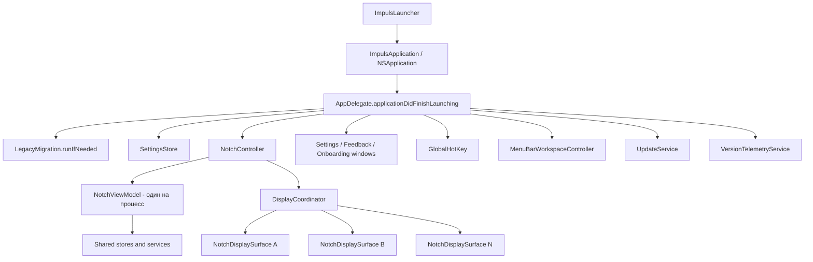
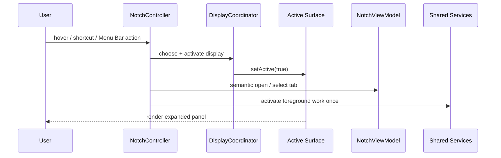

# Application Lifecycle

## Назначение

Этот документ описывает фактический жизненный цикл процесса ИМПУЛЬС: от `NSApplication` до shared services, поверхностей дисплеев, Menu Bar, обновлений и завершения процесса.

## Главный поток запуска

## Последовательность

1. `AppDelegate` создаёт `SettingsStore`, `UpdateService` и `VersionTelemetryService`.
2. Выполняется `LegacyMigration.runIfNeeded()`.
3. Создаётся `NotchController(settings:environment:)` с `.live` окружением.
4. `NotchController.install()` строит **один** `NotchViewModel` и reconcile'ит поверхности всех разрешённых дисплеев.
5. `NotchViewModel` создаёт shared stores: Actions, Music, Shelf, Clipboard, Calendar, Translate, Snippets, Notes, Power и Apple device center.
6. `NotchController` устанавливает системные observers, pointer sampler и topology lifecycle.
7. Создаются контроллеры Settings, Feedback и Onboarding.
8. Регистрируется глобальная горячая клавиша.
9. `MenuBarWorkspaceController` подключается к уже существующему `NotchViewModel` и не создаёт отдельные providers/stores.
10. Через 0.75 с `UpdateService` может показать первичное предложение разрешить update checks.
11. Через 2 с `VersionTelemetryService` делает best-effort проверку heartbeat; transport не затрагивается без consent и build-configured endpoint.
12. Onboarding показывается по своим version/fresh-install правилам.

## Переход в активное состояние панели

Foreground work имеет одного владельца в `NotchController`. Повторный open/re-entry не должен создавать второй refresh batch.

## Sleep / wake / display topology

При `screensDidSleep` панель закрывается и единственный `PointerWatcher` останавливается. При `screensDidWake` сначала reconcile'ится topology, затем sampler запускается снова. Это предотвращает маршрутизацию pointer events в уже отключённый монитор.

## Завершение

`applicationWillTerminate` отключает hotkey callback и вызывает `NotchController.teardown()`. Controller останавливает pointer sampler, shared services, поверхности, observers и subscriptions. `NoteStore`/clipboard persistence получают shutdown flush через view-model lifecycle.

## Ключевой инвариант

**Lifecycle процесса не равен lifecycle дисплея.** Подключение, отключение или перестройка экрана не имеет права пересоздавать shared services.

## Основные файлы

- `Sources/Impuls/App/AppDelegate.swift`
- `Sources/Impuls/Notch/NotchController.swift`
- `Sources/Impuls/Notch/DisplayCoordinator.swift`
- `Sources/Impuls/Model/NotchViewModel.swift`
- `Sources/Impuls/Services/StorageEnvironment.swift`

## Связанные документы

- [State and Ownership](state-and-ownership.md)
- [Multi-Display Architecture](multi-display.md)
- [Storage and Persistence](storage-persistence.md)
- [Project Invariants](../10-ai/invariants.md)
