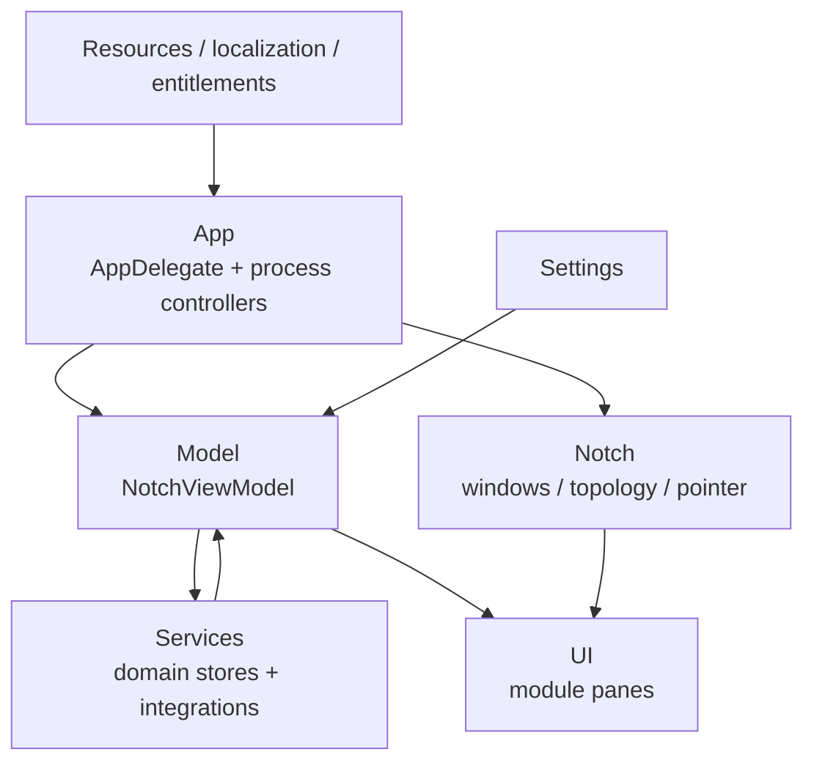

# Architecture Overview

ИМПУЛЬС — native macOS utility: Swift package, SwiftUI presentation поверх AppKit window/orchestration. Основной target `ImpulsCore` живёт в `Sources/Impuls`, executable glue — `Sources/ImpulsLauncher`.

## Layer map

## Directory responsibilities

- `App` — process lifecycle/glue;
- `Model` — shared panel state;
- `Notch` — display topology, windows, geometry, pointer, presentation orchestration;
- `Services` — domain stores, persistence, system/web/device adapters;
- `Settings` — settings model/window, permissions, feedback presentation;
- `UI` — panes/theme/presentation;
- `Resources` — localization, entitlements, assets;
- `Tests` — deterministic contract tests;
- `Scripts` / workflows — packaging and trust pipeline.

## Deep dives

- [Application Lifecycle](application-lifecycle.md)
- [State and Ownership](state-and-ownership.md)
- [Multi-Display](multi-display.md)
- [Storage and Persistence](storage-persistence.md)
- [Permission Architecture](permissions.md)
- [Networking](networking.md)
- [System Diagrams](system-diagrams.md)

## Fundamental boundaries

Shared services are process-level; display surfaces are presentation-level. Networking has exactly three owners. File-backed user state is injectable through `StorageEnvironment`. Sensitive permission prompts require explicit user action. CI contains executable architecture policy in addition to normal tests.
