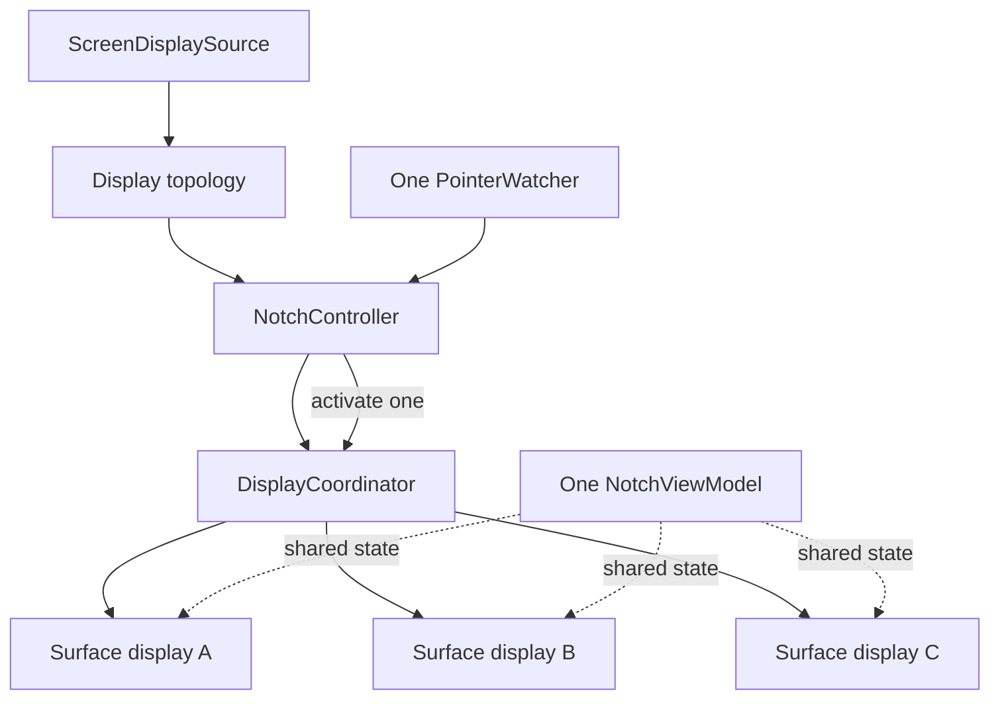

# Multi-Display Architecture

## Контракт

Начиная с 1.4.7 ИМПУЛЬС может иметь presentation surface на каждом разрешённом подключённом дисплее, но в каждый момент **только одна поверхность активна и только одна панель может быть раскрыта**.

## Reconciliation

`DisplayCoordinator.reconcile`:

1. получает свежие `NotchGeometry`;
2. удаляет surfaces исчезнувших displays;
3. обновляет geometry существующих;
4. создаёт surface только для новых;
5. сохраняет deterministic display order;
6. сбрасывает active ID, если активный display исчез.

Это reconciliation, а не rebuild приложения.

## Выбор активного дисплея

Для shortcut/Menu Bar/notification входа controller стремится открыть панель там, где пользователь работает: display под pointer, затем подходящий системный fallback. Hover естественно маршрутизируется зоной конкретного display.

## Один sampler

`PointerWatcher` один на процесс. Он знает зоны дисплеев. Нельзя добавлять timer/sampler на каждый монитор: это увеличит wakeups и создаст конкурирующие источники истины.

## Geometry

`NotchGeometry` принадлежит surface. `SettingsStore.PanelSize` задаёт preset, а geometry clamp'ит его к реальным размерам дисплея. `automatic` выбирает размер из width конкретного display.

## Motion

Панель использует фиксированный AppKit envelope и контролируемую SwiftUI reveal/mask-модель. Reduce Motion берётся из system accessibility state. Delayed completions versioned generation counters, чтобы старый close/open completion не воскресил более новое состояние.

## Hot unplug

При исчезновении активного display surface teardown выполняется до выбора следующего назначения. Shared view model при этом сохраняется. Текст в Notes/Translate/Snippets и module state не должен исчезать из-за отключения монитора.

## Тестовые точки

Основные сценарии защищаются `DisplayTopologyTests.swift` и controller tests: A→B, A→B→A, disconnect, keyboard ownership, pointer routing, notification/openPower destination, Reduce Motion и transition races.

## Исторический контекст

Для причин отдельных geometry решений см. `docs/IMPULS_1_4_7_MULTI_DISPLAY.md` и release 1.4.8 performance work. Текущий контракт находится здесь и в коде.

## Связано

- [State and Ownership](state-and-ownership.md)
- [Application Lifecycle](application-lifecycle.md)
- [ADR-002](../08-decisions/ADR-002-shared-services-per-display-presentation.md)
