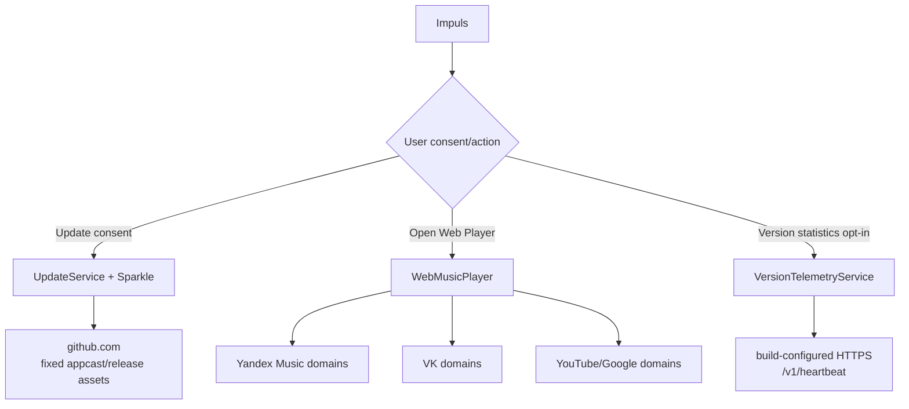

# Networking Architecture

## Три владельца сети

CI разрешает сетевые API только в трёх Swift-файлах.

## 1. UpdateService

Fixed feed: `https://github.com/TumanovNV/impuls/releases/latest/download/appcast.xml`. Sparkle владеет authenticated download/replacement/relaunch. Automatic checks и downloads opt-in; system profiling выключен.

## 2. WebMusicPlayer

WebKit создаётся только после явного `Open Web Player`. Выбор web source сам по себе не создаёт `WKWebView` и не выполняет request. Main-frame navigation ограничена allow-list доменами выбранного provider; unrelated links уходят в default browser.

1.4.16 добавил в JS-мост и в `WebMusicState` четыре capability-поля (`canNext`/`canPrevious`/`canPlayPause`/`canSeek`) — тот же `transport-route lookup`, который уже использовал `command(_:)`, теперь дополнительно репортится в Swift вместо того, чтобы оставаться неиспользуемым внутри страницы. Это не новый network endpoint и не новое исходящее сообщение: поля идут тем же самым каналом (`impulsMusic` postMessage раз в секунду, уже существующий и bounded), тем же provider-allowlist. `WebMusicPlaying` — тестовый DI-протокол вокруг `WebMusicPlayer`; production always resolves to the real `WebMusicPlayer()`, so this network boundary is unchanged in kind. `MusicProviderCatalog` (regional Recommended subset / All Services full catalog) выполняется полностью локально — единственный вход `Locale.current.region`/app-language fallback, без сети и без изменения каталога поддерживаемых источников: `allServices` остаётся полным списком, `recommended(...)` — только его подмножество (см. [Music](../02-modules/music.md)).

## 3. VersionTelemetryService

Отдельный consent. Endpoint отсутствует в source code и приходит из build config/Info.plist. Разрешён только HTTPS endpoint с точным `/v1/heartbeat`, redirects запрещены. Payload allow-list: schema, random installation UUID, app version, optional actually-observed previous version. Не чаще одной попытки в час **для той же app version**; timestamp и версия попытки записываются до request, поэтому и неуспешный collector не может превратить relaunch в обход этого лимита. С 1.4.14 версия, отличная от версии последней попытки, этим лимитом не блокируется — так апдейт репортит себя сразу, а не только после ручного перезапуска. `VersionTelemetryScheduler` дополнительно предлагает попытку примерно раз в час, пока приложение работает; саму throttle-политику по-прежнему решает `VersionTelemetryService`.

С 1.4.16 `VersionTelemetryService.diagnostics()` отдаёт read-only снимок этого же локального состояния для Settings → Data & Privacy. Это не четвёртая network boundary: метод не создаёт `URLRequest`, не вызывает `sendHeartbeatIfNeeded` и не открывает transport — только читает уже существующие `UserDefaults` под тем же lock. Подробности: [Version Statistics Collector](../07-web/version-statistics-collector.md).

## Время жизни WKWebView

Единственный `WKWebView` теперь имеет путь остановки. `WebMusicPlayer.teardown()` вызывается из `MediaController.stop()`: он останавливает внедрённый мост (`setInterval` 1 с и `MutationObserver`), снимает обработчик сообщений `impulsMusic` и user scripts, освобождает view. Раньше эта работа продолжалась со свёрнутой панелью и переживала `NotchController.teardown()` до выхода процесса.

`teardown()` идемпотентен и **не создаёт** view и не грузит URL, поэтому путь завершения не нарушает инвариант «запуск Impuls не конструирует `WKWebView`». Объект остаётся пригодным к повторному использованию: следующее явное действие пользователя пересобирает плеер.

С 1.4.16 (#112) добавлен `webViewWebContentProcessDidTerminate(_:)` — обработка смерти content process WebKit. **Новой network boundary это не создаёт и network-контракт не меняет:** метод только очищает состояние и сообщает об отказе. Он сознательно **не выполняет reload и не грузит URL** — страница, упавшая один раз, склонна упасть снова, и перезагрузка из того же callback'а была бы retry storm с исходящими запросами. Инвариант «запуск Impuls не конструирует `WKWebView`» и «запрос делает только явное действие пользователя» сохраняются: восстановление идёт через следующий явный Open/Reload. Новых таймеров, задач и запросов не добавлено.

Восстановление после такого краха выполняется **внутри явного `show(source:)`** и представляет собой ровно одну навигацию: `webView.reload()`, если текущий URL всё ещё принадлежит выбранному provider'у, иначе `load(homeURL)`. Это не новый network owner и не новый endpoint — тот же `WebMusicPlayer`, тот же provider allow-list, тот же принцип «запрос делает только явное действие пользователя»: навигация происходит потому, что пользователь нажал Open/Retry. Флаг recovery снимается до навигации, поэтому одна страница получает ровно одну попытку; повторный краш снова требует явного действия пользователя, а не автоматического повтора. Таймеров, отложенных перезагрузок и фоновых запросов по-прежнему нет.

`WebMusicPlayer` — main-actor-isolated на уровне **класса**, а не только через протокол `WebMusicPlaying`: этим owner'ом владеют `WKWebView`, window controller и весь navigation/teardown lifecycle. Изоляция один раз была потеряна молча (атрибут случайно оказался на соседнем enum) — на network boundary это не влияет, но именно этот объект является единственной точкой, где создаётся исходящий запрос web-плеера, поэтому его ownership зафиксирован в [Background Work & Concurrency Registry](../12-reference/background-concurrency-registry.md). Границы, allow-list и правило «запрос только по явному действию пользователя» при этом не менялись.

## CI enforcement

`build.yml` и `release.yml` ищут `URLSession`, `URLRequest`, Network.framework/socket helpers и запрещают их во всех остальных Swift-файлах. Добавление четвёртого владельца сети должно быть ADR-level решением.

## Не путать с локализацией

Поставка семи языков и настройка «Язык приложения» сетевой поверхности не добавляют. Таблицы строк лежат в bundle, а `AppLanguageService` пишет только два локальных ключа `UserDefaults` — `app.language.v1` и `AppleLanguages`. Никакого языкового пакета Impuls не загружает. Владельцев сети по-прежнему трое.

## Не путать с локальным device I/O

iPhone/iPad provider использует локальные macOS/device transport mechanisms, а не Internet product networking. Его privacy boundary — explicit external-device switch; hardware I/O также документируется и тестируется отдельно.

## Связано

- [ADR-003](../08-decisions/ADR-003-three-network-owners.md)
- [Security Model](../06-security/security-model.md)
- [Update System](../05-release/update-system.md)
- [Music](../02-modules/music.md)
