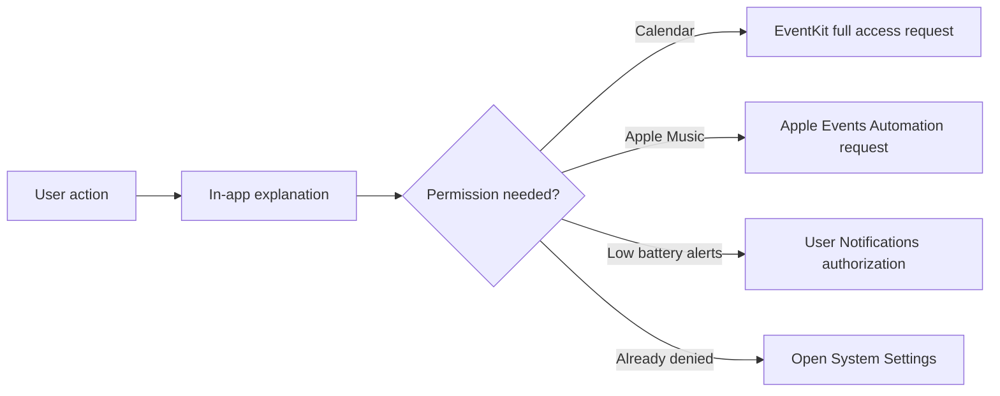

# Permission Architecture

## Принцип

ИМПУЛЬС не должен показывать sensitive system prompt только из-за запуска или обновления. Сначала пользователь видит функцию/объяснение, затем сам инициирует запрос.

## Calendar

`CalendarStore.start()` только читает текущий TCC status. Prompt вызывается `requestAccess()` из UI. Entitlement `com.apple.security.personal-information.calendars` присутствует в bundle.

## Apple Music Automation

Metadata/control использует public Apple Events/scripting path через `PlayerBridge`. `AEDeterminePermissionToAutomateTarget` используется без prompt для status check и с prompt только после user action. Entitlement `com.apple.security.automation.apple-events` присутствует в bundle.

## Notifications

Нужны для opt-in low-battery alerts. Persisted/restored settings сами по себе не имеют права вызвать authorization prompt. `requestAuthorization` передаётся отдельно при явном действии пользователя.

## Apple device trust

iPhone/iPad trust — не macOS TCC permission. Provider проверяет existing trust до чтения; отсутствие trust превращается в `permissionRequired`/инструкцию. Device discovery полностью off, пока пользователь не включил `Show Connected Apple Devices`.

## Accessibility

ИМПУЛЬС не требует Accessibility permission для вставки текста: Snippets/Actions копируют данные в system pasteboard вместо keyboard injection.

## PermissionCenter

`PermissionCenter` агрегирует отображаемые states Calendar, Music Automation и Notifications и умеет открыть соответствующие System Settings. Он не является владельцем бизнес-логики модулей.

## Изменения 1.4.12-hardening

Контракт разрешений не менялся. `PlayerBridge` правился только в части преобразования позиции воспроизведения перед подстановкой в AppleScript: значение приходит из плеера и раньше конвертировалось через `Int(_:)`, что является trap вне диапазона `Int`. `AEDeterminePermissionToAutomateTarget` с `prompt: false` на всех автоматических путях и `prompt: true` только из Settings остались как были.

## Инварианты

- update не создаёт новый prompt сам;
- opening tab может refresh status, но prompt требует button/action;
- denied/restricted state отображается честно;
- новые permissions требуют обновить `PRIVACY.md`, `SECURITY.md`, entitlements, CI, knowledge base и security audit.

## Связано

- [macOS Permissions and TCC](../03-macos/permissions-and-tcc.md)
- [Calendar](../02-modules/calendar.md)
- [Music](../02-modules/music.md)
- [Power](../02-modules/power.md)
