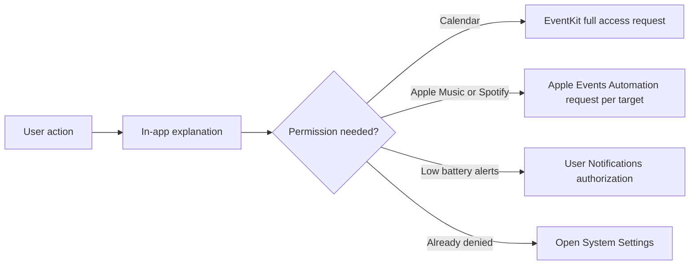

# Permission Architecture

## Принцип

ИМПУЛЬС не должен показывать sensitive system prompt только из-за запуска или обновления. Сначала пользователь видит функцию/объяснение, затем сам инициирует запрос.

## Calendar

`CalendarStore.start()` только читает текущий TCC status. Prompt вызывается `requestAccess()` из UI. Entitlement `com.apple.security.personal-information.calendars` присутствует в bundle.

IMP-21 изменяет только local recognition already-readable meeting URLs after access exists, including both strict Teams URL forms; он не читает новый EventKit field, не меняет entitlement и не добавляет permission action или prompt.

## Native music Automation

Apple Music и Spotify metadata/control используют public Apple Events/scripting path через `PlayerBridge`. `AEDeterminePermissionToAutomateTarget` используется без prompt для status check и с prompt только после user action, отдельно для каждого target bundle ID. `PermissionCenter` не сводит allowed Apple Music и denied Spotify к одному состоянию. Entitlement `com.apple.security.automation.apple-events` присутствует в bundle.

## Notifications

Нужны для opt-in low-battery alerts. Persisted/restored settings сами по себе не имеют права вызвать authorization prompt. `requestAuthorization` передаётся отдельно при явном действии пользователя.

С 1.4.16 Settings показывает реальное состояние этого разрешения как `Allowed`, `Denied` или `Not Requested`; `.notDetermined` больше не маскируется устаревшим состоянием `Planned`. Из Apple Devices пользователь может:

- явно запросить разрешение, если оно ещё не запрашивалось;
- обновить status без prompt;
- открыть Notifications в System Settings после отказа;
- отправить локальное тестовое уведомление после разрешения.

Тестовое уведомление намеренно не содержит процента устройства и не вызывает `LowBatteryAlertEngine`: оно проверяет только системную Notification Center boundary и не меняет persisted warning/critical state. `UNUserNotificationCenter.add` подтверждает принятие request системой, а не то, что человек физически увидел banner.

Возврат Impuls в active state после System Settings обновляет status автоматически; ручной `Refresh Status` остаётся явным fallback. Ни refresh, ни открытие Settings не запрашивают permission сами.

Общая вкладка Settings → Permissions отображает тот же real state через `PermissionCenter.notifications` и также предлагает явную кнопку `Allow` при `Not Requested` (вызывает `PermissionCenter.requestNotifications()`), чтобы описание разрешения и точка входа совпадали с фактическим использованием (low-battery alerts), а не с устаревшим "meeting reminders" placeholder-текстом.

## Apple device trust

iPhone/iPad trust — не macOS TCC permission. Provider проверяет existing trust до чтения; отсутствие trust превращается в `permissionRequired`/инструкцию. Device discovery полностью off, пока пользователь не включил `Show Connected Apple Devices`.

## Accessibility

ИМПУЛЬС не требует Accessibility permission для вставки текста: Snippets/Actions копируют данные в system pasteboard вместо keyboard injection.

## PermissionCenter

`PermissionCenter` агрегирует отображаемые states Calendar, Music Automation и Notifications и умеет открыть соответствующие System Settings. Он не является владельцем бизнес-логики модулей. Notification `.notDetermined` отображается как `Not Requested`; `requestNotifications()` существует только для явного UI action.

## Изменения 1.4.12-hardening

Контракт разрешений не менялся. `PlayerBridge` правился только в части преобразования позиции воспроизведения перед подстановкой в AppleScript: значение приходит из плеера и раньше конвертировалось через `Int(_:)`, что является trap вне диапазона `Int`. `AEDeterminePermissionToAutomateTarget` с `prompt: false` на всех автоматических путях и `prompt: true` только из Settings остались как были.

1.4.16 добавил `NativeMusicBridging`/`LivePlayerBridge` — тонкую обёртку над теми же статическими вызовами `PlayerBridge`, введённую только ради deterministic unit-тестов `MediaController`. `LivePlayerBridge.automationAuthorization(prompt:completion:)` вызывает тот же `PlayerBridge.automationAuthorization(for: .music, prompt:completion:)` с теми же аргументами; ни prompt-политика, ни entitlement, ни путь запроса не изменились.

## Инварианты

- update не создаёт новый prompt сам;
- opening tab / returning from System Settings может refresh status, но prompt требует button/action;
- persisted low-battery opt-in не становится permission request при relaunch;
- denied/restricted state отображается честно;
- notification diagnostics не меняют low-battery threshold state;
- смена языка интерфейса prompt не вызывает: она меняет только то, из какой `InfoPlist.strings` macOS возьмёт **текст** usage description, когда запрос всё-таки инициирует пользователь (см. [macOS Permissions and TCC](../03-macos/permissions-and-tcc.md));
- новые permissions требуют обновить `PRIVACY.md`, `SECURITY.md`, entitlements, CI, knowledge base и security audit.

## Связано

- [macOS Permissions and TCC](../03-macos/permissions-and-tcc.md)
- [Calendar](../02-modules/calendar.md)
- [Music](../02-modules/music.md)
- [Power](../02-modules/power.md)
