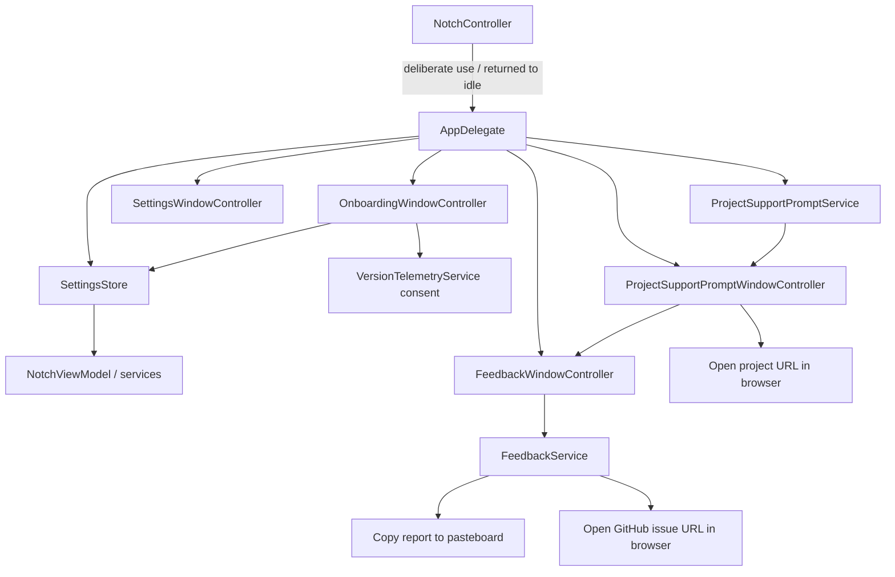
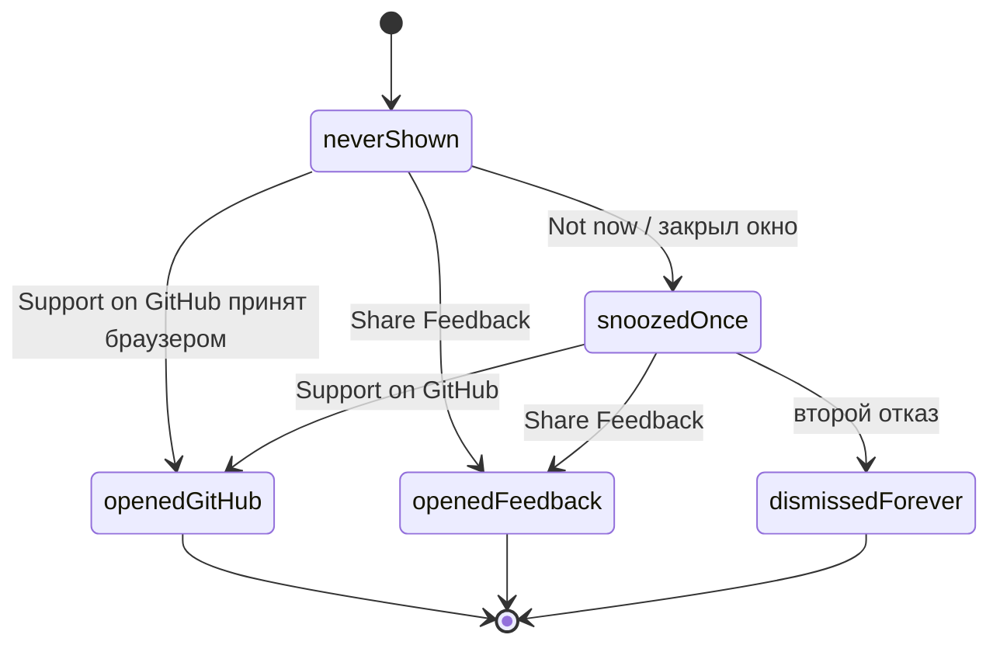

# Settings, Onboarding and Feedback

## Роль подсистем

Эти поверхности находятся вне notch panel, но используют тот же shared state и privacy contracts.

## SettingsStore

`SettingsStore` — process-level persisted configuration. Он хранит hotkey, activation mode/delay, panel size/display scope, module ordering/enabled state, clipboard policy, external-device opt-in, low-battery choices и Menu Bar configuration.

Portable `ImpulsSettingsSnapshot` сознательно уже полного local state: device ordering/hidden keys и selected physical-device key живут отдельно и не входят в backup.

## Onboarding

`OnboardingEligibility` чисто решает `full / whatsNew / none`:

- fresh install без settings/legacy completion → full tour;
- existing install с новой version → What's New;
- уже просмотренная current version → none.

Закрытие окна считается явным dismissal, чтобы tour не становился ловушкой на каждом launch.

Full flow: welcome → features → Menu Bar → quick actions → permissions → privacy → ready. Feature cards берутся из `AppFeatureCatalog`, то есть onboarding не должен рекламировать несуществующий module.

### What's New content

Заголовок и текст What's New берутся из `WhatsNewCatalog.content(forVersion:)`, вызываемого с реальным `Bundle.main.shortVersion` — не из захардкоженной строки в `OnboardingFlow`. До 1.4.14 заголовок и описание были буквально вписаны в `OnboardingFlow.whatsNew`, поэтому апгрейд на 1.4.12/1.4.13 продолжал показывать заметки 1.4.11. Каталог хранит bullet-список изменений по каждой версии; версия без записи получает generic fallback с настоящим номером версии, а не текст соседней версии.

Для 1.4.15 каталог содержит отдельную запись с пользовательскими highlights про выбор языка, применение языка после перезапуска, поддержку открытого проекта через GitHub/Feedback и общую надёжность. Release-подготовка сознательно переиспользует уже существующие ключи из семи localization tables, поэтому packaging версии не создаёт новый непереведённый string contract. Полные пользовательские детали и disclosure про AI-assisted переводы принадлежат `docs/releases/1.4.15.md`; What's New остаётся коротким summary, а не вторым changelog.

Добавление entry для будущего релиза остаётся единственным release-specific изменением в `WhatsNewCatalog.swift`; если новая формулировка требует нового user-facing key, он должен появиться во всех поддерживаемых localization tables в том же change set.

## Telemetry offer

Version-statistics offer встроен как отдельный choice. Unknown consent может быть предложен, allowed/denied не переопрашиваются бесконечно. `Not now` не превращается скрыто в allow.

## Feedback

`FeedbackService` не является network owner. Он:

1. нормализует bounded summary/details (120 / 4000 chars);
2. опционально добавляет только app version, macOS version и CPU architecture;
3. формирует Markdown report;
4. кладёт report в pasteboard с internal marker;
5. открывает строго `https://github.com/TumanovNV/impuls/issues/new` в default browser.

Clipboard contents, notes, filenames/paths, calendar, device identifiers и logs автоматически не добавляются. Если prefilled URL превысил 7000 chars, report остаётся скопированным, а URL открывается без body.

## Project support prompt

Это единственный proactive **project-support ask** Impuls: после накопленного реального использования он может ненавязчиво предложить звезду на GitHub или обратную связь. Автоматический показ ограничен максимум двумя появлениями за lifetime локального состояния. Формулировка сознательно не «оцените нас на 5 звёзд» — звезда на GitHub не пятизвёздочный рейтинг, и в тексте нет ни guilt language, ни countdown, ни искусственной срочности. Update consent, version-statistics offer и permission/TCC flows — отдельные пользовательские запросы с собственными владельцами и consent-контрактами.

Ответственности разделены на три части, и ни одна не может принять решение в одиночку.

### Eligibility — `ProjectSupportPromptService`

Три порога **одновременно**: 30 календарных дней с первого meaningful use, 10 разных active days и 20 meaningful uses. Любой из них по отдельности описывает установку, о которой забыли.

Отсчёт начинается с первого засчитанного использования, а не с даты установки. Дату установки не реконструируют по filesystem metadata: у существующих пользователей записи просто нет, и первое использование после обновления становится днём ноль. Иначе апдейт показал бы окно всем сразу.

Счётчики только растут. Часы, переведённые назад, не уменьшают их и не дают eligibility: `firstMeaningfulUseAt` не сдвигается, более ранний календарный день не считается новым active day, а разница в днях уходит в минус.

Использования ближе 60 s друг к другу — один эпизод. Иначе «20 uses» означало бы 20 кликов, которые набираются за один занятый день.

### Meaningful use — `NotchController`

Один funnel, `noteDeliberateUse`, ровно из шести мест того же файла: глобальный хоткей, клик по свёрнутой вкладке, две команды Menu Bar workspace, открытие Power по клику в уведомлении и клик по телу панели.

Hover сознательно **не** считается: sampler открывает панель по близости указателя, а близость — не намерение. Клик внутри панели — то, что не даёт «hover-пользователю» остаться невидимым для механизма, потому что клик и есть выражение намерения. Ни фоновая работа, ни таймеры, ни проверки обновлений, ни перерисовка Menu Bar, ни запуск приложения использованием не являются.

### Момент — `AppDelegate`

`onReturnedToIdle` приходит из одного места: завершения визуального сворачивания, после того как hit region вернулся к якорю, и только для сессии, в которой было явное действие. Дальше `AppDelegate` ставит **одну** отменяемую `DispatchWorkItem` на `+8 s`; eligibility проверяется до постановки, поэтому у обычного пользователя работа не создаётся вовсе. Возобновление работы отменяет отложенный показ, `applicationWillTerminate` — тоже.

Все условия перечитываются в момент срабатывания, а не захватываются при постановке. Поэтому окно не может появиться на запуске (минимум 120 s uptime), поверх открытой панели, поверх onboarding, What's New, Settings, Feedback или диалога Sparkle (блокирует любое видимое titled-окно; панели и status item borderless), во время ожидающего перезапуска для смены языка и дважды за сессию. Update-consent alert выполняется модально и сам по себе блокирует main queue.

**Границу этой проверки нужно называть точно.** `NSApp.windows` содержит только окна самого Impuls. Системный TCC-диалог принадлежит системному процессу и в этот список не попадает, поэтому `showsTitledWindow` сам по себе **не** доказывает, что prompt не появится рядом с ним. На практике риск закрывает происхождение TCC-запросов: Impuls вызывает их только по явному действию пользователя, а такие действия происходят либо в Settings, либо в открытой панели — и то и другое уже блокирует показ. Остаётся узкий случай: системный диалог, переживший поверхность, которая его вызвала. Это проверяется вручную в `SUP-01`, а не объявляется доказанным из кода.

Подробности cadence — в [Background Work & Concurrency Registry](../12-reference/background-concurrency-registry.md), пороги — в [Resource Budget Registry](../12-reference/resource-budget-registry.md).

### State machine

Максимум **два** автоматических показа за всё время локального состояния. Второй показ возможен не раньше чем через 60 дней после первого **и** только если после него была реальная активность: время, прошедшее над неиспользуемым приложением, второго вопроса не оправдывает.

Закрытие окна — отказ, а не отложенное решение: оставить вопрос нерешённым значило бы спросить снова при первой возможности.

Любое решение — показ, отказ, открытие GitHub, открытие feedback — сбрасывается на диск сразу. Ручной прогон `SUP-01` показал, почему: при обычном `UserDefaults.set` запись остаётся в кеше процесса, и снятие приложения без штатного завершения возвращало состояние «вопрос ещё не задавали». Ограничение в два показа существует ровно настолько, насколько решение переживает процесс.

### GitHub

Impuls только передаёт один точный allowlisted HTTPS URL браузеру по явному клику. Ни GitHub API, ни OAuth, ни token, ни проверки аккаунта, ни HTTP-запроса из приложения. Поэтому это **не** четвёртый network owner: запрос делает браузер, ровно как для ссылки, набранной руками.

Проверка URL fail-closed по образцу `FeedbackService.isAllowedIssueURL` — схема, host, точный path, отсутствие query, credentials, порта и fragment.

Impuls не знает и не утверждает, что звезда поставлена. Максимум, что записывается, — `openedGitHub`, и только после того, как `NSWorkspace` принял URL; флага `starred` не существует. Неудачное открытие ничего не решает и не расходует оставшуюся возможность спросить.

`Share Feedback` открывает существующее окно обратной связи. Второй feedback-реализации нет.

### Privacy

Eligibility считается полностью локально. Ни дата первого использования, ни счётчики, ни `shownCount`, ни состояние наружу не отправляются. Это не telemetry: событий `prompt shown` / `star clicked` не существует, и добавлять их нельзя — это была бы отдельная задача про consent. Хранимые данные — счётчики, а не история: ни модулей, ни запросов, ни содержимого. Состояние машинно-локально и не входит в portable backup; см. [Storage and Persistence](storage-persistence.md).

### Постоянные пути в Settings

Settings → Feedback содержит постоянный блок «Support the Project». Существующая кнопка «Support Impuls on GitHub» остаётся отдельным stateless путём к project URL и не меняет prompt state. Рядом с ней находятся два явных варианта добровольной поддержки разработки: «Russia — CloudTips» и «Other Countries — Boosty». Impuls не выбирает вариант по стране, locale, IP или timezone; пользователь всегда выбирает его сам.

`VoluntarySupportDestination` содержит ровно два donation destination и не объединён с GitHub project URL:

- `.cloudTips` → `https://pay.cloudtips.ru/p/e04ac53f`;
- `.boosty` → `https://boosty.to/tumanovnv/donate`.

Settings передаёт только typed destination через callback, а `ProjectSupportPromptService.openVoluntarySupportPage` статически валидирует точный immutable URL и передаёт его `NSWorkspace`/default browser. UI не принимает и не собирает `String`/`URL`. Любая вариация scheme, host, path, profile, credentials, port, query или fragment отклоняется fail-closed; fallback provider и redirect construction отсутствуют.

Этот browser handoff stateless: он не читает и не изменяет `ProjectSupportPromptRecord`, `UserDefaults`, eligibility, thresholds, meaningful-use counters, `shownCount`, snooze или automatic prompt scheduling. Impuls не получает callback о платеже и не создаёт `donated`, supporter, entitlement или provider-selection state. Неудачное открытие показывает локальную ошибку только в Settings; успешное открытие любого provider убирает предыдущую ошибку. Существующее сообщение об ошибке GitHub остаётся независимым.

`SUP-01` по-прежнему принадлежит только automatic prompt. Постоянные voluntary-support actions проверяются `SUP-02`…`SUP-07` в [Behavioral QA Matrix](../13-qa/behavioral-qa-matrix.md).

## Source map

- `Sources/Impuls/Settings/SettingsStore.swift`
- `Sources/Impuls/Settings/SettingsWindow.swift`
- `Sources/Impuls/UI/OnboardingFlow.swift`
- `Sources/Impuls/Services/WhatsNewCatalog.swift`
- `Sources/Impuls/Services/AppFeatureCatalog.swift`
- `Sources/Impuls/Services/FeedbackService.swift`
- `Sources/Impuls/Settings/FeedbackWindow.swift`
- `Sources/Impuls/Services/ProjectSupportPromptService.swift`
- `Sources/Impuls/Settings/ProjectSupportPromptWindow.swift`
- `Sources/Impuls/App/AppDelegate.swift`
- `Sources/Impuls/Notch/NotchController.swift`

## Verification references

- [`ProjectSupportPromptServiceTests.swift`](../../Tests/ImpulsTests/ProjectSupportPromptServiceTests.swift)
- [`ProjectSupportPromptLifecycleTests.swift`](../../Tests/ImpulsTests/ProjectSupportPromptLifecycleTests.swift)
- [`FeedbackServiceTests.swift`](../../Tests/ImpulsTests/FeedbackServiceTests.swift)
- [`OnboardingFlowTests.swift`](../../Tests/ImpulsTests/OnboardingFlowTests.swift)

## Инварианты

- onboarding never invents product features;
- What's New content always matches the running `Bundle.main.shortVersion`; a version with no curated entry gets a generic version-accurate fallback, never a previous version's copy;
- release-specific What's New copy stays a concise summary; full disclosure and detailed user-facing release notes remain under `docs/releases/`;
- update install must not replay full first-run tour;
- portable settings exclude local physical-device identity;
- feedback does not perform HTTP request itself;
- diagnostics remain minimal and optional;
- the support prompt is capped at two automatic appearances for the lifetime of the local state, and every terminal state is terminal;
- eligibility is computed locally and never transmitted; it must not grow a telemetry event;
- Impuls never checks, claims or stores whether a GitHub star was given;
- neither the prompt nor Settings performs an HTTP request; they only hand an exact allow-listed URL to the browser after a click;
- voluntary-support provider choice is explicit and stateless; it never becomes an eligibility condition, automatic prompt action, entitlement or payment record;
- the prompt appears only from an idle transition after real use, never at launch and never over another Impuls window.
