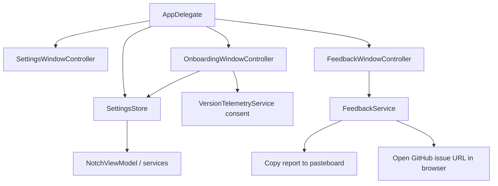

# Settings, Onboarding and Feedback

## Роль подсистем

Эти поверхности находятся вне notch panel, но используют тот же shared state и privacy contracts.

## SettingsStore

`SettingsStore` — process-level persisted configuration. Он хранит hotkey, activation mode/delay, panel size/display scope, module ordering/enabled state, clipboard policy, external-device opt-in, low-battery choices и Menu Bar configuration.

Portable `ImpulsSettingsSnapshot` сознательно уже полного local state: device ordering/hidden keys и selected physical-device key живут отдельно и не входят в backup.

## Onboarding

`OnboardingEligibility` чисто решает `full / whatsNew / none`:

- fresh install без settings/legacy completion → full tour;
- existing install с новой version → What's New;
- уже просмотренная current version → none.

Закрытие окна считается явным dismissal, чтобы tour не становился ловушкой на каждом launch.

Full flow: welcome → features → Menu Bar → quick actions → permissions → privacy → ready. Feature cards берутся из `AppFeatureCatalog`, то есть onboarding не должен рекламировать несуществующий module.

### What's New content

Заголовок и текст What's New берутся из `WhatsNewCatalog.content(forVersion:)`, вызываемого с реальным `Bundle.main.shortVersion` — не из захардкоженной строки в `OnboardingFlow`. До 1.4.14 заголовок и описание были буквально вписаны в `OnboardingFlow.whatsNew`, поэтому апгрейд на 1.4.12/1.4.13 продолжал показывать заметки 1.4.11. Каталог хранит bullet-список изменений по каждой версии; версия без записи получает generic fallback с настоящим номером версии, а не текст соседней версии. Добавление new entry для будущего релиза — единственное, что должно понадобиться в `WhatsNewCatalog.swift`.

## Telemetry offer

Version-statistics offer встроен как отдельный choice. Unknown consent может быть предложен, allowed/denied не переопрашиваются бесконечно. `Not now` не превращается скрыто в allow.

## Feedback

`FeedbackService` не является network owner. Он:

1. нормализует bounded summary/details (120 / 4000 chars);
2. опционально добавляет только app version, macOS version и CPU architecture;
3. формирует Markdown report;
4. кладёт report в pasteboard с internal marker;
5. открывает строго `https://github.com/TumanovNV/impuls/issues/new` в default browser.

Clipboard contents, notes, filenames/paths, calendar, device identifiers и logs автоматически не добавляются. Если prefilled URL превысил 7000 chars, report остаётся скопированным, а URL открывается без body.

## Source map

- `Sources/Impuls/Settings/SettingsStore.swift`
- `Sources/Impuls/Settings/SettingsWindow.swift`
- `Sources/Impuls/UI/OnboardingFlow.swift`
- `Sources/Impuls/Services/WhatsNewCatalog.swift`
- `Sources/Impuls/Services/AppFeatureCatalog.swift`
- `Sources/Impuls/Services/FeedbackService.swift`
- `Sources/Impuls/Settings/FeedbackWindow.swift`

## Инварианты

- onboarding never invents product features;
- What's New content always matches the running `Bundle.main.shortVersion`; a version with no curated entry gets a generic version-accurate fallback, never a previous version's copy;
- update install must not replay full first-run tour;
- portable settings exclude local physical-device identity;
- feedback does not perform HTTP request itself;
- diagnostics remain minimal and optional.
