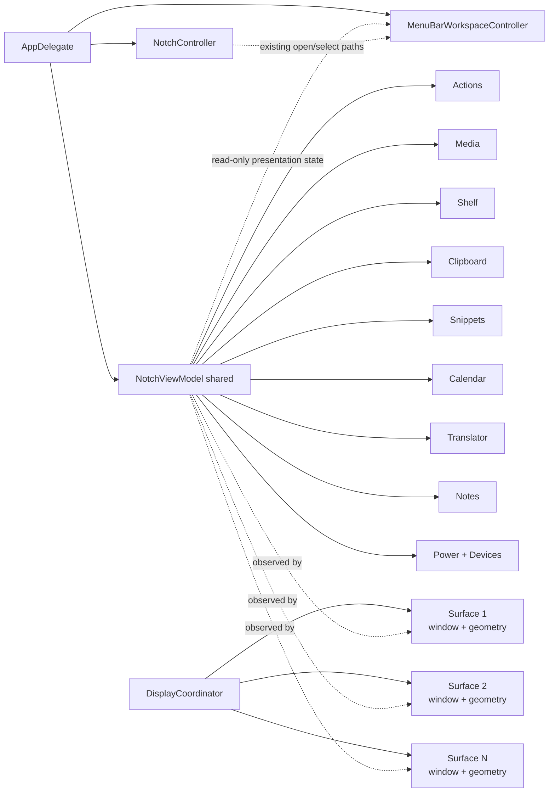

# State and Ownership

## IMP-39 review

Pinned files stay inside the Snippets ownership story rather than starting a new one. `SnippetStore` remains the single owner of the list and of `snippets.json`; the file pin adds one optional field to `Snippet`, not a second store.

`SnippetFileActions` and `SnippetFilePinInteraction` are `@MainActor` view-facing helpers. `SnippetFileActions` is stateless and takes an already-resolved URL; `SnippetFilePinInteraction` owns one row's resolved-URL cache, keyed by the reference it came from so it cannot outlive a re-select or a rename. Neither is a second source of truth — `Snippet.text` and `Snippet.file` stay the stored contract, and the cache is discarded with the row. The three seams (`FilePasteboardWriting`, `FileOpening`, `SnippetFileResolving`) exist so tests can assert on intent without writing to the real pasteboard, launching Finder or touching the filesystem; production passes the real implementations explicitly, since none of the initialisers carries a default.

## Главная модель

ИМПУЛЬС разделяет **shared application state** и **per-display / auxiliary presentation state**.

## Кто чем владеет

| Owner | Владеет | Не должен владеть |
| --- | --- | --- |
| `AppDelegate` | process-level composition/controllers and teardown order | module business state |
| `NotchController` | orchestration, active display, open/close, keyboard ownership, topology observers | отдельными копиями stores на дисплей |
| `NotchViewModel` | один набор module stores/services | `NSScreen` / display geometry |
| `DisplayCoordinator` | set of display surfaces, active surface ID | stores, timers, network, persistence |
| `NotchDisplaySurface` | window, root view, geometry, visual presentation | shared services |
| `MenuBarWorkspaceController` | one AppKit Menu Bar presentation/menu/status item over existing shared state | provider startup, networking, permission prompts, independent polling/service graph |
| `MenuBarStatusItemPresentation` | pure formatting of already-resolved logo/player/battery status content | provider selection, domain state, AppKit lifecycle |
| `AppLanguageService` | the interface-language preference `app.language.v1`, its validation, and the `AppleLanguages` override written on an explicit choice | a mirrored copy in `SettingsStore`, any attempt to switch the running process's language |
| `AppRelaunchService` | the order of a restart — start the one-shot helper, and only then terminate | the language preference itself, any path that could leave two instances running |
| `ProjectSupportPromptService` | the machine-local prompt counters `projectSupport.prompt.v1`, the eligibility thresholds and prompt state machine, plus the separate exact GitHub project-URL handoff | the decision about *when* it is a good moment, the presentation itself, any network request, any claim about whether a star or payment was completed |
| `VoluntarySupportDestination` | the immutable typed policy for the exact CloudTips and Boosty destinations | prompt state, provider selection, payment state or entitlement |
| `ProjectSupportPromptWindowController` | presenting the prompt and reporting the chosen outcome back | eligibility, thresholds, a second feedback implementation |
| module store/service | domain state | panel geometry |
| pane | presentation + user interaction | прямой filesystem/network ownership |

## Почему это критично

До multi-display разделение geometry и stores было недостаточным: перестройка экрана могла создать второй view model, а вместе с ним второй `ClipboardStore`, `PowerMonitor` и таймеры. Нынешняя архитектура делает это структурно невозможным при соблюдении ownership rules.

Menu Bar follows the same principle. It is a second **presentation surface**, not a second service graph: selecting a battery/player/status mode must read the state the application already owns rather than creating another provider, timer, permission path or network owner.

The 1.4.14 `VersionTelemetryScheduler` addition is a concrete instance of `AppDelegate`'s "teardown order" ownership above: `AppDelegate` starts it after the existing launch deferrals and stops it in `applicationWillTerminate`, but the scheduler itself owns no consent/endpoint/throttle policy — that stays inside `VersionTelemetryService`, per [Background Work & Concurrency Registry](../12-reference/background-concurrency-registry.md).

## MainActor and isolation

Большинство orchestration/UI stores являются `@MainActor`. Это не означает, что тяжёлая работа выполняется на UI thread. Дисковая запись notes/clipboard, hardware I/O и другие потенциально долгие операции выносятся на queues/async sources. Особенно важно для device layer: socket/process/device I/O не должен попадать на main actor.

`@unchecked Sendable`, explicit locks, custom actors and `nonisolated` declarations are ownership contracts, not compiler-silencing decorations. A change to one of these boundaries must answer:

- which mutable state is protected;
- who may access it concurrently;
- which operations may suspend;
- whether UI-observable publication returns to the correct actor;
- what prevents duplicate work or a main-thread stall.

These boundaries are guarded by Documentation Guardian and the Background Work & Concurrency Registry.

`ProjectSupportPromptService` is `@MainActor` because it is read and mutated from `AppDelegate` and the prompt window, both of which are main-actor bound. It protects one value, `record`, and the single `UserDefaults` key behind it, `projectSupport.prompt.v1`. That remains the only persisted project-support prompt state; eligibility, thresholds, state transitions, snooze and the lifetime cap are unchanged. Nothing suspends: reads and writes are synchronous, and the service owns no task, timer, observer or network client. Its prompt policy constants and separate GitHub project URL contract are immutable. `openProjectPageInBrowser` is the stateless Settings handoff for that GitHub URL; the instance method used by the automatic prompt records `openedGitHub` only when the browser accepted it.

Voluntary support is a separate stateless path, not an extension of that record or state machine. `VoluntarySupportDestination` owns the typed exact allow-list consisting only of the approved CloudTips and Boosty endpoints. `ProjectSupportPromptService.openVoluntarySupportPage` delegates validation to that policy and performs one system-browser handoff; it neither reads nor protects `record`. No provider choice, payment result, supporter status or entitlement exists in application state. `AppDelegate` only wires the typed Settings callback to this handoff; ownership of automatic prompt scheduling, including the existing one-shot quiet deferral, is unchanged.

Ownership of the *moment* is deliberately elsewhere. `NotchController` owns the single meaningful-use funnel and the single return-to-idle report; `AppDelegate` owns the cancellable one-shot deferral and the environment checks. The service therefore cannot decide to appear, and the controller cannot decide whether the app has earned it. Those environment checks reach exactly as far as this process: `NSApp.windows` lists Impuls's own windows and nothing else, so a macOS permission dialog owned by a system process is outside the boundary. That is a limit of the ownership model, not an oversight — `AppDelegate` cannot observe another process's surfaces — and it is why the manual contract states the TCC case as something to verify rather than something the code proves.

`AppLanguageService` is `@MainActor` for the ordinary reason — it is an `ObservableObject` a Settings pane binds to — and answers the questions above narrowly. It protects one published value, `selection`, plus the two `UserDefaults` keys described in the [Schema & Migration Registry](../12-reference/schema-migration-registry.md). Only the main actor reaches it; the pane observes the service directly rather than through `SettingsStore`, which holds it by composition and publishes no copy of its own. Nothing suspends: the service performs synchronous `UserDefaults` reads and writes and starts no task, timer or observer, so it adds no background work and cannot stall the main thread. It never mutates state on initialisation — reading the preference must not change what language the user's Mac is in — and it never changes the *running* process's language, only what the next launch will resolve.

`NativeMusicBridging` (`PlayerBridge.swift`) and `WebMusicPlaying` (`WebMusicPlayer.swift`), added in 1.4.16, are `@MainActor` protocols in front of `MediaController`'s two collaborators. This does not move an isolation boundary: `PlayerBridge`'s static functions and `WebMusicPlayer` were already reachable only from the main actor through `MediaController`, itself `@MainActor`. The protocols exist purely as a dependency-injection seam so `MediaControllerTests.swift` can drive source switch, track switch, the stale-refresh generation guard and capability propagation with `FakeNativeMusicBridging`/`FakeWebMusicPlayer` — synchronous, in-memory doubles — instead of a real Music app, Automation permission, WebKit or network. Production always resolves to `LivePlayerBridge()` and a real `WebMusicPlayer()`, both still `@MainActor`, so nothing about where this work runs changed.

## Published-state budget

**Наблюдатель не обязан перестраиваться на каждое уведомление.** `MediaController.position` публикуется 4 раза в секунду во время воспроизведения. `MenuBarWorkspaceController` подписан на `media.objectWillChange` и раньше на каждое такое уведомление пересобирал весь `NSMenu` и перечитывал иконку статуса с диска. Теперь пересборка ограничена сравнением `MenuBarMenuFingerprint` — значения, которое несёт всё, что меню показывает или включает, и намеренно не несёт `position`, потому что меню его не отображает. `menuWillOpen` пересобирает принудительно.

Та же идея в `ImpulsActionsStore`: свёрнутый корпус поиска строится один раз и сбрасывается по `objectWillChange` от clipboard/snippets/notes, а не на каждое нажатие клавиши. Подписка живёт в `NotchViewModel` и ничего не переиздаёт, поэтому не возвращает перерисовку панели на букву, которой fan-in выше специально избегает.

`MenuBarWorkspaceController` живёт всё время процесса и не разбирается `NotchController.teardown()`.

`NotchViewModel` не проксирует любое изменение любого store постоянно. Для collapsed state широкие redraws бессмысленны; часть child publishers форвардится только когда панель открыта или drop-targeted. Text-field stores наблюдаются pane'ами напрямую, иначе глобальный redraw на каждую букву способен сбить focus.

Menu Bar likewise consumes only the subset of already-published state necessary for its current presentation. It must not make a store more chatty merely because another UI surface exists.

## Keyboard ownership

Keyboard claim — отдельное состояние от выбранной вкладки. `wantsKeyboard`, `keyboardNavigationActive` и controller-level `keyboardIsClaimed` различают:

- вкладка содержит поле;
- пользователь явно открыл панель клавиатурой;
- какой display сейчас является активным владельцем keyboard surface.

Перенос активной поверхности между дисплеями не должен сам по себе создать новый keyboard claim, если его не было. Menu Bar actions reuse controller open/select paths and must not create a parallel keyboard-ownership system.

## Правило изменения

Если новая функция требует «ещё один store/provider/timer на каждый экран или presentation surface», сначала докажи, почему это presentation state, а не shared service. По умолчанию services shared, surfaces per-display/auxiliary.

Changing `@MainActor`, `@unchecked Sendable`, lock/actor ownership or process composition requires source + test + canonical documentation review in the same change set.

## Связано

- [Multi-Display Architecture](multi-display.md)
- [Application Lifecycle](application-lifecycle.md)
- [Menu Bar Workspace](../02-modules/menu-bar.md)
- [Background Work & Concurrency Registry](../12-reference/background-concurrency-registry.md)
- [ADR-002](../08-decisions/ADR-002-shared-services-per-display-presentation.md)
