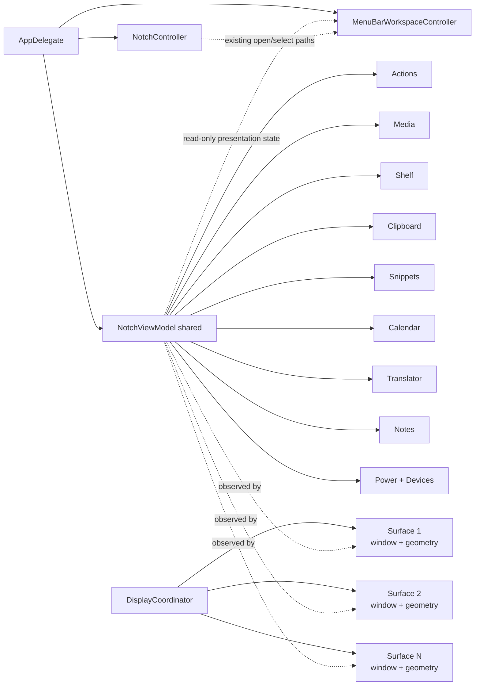

# State and Ownership

## Главная модель

ИМПУЛЬС разделяет **shared application state** и **per-display / auxiliary presentation state**.

## Кто чем владеет

| Owner | Владеет | Не должен владеть |
| --- | --- | --- |
| `AppDelegate` | process-level composition/controllers and teardown order | module business state |
| `NotchController` | orchestration, active display, open/close, keyboard ownership, topology observers | отдельными копиями stores на дисплей |
| `NotchViewModel` | один набор module stores/services | `NSScreen` / display geometry |
| `DisplayCoordinator` | set of display surfaces, active surface ID | stores, timers, network, persistence |
| `NotchDisplaySurface` | window, root view, geometry, visual presentation | shared services |
| `MenuBarWorkspaceController` | one AppKit Menu Bar presentation/menu/status item over existing shared state | provider startup, networking, permission prompts, independent polling/service graph |
| `MenuBarStatusItemPresentation` | pure formatting of already-resolved logo/player/battery status content | provider selection, domain state, AppKit lifecycle |
| module store/service | domain state | panel geometry |
| pane | presentation + user interaction | прямой filesystem/network ownership |

## Почему это критично

До multi-display разделение geometry и stores было недостаточным: перестройка экрана могла создать второй view model, а вместе с ним второй `ClipboardStore`, `PowerMonitor` и таймеры. Нынешняя архитектура делает это структурно невозможным при соблюдении ownership rules.

Menu Bar follows the same principle. It is a second **presentation surface**, not a second service graph: selecting a battery/player/status mode must read the state the application already owns rather than creating another provider, timer, permission path or network owner.

## MainActor and isolation

Большинство orchestration/UI stores являются `@MainActor`. Это не означает, что тяжёлая работа выполняется на UI thread. Дисковая запись notes/clipboard, hardware I/O и другие потенциально долгие операции выносятся на queues/async sources. Особенно важно для device layer: socket/process/device I/O не должен попадать на main actor.

`@unchecked Sendable`, explicit locks, custom actors and `nonisolated` declarations are ownership contracts, not compiler-silencing decorations. A change to one of these boundaries must answer:

- which mutable state is protected;
- who may access it concurrently;
- which operations may suspend;
- whether UI-observable publication returns to the correct actor;
- what prevents duplicate work or a main-thread stall.

These boundaries are guarded by Documentation Guardian and the Background Work & Concurrency Registry.

## Published-state budget

**Наблюдатель не обязан перестраиваться на каждое уведомление.** `MediaController.position` публикуется 4 раза в секунду во время воспроизведения. `MenuBarWorkspaceController` подписан на `media.objectWillChange` и раньше на каждое такое уведомление пересобирал весь `NSMenu` и перечитывал иконку статуса с диска. Теперь пересборка ограничена сравнением `MenuBarMenuFingerprint` — значения, которое несёт всё, что меню показывает или включает, и намеренно не несёт `position`, потому что меню его не отображает. `menuWillOpen` пересобирает принудительно.

Та же идея в `ImpulsActionsStore`: свёрнутый корпус поиска строится один раз и сбрасывается по `objectWillChange` от clipboard/snippets/notes, а не на каждое нажатие клавиши. Подписка живёт в `NotchViewModel` и ничего не переиздаёт, поэтому не возвращает перерисовку панели на букву, которой fan-in выше специально избегает.

`MenuBarWorkspaceController` живёт всё время процесса и не разбирается `NotchController.teardown()`.

`NotchViewModel` не проксирует любое изменение любого store постоянно. Для collapsed state широкие redraws бессмысленны; часть child publishers форвардится только когда панель открыта или drop-targeted. Text-field stores наблюдаются pane'ами напрямую, иначе глобальный redraw на каждую букву способен сбить focus.

Menu Bar likewise consumes only the subset of already-published state necessary for its current presentation. It must not make a store more chatty merely because another UI surface exists.

## Keyboard ownership

Keyboard claim — отдельное состояние от выбранной вкладки. `wantsKeyboard`, `keyboardNavigationActive` и controller-level `keyboardIsClaimed` различают:

- вкладка содержит поле;
- пользователь явно открыл панель клавиатурой;
- какой display сейчас является активным владельцем keyboard surface.

Перенос активной поверхности между дисплеями не должен сам по себе создать новый keyboard claim, если его не было. Menu Bar actions reuse controller open/select paths and must not create a parallel keyboard-ownership system.

## Правило изменения

Если новая функция требует «ещё один store/provider/timer на каждый экран или presentation surface», сначала докажи, почему это presentation state, а не shared service. По умолчанию services shared, surfaces per-display/auxiliary.

Changing `@MainActor`, `@unchecked Sendable`, lock/actor ownership or process composition requires source + test + canonical documentation review in the same change set.

## Связано

- [Multi-Display Architecture](multi-display.md)
- [Application Lifecycle](application-lifecycle.md)
- [Menu Bar Workspace](../02-modules/menu-bar.md)
- [Background Work & Concurrency Registry](../12-reference/background-concurrency-registry.md)
- [ADR-002](../08-decisions/ADR-002-shared-services-per-display-presentation.md)
