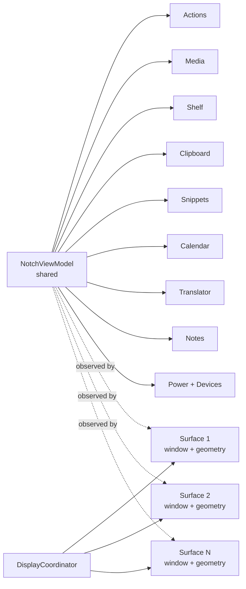

# State and Ownership

## Главная модель

ИМПУЛЬС разделяет **shared application state** и **per-display presentation state**.

## Кто чем владеет

| Owner | Владеет | Не должен владеть |
| --- | --- | --- |
| `AppDelegate` | process-level controllers | module business state |
| `NotchController` | orchestration, active display, open/close, keyboard ownership, topology observers | отдельными копиями stores на дисплей |
| `NotchViewModel` | один набор module stores/services | `NSScreen` / display geometry |
| `DisplayCoordinator` | set of display surfaces, active surface ID | stores, timers, network, persistence |
| `NotchDisplaySurface` | window, root view, geometry, visual presentation | shared services |
| module store/service | domain state | panel geometry |
| pane | presentation + user interaction | прямой filesystem/network ownership |

## Почему это критично

До multi-display разделение geometry и stores было недостаточным: перестройка экрана могла создать второй view model, а вместе с ним второй `ClipboardStore`, `PowerMonitor` и таймеры. Нынешняя архитектура делает это структурно невозможным при соблюдении ownership rules.

## MainActor

Большинство orchestration/UI stores являются `@MainActor`. Это не означает, что тяжёлая работа выполняется на UI thread. Дисковая запись notes/clipboard, hardware I/O и другие потенциально долгие операции выносятся на очереди/async sources. Особенно важно для device layer: socket I/O не должен попадать на main actor.

## Published-state budget

`NotchViewModel` не проксирует любое изменение любого store постоянно. Для collapsed state широкие redraws бессмысленны; часть child publishers форвардится только когда панель открыта или drop-targeted. Text-field stores наблюдаются pane'ами напрямую, иначе глобальный redraw на каждую букву способен сбить focus.

## Keyboard ownership

Keyboard claim — отдельное состояние от выбранной вкладки. `wantsKeyboard`, `keyboardNavigationActive` и controller-level `keyboardIsClaimed` различают:

- вкладка содержит поле;
- пользователь явно открыл панель клавиатурой;
- какой display сейчас является активным владельцем keyboard surface.

Перенос активной поверхности между дисплеями не должен сам по себе создать новый keyboard claim, если его не было.

## Правило изменения

Если новая функция требует «ещё один store на каждый экран», сначала докажи, почему это presentation state, а не shared service. По умолчанию services shared, surfaces per-display.

## Связано

- [Multi-Display Architecture](multi-display.md)
- [Application Lifecycle](application-lifecycle.md)
- [ADR-002](../08-decisions/ADR-002-shared-services-per-display-presentation.md)
