# Storage and Persistence

## Карта данных

```mermaid
flowchart TD
    UD[UserDefaults] --> SET[SettingsStore]
    UD --> SH[Shelf URL references]
    UD --> MEDIA[Selected music source]
    UD --> TR[Translation language pair]
    UD --> LANG[Interface language\napp.language.v1 + AppleLanguages]
    UD --> SUP[Project-support prompt state\nprojectSupport.prompt.v1]

    AS[Application Support / Impuls] --> NOTES[notes.json]
    AS --> SNIP[snippets.json]
    AS --> CLIP[clipboard-history.v1 encrypted]

    KC[macOS Keychain] --> CK[AES-GCM clipboard key\nThisDeviceOnly]
    KC --> VID[Version statistics random UUID\nThisDeviceOnly]
    KC --> DID[Device identity local secret / opaque keys]

    FS[User-selected files] --> SHELF[Shelf references only]
```

## StorageEnvironment

`StorageEnvironment` делает пути file-backed stores явной зависимостью `NotchViewModel`. Production использует `.live`; tests передают temporary paths. Это защищает реальные пользовательские notes/snippets от тестов.

Разрешение пути (`ApplicationSupport.file`) не создаёт директорию. Parent folder создаётся только непосредственно перед записью.

## Settings

`SettingsStore` хранит persisted preferences в UserDefaults. Export snapshot включает переносимые настройки, но **не включает local-only device keys** и selected physical device identity.

## Язык интерфейса

Выбор языка персистится отдельно от snapshot'а и в backup не попадает: он машинно-локален, потому что применяется через `AppleLanguages` в домене конкретного Mac. Владелец — `AppLanguageService`; `SettingsStore` держит его по композиции и второй копии не хранит.

Ключей два и роли у них разные. `app.language.v1` — выбор, сделанный внутри Impuls. `AppleLanguages` — системный механизм per-app языка, который пользователь мог задать и средствами самой macOS, поэтому Impuls пишет его только при явном выборе языка и удаляет только при явном возврате на «Системный» поверх собственного override. Чтение состояния не имеет побочных эффектов: отсутствующее, `system` или нераспознанное значение деградирует в памяти, ничего не записывая.

Запись сбрасывается на диск сразу при выборе языка, а не откладывается до выхода из приложения. Причина конкретная: подтверждённая смена языка завершает процесс почти сразу после записи, и следующий процесс должен прочитать уже новое значение. Это единственное место, где Impuls форсирует flush `UserDefaults`; в остальном порядок записи обычный.

Подробности и политика совместимости — в [Schema & Migration Registry](../12-reference/schema-migration-registry.md).

## Состояние project-support prompt

`ProjectSupportPromptService` хранит под `projectSupport.prompt.v1` минимум, необходимый для anti-nag политики: дату первого meaningful use, последний active day, счётчики active days и meaningful uses, время последнего засчитанного use, время последнего показа, число показов и состояние конечного автомата.

Это **счётчики, а не история**. Ни названий модулей, ни поисковых запросов, ни содержимого буфера, заметок, полки, календаря, ни имён файлов и путей, ни идентификаторов устройств здесь нет и быть не должно: решение «пора ли один раз спросить» их не требует, а собрать их означало бы превратить политику показа в журнал использования.

Данные машинно-локальные и в portable backup не входят. Причина не формальная: пороги описывают, как пользовались **этим** Mac, и восстановление бэкапа на другой машине не должно ни импортировать чужую eligibility, ни отменять уже данный ответ. Ключ поэтому живёт отдельно и не входит в `ImpulsSettingsSnapshot`.

Ничего из этого наружу не отправляется. Это не telemetry: у функции нет ни события «prompt shown», ни «star clicked», ни сервера, у которого можно было бы спросить про звезду.

Записывает это состояние только сам prompt: `ProjectSupportPromptWindowController` сообщает сервису выбранный исход, а постоянная кнопка в Settings → Feedback открывает тот же URL **stateless** и не пишет ничего. Поэтому нажатие в Settings не расходует и не возвращает автоматический показ.

Закрытие окна без выбора — тоже запись: это засчитанный отказ, а не отсутствие ответа. Иначе состояние осталось бы нетронутым и вопрос вернулся бы при первой же возможности, то есть ровно тем поведением, которого функция избегает.

Декодирование толерантное и смещено **в сторону меньшего числа показов**: отсутствующие поля берут значения свежей установки, счётчики зажимаются в `>= 0`, а нераспознанный `state` читается как `dismissedForever`, а не как разрешение спросить. Подробности — в [Schema & Migration Registry](../12-reference/schema-migration-registry.md).

## Notes

`notes.json` — внутреннее хранилище scratchpad. Запись debounce ~0.8 s на utility queue, atomic write; при shutdown используется synchronous final flush. Лимит файла 10 MiB, максимум 5 000 notes.

## Snippets

`snippets.json` намеренно user-editable. Store проверяет file signature, re-read'ит перед записью и ограничивает файл 10 MiB / 5 000 элементов. JSON pretty-printed.

## Clipboard history

`load()` различает «архива нет» и «архив есть, но открыть его не удалось». Второй исход ставит write latch в `ClipboardHistoryPersistence`: пока он активен, ни один путь записи — clipboard event, `prune`, смена retention, shutdown-`flush` — не заменяет файл, и снять латч может только успешное чтение. Восстановление и явный destructive reset описаны в [Clipboard](../02-modules/clipboard.md). Keychain service/account инжектируемы (по образцу `DeviceIdentityResolver`), чтобы тест пути записи не мог создать или удалить ключ, которым шифруется настоящий архив; значения по умолчанию не изменились.

По умолчанию persistent history выключена. При opt-in:

- archive `clipboard-history.v1`;
- JSON payload шифруется AES-GCM;
- случайный 256-bit key находится только в Keychain;
- Keychain accessibility: `AfterFirstUnlockThisDeviceOnly`;
- архив ограничен 64 MiB;
- отключение persistence удаляет archive и key.

## Shelf

Shelf не копирует исходные файлы. В UserDefaults хранятся пути до максимум 60 карточек. Если исходный файл исчез, он фильтруется при load. Результаты file tools создаются отдельно и могут быть добавлены на shelf.

## Backup

Backup schema v2 содержит:

- portable settings snapshot;
- snippets;
- notes;
- metadata schema/app version/date.

Не содержит clipboard history, encrypted keys, raw device identities, local selected-device key, состояние project-support prompt или содержимое Shelf files. Максимум backup — 10 MiB.

## Правило

Новый persisted datum должен документировать: location, schema/versioning, limit, portability, deletion semantics, privacy class и migration behavior.

## Связано

- [Data Classification](../06-security/data-classification.md)
- [Clipboard](../02-modules/clipboard.md)
- [Notes](../02-modules/notes.md)
- [Snippets](../02-modules/snippets.md)
