# Storage and Persistence

## IMP-11 review

Reviewed against `Sources/Impuls/Settings`: IMP-11 creates no UserDefaults key or backup/schema change. The selected music-source key is unchanged; Spotify metadata is runtime-only, and Automation/TCC status belongs to macOS rather than Impuls persistence.

Re-reviewed after the Automation status fix: the two additional row states (`appNotRunning`, `notInstalled`) are `@Published` runtime values recomputed on every `refresh()`. Nothing about them is written to disk, exported or backed up, so the persistence map is unchanged.

## Карта данных

```mermaid
flowchart TD
    UD[UserDefaults] --> SET[SettingsStore]
    UD --> SH[Shelf URL references]
    UD --> MEDIA[Selected music source]
    UD --> TR[Translation language pair]
    UD --> LANG[Interface language\napp.language.v1 + AppleLanguages]
    UD --> SUP[Project-support prompt state\nprojectSupport.prompt.v1]

    AS[Application Support / Impuls] --> NOTES[notes.json]
    AS --> SNIP[snippets.json]
    AS --> CLIP[clipboard-history.v1 encrypted]

    KC[macOS Keychain] --> CK[AES-GCM clipboard key\nThisDeviceOnly]
    KC --> VID[Version statistics random UUID\nThisDeviceOnly]
    KC --> DID[Device identity local secret / opaque keys]

    FS[User-selected files] --> SHELF[Shelf references only]
```

## StorageEnvironment

`StorageEnvironment` делает пути file-backed stores явной зависимостью `NotchViewModel`. Production использует `.live`; tests передают temporary paths. Это защищает реальные пользовательские notes/snippets от тестов.

Разрешение пути (`ApplicationSupport.file`) не создаёт директорию. Parent folder создаётся только непосредственно перед записью.

## Settings

`SettingsStore` хранит persisted preferences в UserDefaults. Export snapshot включает переносимые настройки, но **не включает local-only device keys** и selected physical device identity.

### Review 1.4.16 — Power Center Reliability 2.0

Notification diagnostics в `AppleDeviceSettingsPane` — presentation/TCC change, а не storage change. `Allowed / Denied / Not Requested`, переход в System Settings и тестовое уведомление ничего нового не сохраняют. Существующий ключ `appleDevices.lowBatteryAlerts.enabled` не менялся, по-прежнему machine-local и excluded from backup; состояние системного разрешения остаётся владельцем macOS Notification Center и не дублируется в UserDefaults. Новый migration или backup schema для 1.4.16 здесь не нужен.

Финальная привязка автообновления status к `NSApplication.didBecomeActiveNotification` через Combine повторно проверена после исправления импорта: publisher живёт только в процессе и также не добавляет persisted state, background storage work или новую migration obligation.

Общая вкладка Settings → Permissions теперь показывает то же live-only `notifications` state и вызывает существующий explicit `requestNotifications()` из своей кнопки `Allow`; исправлена только stale copy и wiring, никакого нового UserDefaults-ключа или backup-поля это не добавляет.

### Review 1.4.16 — version-statistics diagnostics

`VersionTelemetryService.diagnostics()` — read-only local presentation, а не storage change сама по себе. Единственное реальное изменение — новый UserDefaults-ключ `versionStatistics.lastSuccess.v1` (см. [Schema & Migration Registry](../12-reference/schema-migration-registry.md)); он local-only, excluded from export/backup, как и остальные ключи этой группы, и не требует миграции. Diagnostics ничего не пишет — только читает существующие ключи под тем же `lock`, которым уже владеет `sendHeartbeatIfNeeded`.

### Review 1.4.16 — UI consistency pass (#97)

Изменения в `Sources/Impuls/Settings/SettingsWindow.swift` — один doc comment, фиксирующий, что окно намеренно не использует `Theme` (реальный `NSWindow`/`Form`, а не ещё один рендер панели). Ни одного persisted key, migration или export/backup поля это не касается; вся правка — комментарий над существующим `SettingsView`.

### Review 1.4.16 — iPhone/iPad Battery reliability

`DeviceProviderStatus.deviceLocked` и honest-messaging правки в `AppleDeviceSettingsPane`/`PowerPane` — presentation/in-memory state, никакого нового persisted key. `DevicePowerCenter.lastGoodDevices`/`statuses` остаются process-local runtime state, как и раньше; ничего из этого не сериализуется в UserDefaults/backup. Никакой schema/migration impact.

### Review 1.4.16 — iPhone/iPad Battery Beta → Stable (#103/#106)

Снятие маркировки Beta — **presentation/product-status change**. `AppleDevicePresentation.isBeta(_:)` теперь возвращает `false` для всех kinds, и из `AppleDeviceSettingsPane` убран поясняющий Beta-раздел. Больше ничего в этой области не изменилось.

Storage-контракт не затронут: новых persisted keys нет, backup schema и состав экспорта прежние, device identity и pairing material по-прежнему не сериализуются и не попадают в backup, `AppleDeviceIdentity` остаётся тем же непрозрачным boundary, а machine-local ключи этой группы (включая selected-device key) остаются excluded from backup. Ни один Beta-флаг никогда не персистился — это была строка в UI, а не состояние на диске, поэтому migration тут нечего мигрировать.

Статусу Stable соответствует повторный owner hardware QA на реальных iPhone/iPad (см. [Power](../02-modules/power.md)). Технический usbmuxd/lockdown boundary при этом **не менялся**: transport, cadence (60 s active / 900 s idle), privacy/network boundary и trust model прежние. Stable описывает подтверждённое пользовательское поведение, а не переход на private Apple frameworks/API — протокол остаётся недокументированным и изолированным.

## Язык интерфейса

Выбор языка персистится отдельно от snapshot'а и в backup не попадает: он машинно-локален, потому что применяется через `AppleLanguages` в домене конкретного Mac. Владелец — `AppLanguageService`; `SettingsStore` держит его по композиции и второй копии не хранит.

Ключей два и роли у них разные. `app.language.v1` — выбор, сделанный внутри Impuls. `AppleLanguages` — системный механизм per-app языка, который пользователь мог задать и средствами самой macOS, поэтому Impuls пишет его только при явном выборе языка и удаляет только при явном возврате на «Системный» поверх собственного override. Чтение состояния не имеет побочных эффектов: отсутствующее, `system` или нераспознанное значение деградирует в памяти, ничего не записывая.

Запись сбрасывается на диск сразу при выборе языка, а не откладывается до выхода из приложения. Причина конкретная: подтверждённая смена языка завершает процесс почти сразу после записи, и следующий процесс должен прочитать уже новое значение. Это единственное место, где Impuls форсирует flush `UserDefaults`; в остальном порядок записи обычный.

Подробности и политика совместимости — в [Schema & Migration Registry](../12-reference/schema-migration-registry.md).

## Состояние project-support prompt

`ProjectSupportPromptService` хранит под `projectSupport.prompt.v1` минимум, необходимый для anti-nag политики: дату первого meaningful use, последний active day, счётчики active days и meaningful uses, время последнего засчитанного use, время последнего показа, число показов и состояние конечного автомата.

Это **счётчики, а не история**. Ни названий модулей, ни поисковых запросов, ни содержимого буфера, заметок, полки, календаря, ни имён файлов и путей, ни идентификаторов устройств здесь нет и быть не должно: решение «пора ли один раз спросить» их не требует, а собрать их означало бы превратить политику показа в журнал использования.

Данные машинно-локальные и в portable backup не входят. Причина не формальная: пороги описывают, как пользовались **этим** Mac, и восстановление бэкапа на другой машине не должно ни импортировать чужую eligibility, ни отменять уже данный ответ. Ключ поэтому живёт отдельно и не входит в `ImpulsSettingsSnapshot`.

Ничего из этого наружу не отправляется. Это не telemetry: у функции нет ни события «prompt shown», ни «star clicked», ни сервера, у которого можно было бы спросить про звезду.

Записывает это состояние только automatic prompt: `ProjectSupportPromptWindowController` сообщает сервису выбранный исход. Settings → Feedback теперь имеет три постоянных browser action: отдельный GitHub project action и voluntary-support actions для CloudTips и Boosty. Все три пути stateless и не изменяют `projectSupport.prompt.v1`, поэтому нажатие в Settings не расходует и не возвращает автоматический показ.

Ни один permanent voluntary-support action не сохраняет выбор provider, сумму donation, результат платежа, supporter status, entitlement, last donation или payment credentials. Новый persisted key не появился, schema `projectSupport.prompt.v1` не изменилась, а состав и версия portable backup остались прежними.

Закрытие окна без выбора — тоже запись: это засчитанный отказ, а не отсутствие ответа. Иначе состояние осталось бы нетронутым и вопрос вернулся бы при первой же возможности, то есть ровно тем поведением, которого функция избегает.

Записи-решения (показан, отказ, открыт GitHub, открыт feedback) сбрасываются на диск синхронно — как и языковое предпочтение, и по родственной причине. Обещание «максимум два показа» держится только если решение переживает процесс, а menu-bar утилиту регулярно снимают force-quit, а не закрывают штатно: при обычном `set` запись остаётся в кеше процесса и теряется. Это нашла ручная проверка `SUP-01`. Подсчёт использования сбрасывать не нужно и не следует: он происходит до раза в минуту, а потеря одного лишь замедляет накопление, то есть ошибается в сторону «спросить реже».

Декодирование толерантное и смещено **в сторону меньшего числа показов**: отсутствующие поля берут значения свежей установки, счётчики зажимаются в `>= 0`, а нераспознанный `state` читается как `dismissedForever`, а не как разрешение спросить. Подробности — в [Schema & Migration Registry](../12-reference/schema-migration-registry.md).

## Notes

`notes.json` — внутреннее хранилище scratchpad. Запись debounce ~0.8 s на utility queue, atomic write; при shutdown используется synchronous final flush. Лимит файла 10 MiB, максимум 5 000 notes.

## Snippets

`snippets.json` намеренно user-editable. Store проверяет file signature, re-read'ит перед записью и ограничивает файл 10 MiB / 5 000 элементов. JSON pretty-printed.

## Clipboard history

`load()` различает «архива нет» и «архив есть, но открыть его не удалось». Второй исход ставит write latch в `ClipboardHistoryPersistence`: пока он активен, ни один путь записи — clipboard event, `prune`, смена retention, shutdown-`flush` — не заменяет файл, и снять латч может только успешное чтение. Восстановление и явный destructive reset описаны в [Clipboard](../02-modules/clipboard.md). Keychain service/account инжектируемы (по образцу `DeviceIdentityResolver`), чтобы тест пути записи не мог создать или удалить ключ, которым шифруется настоящий архив; значения по умолчанию не изменились.

По умолчанию persistent history выключена. При opt-in:

- archive `clipboard-history.v1`;
- JSON payload шифруется AES-GCM;
- случайный 256-bit key находится только в Keychain;
- Keychain accessibility: `AfterFirstUnlockThisDeviceOnly`;
- архив ограничен 64 MiB;
- отключение persistence удаляет archive и key.

## Shelf

Shelf не копирует исходные файлы. В UserDefaults хранятся пути до максимум 60 карточек. Если исходный файл исчез, он фильтруется при load. Результаты file tools создаются отдельно и могут быть добавлены на shelf.

## Backup

Backup schema v2 содержит:

- portable settings snapshot;
- snippets;
- notes;
- metadata schema/app version/date.

Не содержит clipboard history, encrypted keys, raw device identities, local selected-device key, состояние project-support prompt или содержимое Shelf files. Максимум backup — 10 MiB.

### Review 1.4.16 — backup import/export responsiveness

Чтение, декодирование, кодирование и запись backup перенесены с main actor на `Task.detached`; `BackupService.decode(contentsOf:)` и `write(_:to:)` стали `nonisolated`. Это изменение **исполнения**, а не хранения: schema остаётся `2`, диапазон чтения `1...2`, состав документа и список исключённых данных выше не изменились, настройки `JSONEncoder` и `.atomic` write semantics прежние, имя файла по умолчанию прежнее. Дополнительно `BoundedFileReader` отказывает не-regular файлам (FIFO/устройство/сокет/каталог) до чтения: byte budget ограничивает объём, но не время ожидания. Это отказ до чтения, а не новое поле формата, поэтому нового persisted key, migration или backup-поля здесь нет.

## Правило

Новый persisted datum должен документировать: location, schema/versioning, limit, portability, deletion semantics, privacy class и migration behavior.

## Связано

- [Data Classification](../06-security/data-classification.md)
- [Clipboard](../02-modules/clipboard.md)
- [Notes](../02-modules/notes.md)
- [Snippets](../02-modules/snippets.md)
