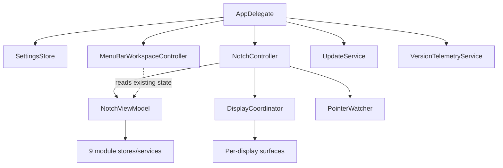
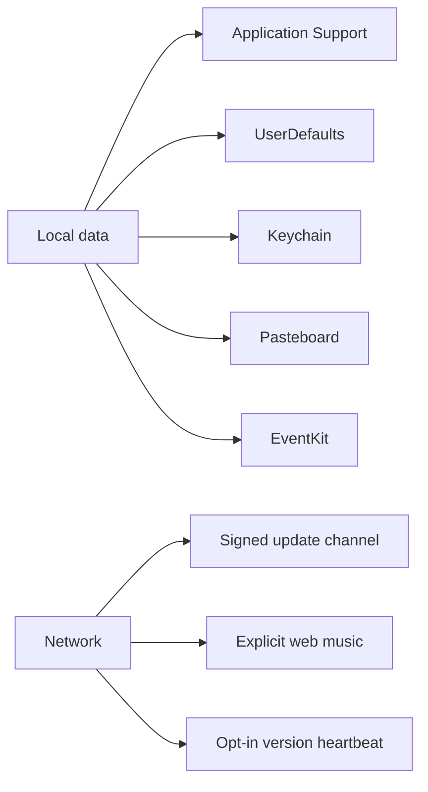
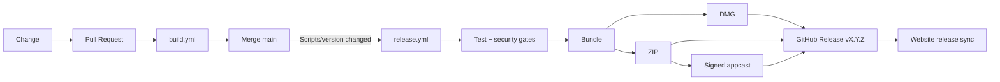
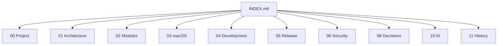

# System Diagrams

Эта страница — единая карта основных схем. Detailed diagrams живут также в соответствующих документах.

## Component map

## Data boundary map

## Release map

## Documentation map

## Правило схем

Mermaid source является source of truth. Не добавлять вручную экспортированные PNG/SVG для схем без отдельной причины: они дрейфуют от Markdown и хуже анализируются агентами.
