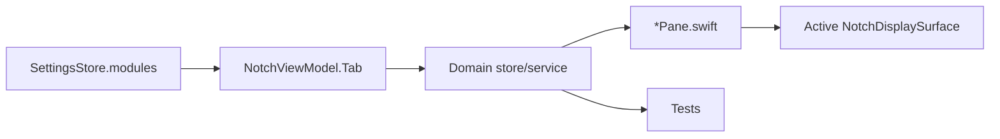

# Module Catalog

ИМПУЛЬС 1.4.11 содержит девять основных panel modules. Menu Bar workspace документируется рядом как отдельная presentation surface.

| ID | Пользовательское имя | Документ | Основной state owner |
| --- | --- | --- | --- |
| `actions` | Actions | [actions.md](actions.md) | `ImpulsActionsStore` + existing stores |
| `media` | Music | [music.md](music.md) | `MediaController` |
| `shelf` | Shelf | [shelf.md](shelf.md) | `ShelfStore` + `FileToolsCoordinator` |
| `clipboard` | Clipboard | [clipboard.md](clipboard.md) | `ClipboardStore` |
| `snippets` | Snippets | [snippets.md](snippets.md) | `SnippetStore` |
| `calendar` | Calendar | [calendar.md](calendar.md) | `CalendarStore` |
| `translate` | Translate | [translate.md](translate.md) | `Translator` |
| `notes` | Notes | [notes.md](notes.md) | `NoteStore` |
| `power` | Battery / Power | [power.md](power.md) | `PowerMonitor` + `DevicePowerCenter` |

Дополнительно: [Menu Bar Workspace](menu-bar.md).

## Общая архитектура модуля

## Общие правила

- module ID стабилен и участвует в settings/backup compatibility;
- один store/service на process, не на display;
- pane не владеет filesystem/network;
- sensitive permission не запрашивается автоматически;
- отсутствующие hardware/data values не угадываются;
- новая network boundary требует ADR/security review;
- module contract меняется вместе с этим каталогом и конкретной page.
