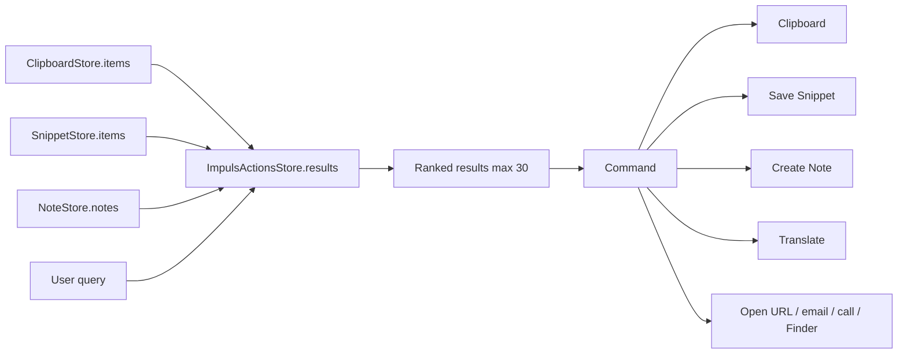

# Actions

## Назначение

Локальная command/search surface поверх данных, которыми ИМПУЛЬС уже владеет: Clipboard, Snippets и Notes. Отдельная поисковая БД не создаётся.

## Data flow

## Контракт

Query ограничен 256 characters; searchable representation ограничивается 16 KiB на value. Пустой query строит короткий recent landing set вместо сканирования всего store. Ranking учитывает source priority, pinned clipboard, exact/prefix/content matches.

## Commands

Copy; To Snippets; To Notes; Translate; Open; New Email; Call; Format JSON; Pin/Unpin clipboard; Show in Finder. Доступность зависит от content kind/origin.

## State / persistence

`ImpulsActionsStore` хранит только query и вычисляемые results. Никакой отдельной persistence/search index нет. После ухода с Actions query очищается.

## Permissions / network

Нет собственных permissions и network. External URL/file open выполняется через `NSWorkspace`. Передача текста между приложениями — pasteboard.

## UI semantics

Hover только подсвечивает строку. Selection изменяется кликом/keyboard; double click выполняет copy. CI отдельно запрещает selection-on-hover regression.

## Source map

- `Sources/Impuls/Services/ImpulsActionsStore.swift`
- `Sources/Impuls/UI/ActionsPane.swift`
- `Sources/Impuls/Model/NotchViewModel.swift`
- `Sources/Impuls/Services/ClipboardContent.swift`

## Инварианты

- не создавать вторую search DB;
- bounded search всегда сохраняется;
- hover != selection;
- command действует на явно выбранный result;
- origin identity используется для pin/copy semantics.

## Проверка изменения

Проверить ranking, content classifier, keyboard navigation, click/double-click/hover lifecycle и команды cross-module.
