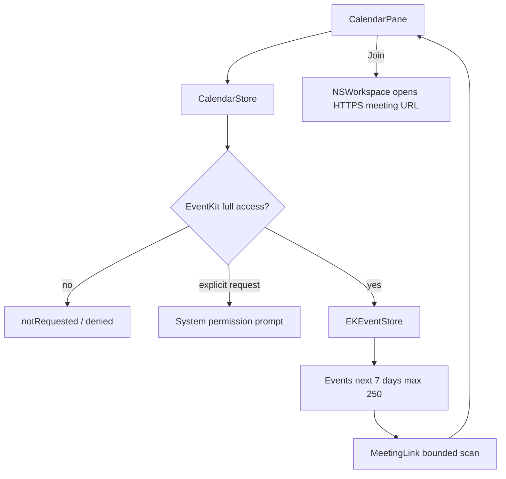

# Calendar

## Назначение

Показ ближайших non-all-day встреч и безопасной ссылки для подключения.

## Flow

## Permission lifecycle

Launch/start никогда не prompt'ит. `start` и `refreshAccess` только читают status. `requestAccess` вызывается explicit button. `EKEventStoreChanged` refresh'ит data после granted access.

## Activity/performance

30-second timer работает только пока panel active и access granted; он обновляет countdown и удаляет finished events без полного refetch. Event query horizon — 7 days, максимум 250 meetings.

## Meeting links

Scanning ограничен 32 KiB на field. Разрешены только HTTPS known provider hosts (Google Meet, Zoom, Teams, Webex, Whereby, Jitsi, Discord, Yandex Telemost). URL user/password/port запрещены.

## Persistence / network

Calendar data не сохраняется product storage и не отправляется в сеть. Join открывает URL системным браузером/app.

## Source map

- `CalendarStore.swift`
- `CalendarPane.swift`
- `PermissionCenter.swift`

## Инварианты

- no launch prompt;
- no calendar persistence;
- bounded link scan;
- allow-listed HTTPS meeting link;
- timer only while useful.
