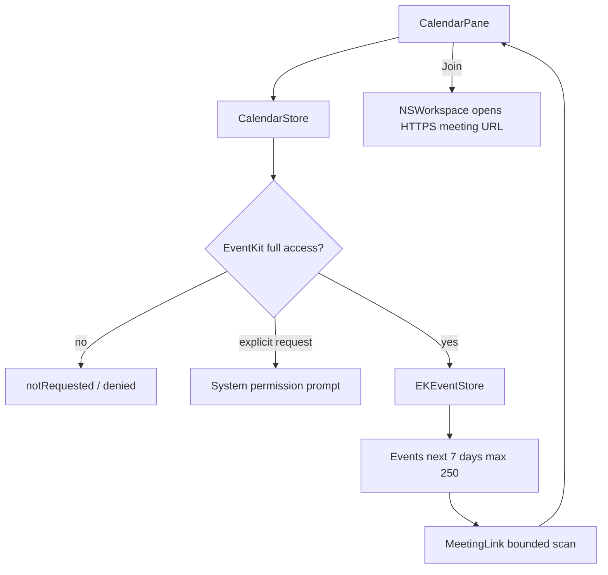

# Calendar

## Назначение

Показ ближайших non-all-day встреч и безопасной ссылки для подключения.

## Flow

## Permission lifecycle

Launch/start никогда не prompt'ит. `start` и `refreshAccess` только читают status. `requestAccess` вызывается explicit button. `EKEventStoreChanged` refresh'ит data после granted access.

## Activity/performance

30-second timer работает только пока panel active и access granted; он обновляет countdown и удаляет finished events без полного refetch. Event query horizon — 7 days, максимум 250 meetings.

## Meeting links

Scanning ограничен 32 KiB на каждом field и идёт в детерминированном порядке: `location`, затем `notes`, затем `event.url.absoluteString`; внутри field побеждает первая accepted URL в textual order. Для события остаётся один Join action, поэтому collection/deduplication не нужен.

Все URL должны быть HTTPS без user/password и explicit port. Accepted URL не normalizes, не rewrites и не logs: original URL передаётся только по explicit Join в `NSWorkspace`/system browser or app. Calendar не делает network preflight, provider verification, scraping или redirects resolution.

IMP-21 fail-closed contracts:

- Zoom: `zoom.us` или `*.zoom.us`, только `/j/<9–11 ASCII digits>`; query/fragment opaque и сохраняются.
- Google Meet: exact `meet.google.com`, только один code `/abc-defg-hij` (ASCII letters, `3-4-3`); subdomains не принимаются.
- Microsoft Teams: exact `teams.microsoft.com`, путь начинается `/l/meetup-join/` и содержит non-empty join path material; opaque path/query/fragment не decode и не rewrites.

Legacy Webex, Whereby, Jitsi, Discord, Yandex Telemost и `teams.live.com` временно сохраняют прежний host-only compatibility contract. Их provider-specific hardening отложен: в IMP-21 их support не удаляется, не расширяется и не классифицируется как новый strict contract.

## Persistence / network

Calendar data не сохраняется product storage и не отправляется в сеть. Meeting URL, event title, location и notes не log'ятся. Join открывает original accepted URL системным браузером/app только по explicit action.

## Source map

- `CalendarStore.swift`
- `CalendarPane.swift`
- `PermissionCenter.swift`

## Инварианты

- no launch prompt;
- no calendar persistence;
- bounded link scan;
- allow-listed HTTPS meeting link;
- timer only while useful.
