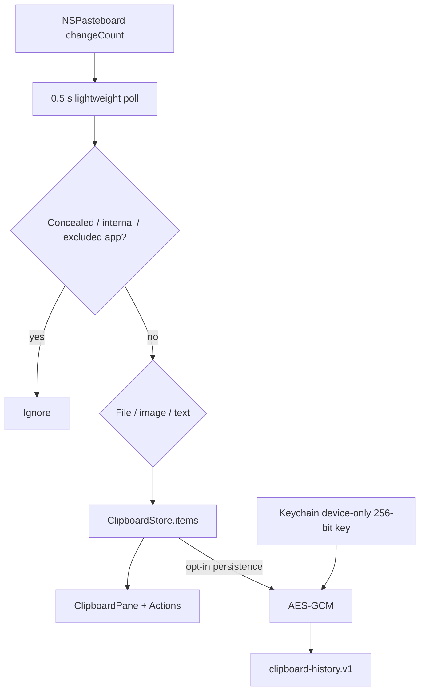

# Clipboard

## Назначение

Локальная история system pasteboard с pin, content classification, pause, exclusions и optional encrypted persistence.

## Runtime flow

## Capture rules

- cheap integer `changeCount` read until clipboard actually changes;
- concealed pasteboard type ignored;
- Impuls internal marker ignored;
- excluded source bundle IDs ignored;
- text max 512 KiB;
- image max 64 MiB;
- history max 100 entries, pinned preserved first;
- repeated payload reuses item identity and updates recency.

## Image path

Image capture может асинхронно передаваться в screenshot vault/shelf. Delayed image availability получает bounded retry вместо busy polling.

## Persistence

Off by default. Opt-in archive AES-GCM encrypted; random key только в Keychain (`AfterFirstUnlockThisDeviceOnly`). Retention: 1h/1d/7d/30d; pinned entries не удаляются по age. Выключение persistence удаляет archive и key.

**Unreadable ≠ empty.** `load()` различает «архива ещё нет» и «архив есть, но открыть его не удалось» — over budget, недоступный key, провалившаяся аутентификация AES-GCM, формат более новой сборки. Раньше все четыре исхода возвращали `[]`, и включение переключателя немедленно запечатывало пустой список поверх файла, уничтожая историю без единого следа кроме `NSLog`.

**Write latch.** Неудачное чтение переводит `ClipboardHistoryPersistence` в состояние «архив есть, но он не наш, чтобы его заменять», и в этом состоянии не пишет ничего. Латч живёт в объекте, который единственный трогает файл, и стоит в `saveImmediately` — единственной точке записи, через которую проходят и debounced `save`, и очередной `writePendingItems`, и shutdown-`flush`. Поэтому его нельзя обойти ни новым clipboard event, ни `prune`, ни сменой retention, ни выходом из приложения. Guard в `configurePersistence` этого не давал: защищён был только сам переключатель, а следующее копирование через полсекунды архив всё равно перезаписывало.

**Recovery.** Латч снимает только успешное чтение. `ClipboardStore.restoreFromArchive()` перечитывает архив в двух явных моментах, которые у него уже есть, — при конфигурировании persistence и при остановке, — и при успехе складывает восстановленные записи с накопленными за сессию через обычный `merge` (объединение по равенству payload), после чего пишет результат. Новой фоновой работы не появилось.

Пока латч активен, записи сессии остаются в памяти и видны в UI, но на диск не попадают; каждая заблокированная запись пишет в `NSLog` строку с их количеством. Если процесс завершится, не восстановив чтение, эти записи будут потеряны — сохранение существующего архива приоритетнее, чем сохранение записей, которые всё равно некуда было записать.

**Explicit destructive reset.** Единственное действие, которому разрешено пройти латч, — `delete()`, то есть выключение persistence пользователем: он просит убрать архив и ключ. Ничто автоматическое туда не приходит.

Декодирование изображений из pasteboard выполняется на отдельной serial queue; на `MainActor` остаются только чтения `NSPasteboard`. Результат отбрасывается, если `changeCount` успел смениться.

Представления берутся поэтапно: сначала PNG, и только если он оказался непригодным — объявлен, но превышает бюджет или не открывается ImageIO — читается TIFF. Читать оба сразу означало бы держать в памяти две копии крупного скриншота ради fallback, который почти никогда не выполняется.

## Privacy

Clipboard не отправляется в сеть и не входит в backup. Password-manager concealed entries не захватываются. Application exclusions позволяют исключить selected bundle IDs.

## Source map

- `ClipboardStore.swift`
- `ClipboardHistoryPersistence.swift`
- `ClipboardContent.swift`
- `ClipboardPane.swift`
- `BoundedData.swift` / `BoundedText.swift`

## Инварианты

- persistence explicit opt-in;
- encryption key never UserDefaults/archive;
- tests never touch real clipboard-history key;
- concealed/internal/excluded data ignored;
- large payloads bounded;
- no network.

## Связано

- [Storage](../01-architecture/storage-persistence.md)
- [Data Classification](../06-security/data-classification.md)
