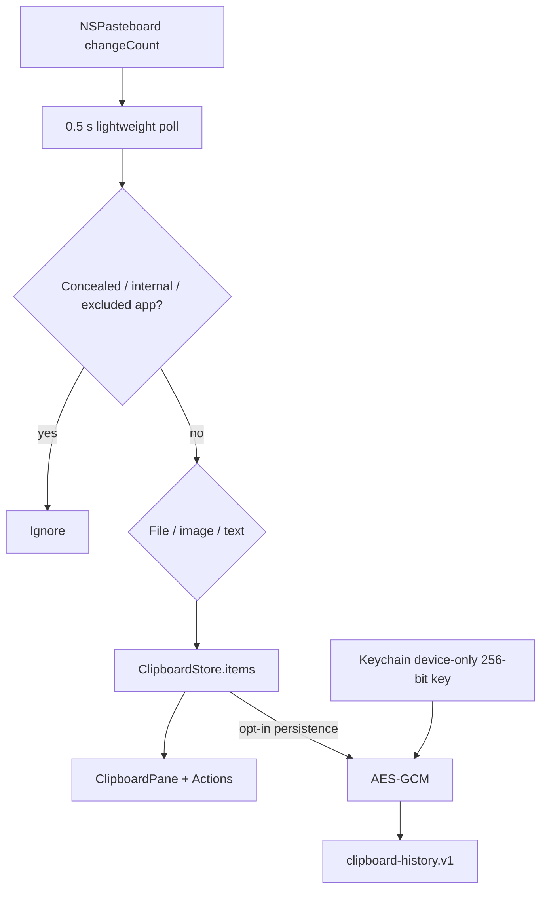

# Clipboard

## Назначение

Локальная история system pasteboard с pin, content classification, pause, exclusions и optional encrypted persistence.

## Runtime flow

## Capture rules

- cheap integer `changeCount` read until clipboard actually changes;
- concealed pasteboard type ignored;
- Impuls internal marker ignored;
- excluded source bundle IDs ignored;
- text max 512 KiB;
- image max 64 MiB;
- history max 100 entries, pinned preserved first;
- repeated payload reuses item identity and updates recency.

## Image path

Image capture может асинхронно передаваться в screenshot vault/shelf. Delayed image availability получает bounded retry вместо busy polling.

## Persistence

Off by default. Opt-in archive AES-GCM encrypted; random key только в Keychain (`AfterFirstUnlockThisDeviceOnly`). Retention: 1h/1d/7d/30d; pinned entries не удаляются по age. Выключение persistence удаляет archive и key.

## Privacy

Clipboard не отправляется в сеть и не входит в backup. Password-manager concealed entries не захватываются. Application exclusions позволяют исключить selected bundle IDs.

## Source map

- `ClipboardStore.swift`
- `ClipboardHistoryPersistence.swift`
- `ClipboardContent.swift`
- `ClipboardPane.swift`
- `BoundedData.swift` / `BoundedText.swift`

## Инварианты

- persistence explicit opt-in;
- encryption key never UserDefaults/archive;
- tests never touch real clipboard-history key;
- concealed/internal/excluded data ignored;
- large payloads bounded;
- no network.

## Связано

- [Storage](../01-architecture/storage-persistence.md)
- [Data Classification](../06-security/data-classification.md)
