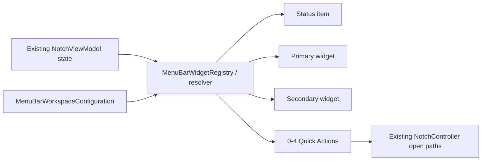

# Menu Bar Workspace

## Роль

Menu Bar — presentation client существующего state, а не десятый domain provider. Он не запускает battery provider, player, network request или polling timer ради собственного отображения.

## Flow

## Configuration

Presets: Minimal, Batteries, Music, Work, Smart, Custom. Status modes: logo, Mac battery, selected device, lowest battery, player, automatic. Widgets: none, battery variants, player, quick actions, automatic.

Max quick actions: 4. Low-battery threshold normalized 5...50. Unknown future IDs decode defensively. Duplicate primary/secondary widget suppressed.

## Persistence

Generic workspace config входит в settings snapshot/backup. Selected physical-device key хранится отдельно local-only и не переносится между Mac.

## Smart policy

Ordered priorities: low battery, active player, charging, neutral. Priority выигрывает только при наличии honest current value; resolver не придумывает data ради заполнения widget.

## Quick Actions

Intentional entrance points: open panel, screenshot folder actions и переходы к enabled modules. Они используют тот же single-surface controller path.

## Source map

- `MenuBarWorkspace.swift`
- `MenuBarWorkspaceController.swift`
- `AppFeatureCatalog.swift`
- `SettingsStore.swift`
- `OnboardingFlow.swift`

## Инварианты

- no new provider/timer/network;
- reads existing published state only;
- selected device identity local-only;
- missing values fall back predictably, never fabricated;
- quick action не создаёт второй view model/surface owner.
