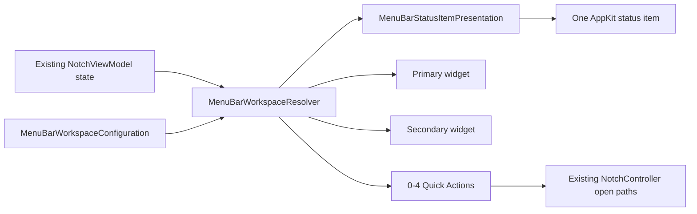

# Menu Bar Workspace

## Роль

Menu Bar — presentation client существующего state, а не десятый domain provider. Он не запускает battery provider, player, network request или polling timer ради собственного отображения.

## Flow

## Configuration

Presets: Minimal, Batteries, Music, Work, Smart, Custom. Status modes: logo, Mac battery, selected device, lowest battery, player, automatic. Widgets: none, battery variants, player, quick actions, automatic.

Max quick actions: 4. Low-battery threshold normalized 5...50. Unknown future IDs decode defensively. Duplicate primary/secondary widget suppressed.

## Status item presentation — 1.4.12

`MenuBarStatusItemPresentation` is the narrow formatting boundary between resolved workspace content and the AppKit status item. It does **not** choose a provider or fetch data; it only expresses the already-resolved local value.

For battery content:

- the status item uses native SF Symbols, never the Impuls logo as the battery glyph;
- percentage text remains normal system Menu Bar text rather than being recoloured with the battery level;
- charging uses native `bolt.fill` only when the state is actually `.charging`;
- `.charged`, `.pluggedNotCharging`, `.discharging` and unknown states do not invent a charging bolt;
- battery symbol buckets are `0`, `25`, `50`, `75`, `100%` according to the reported percentage;
- semantic level roles are green for 60–100%, orange for 20–59%, red for 0–19%; unknown percentage has no level colour role.

The deterministic threshold/symbol/bolt contract is covered by `MenuBarStatusItemPresentationTests.swift`. The release-specific light/dark + Retina visual acceptance is recorded independently as Behavioral QA `UI-06` in the 1.4.12 Release QA Evidence.

## Persistence

Generic workspace config входит в settings snapshot/backup. Selected physical-device key хранится отдельно local-only и не переносится между Mac.

## Smart policy

Ordered priorities: low battery, active player, charging, neutral. Priority выигрывает only при наличии honest current value; resolver не придумывает data ради заполнения widget.

## Quick Actions

Intentional entrance points: open panel, screenshot folder actions и переходы к enabled modules. Они используют тот же single-surface controller path.

## Source / verification map

- `Sources/Impuls/Services/MenuBarWorkspace.swift` — configuration, state and resolver policy;
- `Sources/Impuls/App/MenuBarStatusItemPresentation.swift` — status-item formatting and battery presentation;
- `Sources/Impuls/App/MenuBarWorkspaceController.swift` — AppKit presentation/controller glue over existing state;
- `Sources/Impuls/Services/AppFeatureCatalog.swift` — shipped quick-action/module catalogue;
- `Sources/Impuls/Settings/SettingsStore.swift` — persisted generic workspace config + local-only selected device preference;
- `Tests/ImpulsTests/MenuBarWorkspaceTests.swift` — resolver/configuration/persistence behavior;
- `Tests/ImpulsTests/MenuBarStatusItemPresentationTests.swift` — battery glyph, percentage and charging presentation contract.

## Инварианты

- no new provider/timer/network;
- reads existing published state only;
- one status item presentation path for This Mac and compatible selected Apple devices;
- selected device identity local-only;
- missing values fall back predictably, never fabricated;
- percentage text stays semantically separate from battery level colour;
- quick action не создаёт второй view model/surface owner.
