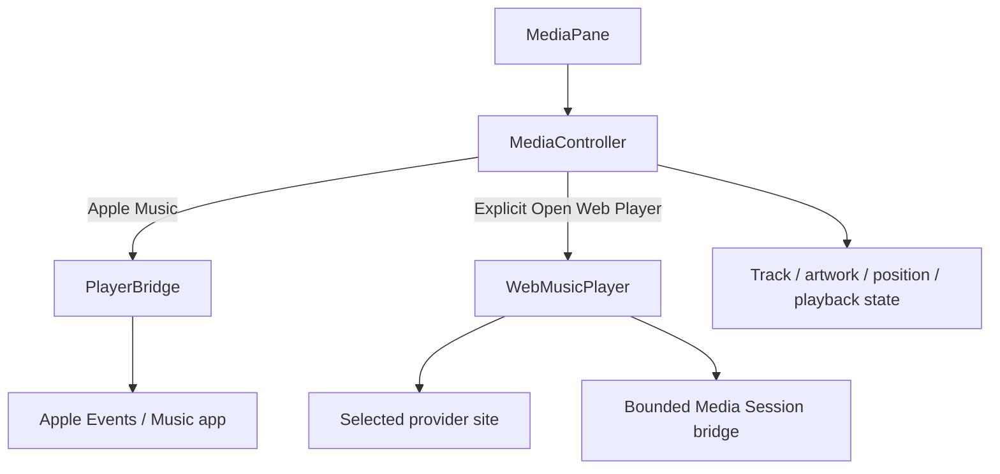

# Music

## Назначение

Управление **явно выбранным** источником музыки без угадывания «какой из запущенных плееров главный».

Поддерживаются Apple Music, Яндекс Музыка, VK Музыка и YouTube Music. Spotify намеренно отсутствует: WebKit не обеспечивает Widevine playback для его web player.

## Architecture

## Source selection

Source сохраняется в UserDefaults (`music.selectedSource.v1`). Выбор web source **не создаёт WebKit**. Только `openSelectedSource()` создаёт/показывает `WebMusicPlayer` и разрешает request.

## Apple Music

`PlayerBridge` получает state через scripting interface/public Automation path и distributed player notifications. Active pane имеет bounded 1 s native refresh; duplicate refreshes coalesced.

Permission: Apple Events Automation. Status check не prompt'ит; пользователь сам инициирует request.

## Web players

Main-frame navigation ограничена provider allow-list; sign-in hosts включены явно. Subframes разрешают безопасные web schemes, но bridge inject'ится только main frame. Unrelated main-frame links не становятся частью Impuls browser boundary.

## Network

Это один из трёх разрешённых network owners: `WebMusicPlayer.swift`. Network возникает только после явного `Open Web Player`.

## State / persistence

Track/artwork/play state — runtime. Selected source — UserDefaults. Web session/cache управляются WebKit по своей конфигурации; module не превращает metadata в product telemetry.

## Source map

- `MediaController.swift`
- `MusicSource.swift`
- `PlayerBridge.swift`
- `WebMusicPlayer.swift`
- `MediaPane.swift`

## Инварианты

- no private `MediaRemote`;
- no process injection;
- source selection itself is offline;
- WebKit only explicit user action;
- provider navigation boundary stays allow-listed;
- artwork/data reads remain bounded.

## Связано

- [Networking](../01-architecture/networking.md)
- [Permissions](../01-architecture/permissions.md)
- `docs/audits/1.3.0-web-music-security.md`
