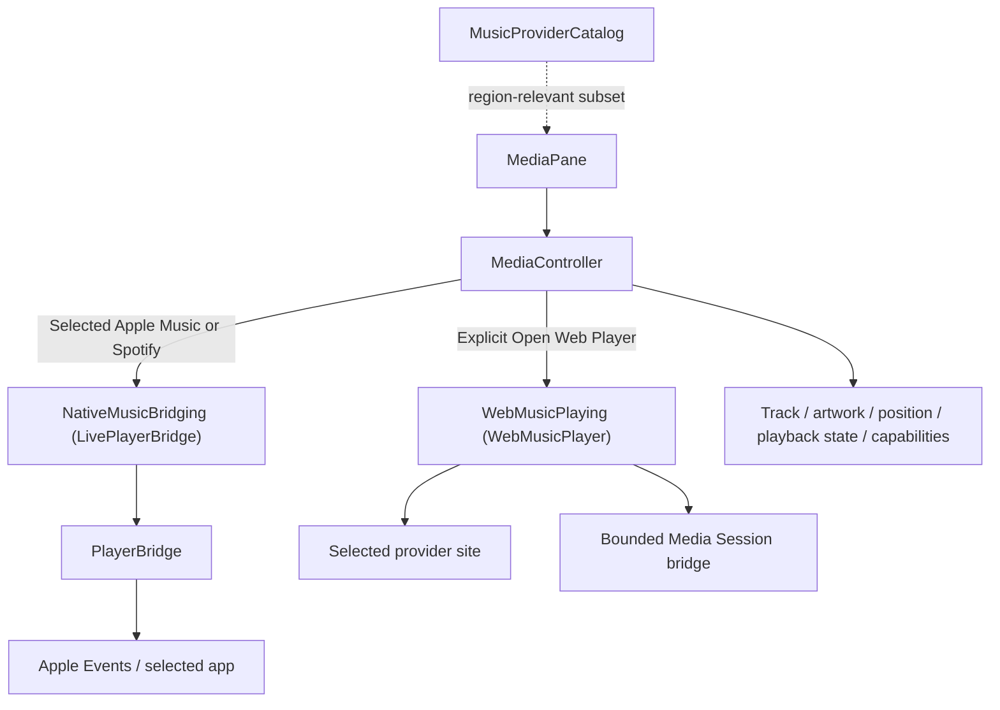

# Music

## Web content process termination (1.4.16, IMP-12 / #112)

WebKit's content process может умереть — краш или system reclaim под memory pressure, что для тяжёлого SPA обычное дело. Раньше это никем не обрабатывалось: view становился пустым, а последний adopted track оставался на экране вместе с transport-кнопками, которые молча ничего не делали. JS-pump умирал вместе с процессом, поэтому ничего само не исправлялось — помогал только явный reload.

`WebMusicPlayer.webViewWebContentProcessDidTerminate(_:)` теперь очищает состояние и сообщает об отказе:

- guard по **идентичности** web view (`current === webView`) плюс `isPopup` — поздний callback от view, которым player уже не владеет (после `teardown()`), или от popup, не может очистить живое состояние;
- `onState(source, nil)` — capabilities сбрасываются через тот же state pipeline, а не вторым независимым путём, который мог бы с ним разойтись;
- `onFailure(source, …)` — фиксированное локализованное сообщение, ничего со страницы;
- `playbackIntent += 1` — press, который был в полёте, принадлежал странице, которой больше нет.

**Automatic reload намеренно отсутствует.** Страница, упавшая один раз, склонна упасть снова, и перезагрузка из того же callback'а, который сообщает о падении, — это и есть retry storm. Восстановление идёт обычным путём: следующий явный Open/Reload пользователя, `show(source:)` находит пригодный web view, WebKit поднимает новый процесс. Никаких новых таймеров, задач или сетевых путей.

Источник в отчёте передаётся как обычно, поэтому существующий guard `selectedSource == source` в `MediaController` решает, вправе ли уже переключённый сервис что-то менять. Обе половины защищают пользователя только вместе, и обе покрыты тестами.

**Recovery.** Отказ от automatic reload имеет смысл только если следующий явный Open/Retry действительно восстанавливает плеер. После termination web view сохраняет прежний provider URL, поэтому обычная логика `show(source:)` увидела бы «тот же source, URL всё ещё allowlisted» и запросила бы snapshot у страницы, которой больше нет — пользователь остался бы в failed state даже после Retry.

Поэтому termination поднимает `needsRecoveryLoad`, а `show(source:)` принимает решение через `WebMusicPlayer.showAction(...)`:

| Ситуация | Действие |
| --- | --- |
| source изменился | `load` (recovery-флаг к новому сервису не относится) |
| recovery нужен, текущий URL — provider | `recoveryReload` — ровно одна явная навигация |
| recovery нужен, URL не provider (например локальная страница ошибки) | `load` домашней страницы |
| обычный случай, страница жива | `snapshot` |

Флаг снимается **до** навигации, поэтому recovery происходит один раз; повторный краш поднимает его снова и снова даёт пользователю Retry — это цикл ровно настолько, насколько его выбирает пользователь. Сбрасывается также при teardown и при создании нового web view. Ни таймера, ни отложенной перезагрузки, ни фоновой сетевой активности не добавлено: навигация выполняется только внутри явного пользовательского `show(source:)`.

**Actor ownership.** `WebMusicPlayer` изолирован `@MainActor` на уровне класса. Протокол `WebMusicPlaying` тоже `@MainActor`, но изоляция протокола покрывает только его requirements — не конкретное состояние объекта: `WKWebView`, window controller, таблицу popup'ов, `currentState`, `source`, `requestedArtworkKey`, `playbackIntent`, `needsRecoveryLoad`, navigation callbacks, JS evaluation и teardown. Это AppKit/WebKit state, и он обязан оставаться на main actor. `WebPlayerShowAction` рядом — чистое значение и намеренно **не** изолирован. Подробности и причина, по которой это нельзя проверить машинно, — в [Background Work & Concurrency Registry](../12-reference/background-concurrency-registry.md).

## Назначение

Управление **явно выбранным** источником музыки без угадывания «какой из запущенных плееров главный», с честным Now Playing state — источник не выдаёт непроверенную возможность за доступную.

Поддерживаются native Apple Music и Spotify, а также Яндекс Музыка, VK Музыка и YouTube Music как web providers. Spotify — только native macOS app через его поставляемый Scripting Dictionary; Spotify WEB embedding по-прежнему не поддерживается.

## Architecture

`NativeMusicBridging` and `WebMusicPlaying` are DI seams for deterministic `MediaControllerTests`. Production resolves to `LivePlayerBridge` and a real `WebMusicPlayer()`: IMP-11 changed runtime behavior by adding Spotify as a selected native provider through its shipped Scripting Dictionary, while keeping Spotify web embedding unsupported.

## Source selection

Source сохраняется в UserDefaults (`music.selectedSource.v1`). Выбор web source **не создаёт WebKit**. Только `openSelectedSource()` создаёт/показывает `WebMusicPlayer` и разрешает request.

### Regional recommendations (1.4.16)

`MusicProviderCatalog.allServices` — полный, неизменный каталог (`MusicSource.allCases`), который `MediaPane` показывает под «Все сервисы». `recommended(...)` — намеренно **не** переупорядоченный тот же список, а короткое **подмножество** конкретно под регион, иначе «Рекомендуемые» дублирует «Все сервисы» под другим заголовком (это было исправлено по review в PR #96). Единственный сигнал для выбора подмножества — `Locale.current.region` (локальный system region), без сети, без IP-geolocation, без backend-запроса. Приложенческий язык интерфейса (`appLanguage` из `Strings.swift`) используется **только** как вторичный детерминированный fallback, когда `Locale.current.region` не резолвится — никогда как замена региону и никогда как language==country допущение (см. `MusicProviderCatalogTests.swift`, включая проверку, что de/fr/es/ja/zh-Hans языки сами по себе не переключают подмножество).

Product-priority подмножества на 1.4.16 (все источники, которые не входят в подмножество, остаются доступны под «Все сервисы» — ничего не становится недостижимым, только не продвигается):

| Регион | `recommended(...)` |
| --- | --- |
| RU, BY, KZ, KG, AM, UZ, TJ | Yandex Music, VK Music, Apple Music (в этом порядке — Yandex и VK впереди, Apple Music сохранён, но не продвинут перед ними) |
| Материковый Китай (`CN` — не HK/MO/TW) | только Apple Music (YouTube Music там недоступен, поэтому не продвигается) |
| Всё остальное, включая неизвестный/неопознанный регион | Apple Music, YouTube Music |

## Native music apps

`PlayerBridge` получает state только от явно выбранного `PlayerApp` через scripting interface/public Automation path, за `NativeMusicBridging` (production: `LivePlayerBridge`). Active pane имеет bounded 1 s native refresh; duplicate refreshes coalesced. Поэтому одновременно запущенный Apple Music не может подменить Spotify state и наоборот. Изоляция держится на двух проверках, а не на одной: fetch адаптируется только если `state.app` совпадает с запрошенным app, и Apple Music notification fallback replay дополнительно требует `fallback.state.app == app` — сам fallback пишется любым native fetch, поэтому без этой проверки кэшированный Spotify state мог быть показан под Apple Music при переключении source внутри 8 s окна. Apple Music distributed notification остаётся Apple-Music-only fallback; для Spotify notification не предполагается.

Permission: Apple Events Automation per target app. Status check не prompt'ит; пользователь сам инициирует request. Apple Music и Spotify отображаются и разрешаются независимо; отсутствие Spotify — safe unavailable state без prompt.

### Stale-refresh guard (1.4.16 fix)

До этого исправления возможна была гонка: scripting-refresh для трека A ещё in-flight, когда distributed notification для более нового трека B синхронно адаптируется через `adopt(_:)`; когда fetch трека A наконец возвращался, он безусловно перезаписывал уже актуальный трек B на короткое время, до следующего self-correcting refresh. `MediaController` ведёт monotonic `stateGeneration`; `refreshFromNativeProvider()` захватывает generation перед запросом и отбрасывает завершение fetch, если generation успел сдвинуться. Apple Music notification fallback остаётся Apple-only; Spotify получает state только из своего явно выбранного scripting path.

## Capabilities (1.4.16)

`MediaController.capabilities: MediaCapabilities` (`canPlayPause` / `canNext` / `canPrevious` / `canSeek`) заменяет прежнее допущение «у всех источников доступен весь transport». Apple Music отдаёт capability `true` безусловно, как только трек загружен — scripting-мост не даёт частичной granularity. Web-источник отдаёт ровно то, что нашёл его собственный transport-route lookup (тот же, которым пользуется `command(_:)`) — до этого изменения бридж уже вычислял этот сигнал (`handlers['nexttrack']` / Media Session action handlers / DOM-fallback через `clickKnown`), но никогда не передавал его в Swift. `MediaPane` теперь `.disabled()`-гейтит Previous/Play-Pause/Next по этим полям вместо того, чтобы всегда предлагать кнопку, которая может ничего не делать. `clear(reason:)` сбрасывает capabilities к all-false — недоказанная возможность не предлагается.

## Web players

Main-frame navigation ограничена provider allow-list; sign-in hosts включены явно. Subframes разрешают безопасные web schemes, но bridge inject'ится только main frame. Unrelated main-frame links не становятся частью Impuls browser boundary.

## Время жизни web-плеера

`MediaController.stop()` вызывает `WebMusicPlayer.teardown()`. До 1.4.12-hardening этого пути не существовало: `deactivate()` только убирал окно, и внедрённый мост продолжал раз в секунду отправлять состояние со свёрнутой панелью, переживая `NotchController.teardown()`. Это была единственная фоновая работа приложения без owner'а остановки.

`teardown()` идемпотентен, не создаёт `WKWebView` и не грузит URL, и оставляет объект пригодным к повторному открытию.

## Network

Это один из трёх разрешённых network owners: `WebMusicPlayer.swift`. Network возникает только после явного `Open Web Player`. 1.4.16 не меняет это в принципе: конструирование `MediaController`, выбор источника и чтение regional recommendations остаются полностью локальными (`MediaControllerTests.testConstructionAndSourceSelectionNeverBuildAWebPlayer`).

## State / persistence

Track/artwork/play state — runtime. Selected source — UserDefaults. Web session/cache управляются WebKit по своей конфигурации; module не превращает metadata в product telemetry. Spotify metadata и Automation/TCC state не персистятся Impuls: TCC принадлежит macOS. Capabilities и regional recommendation order — тоже чисто runtime/local, ничего нового не персистится и не логируется.

## Spotify native contract (IMP-11)

Spotify native macOS app is queried only through its shipped Scripting Dictionary and public Apple Events. `PlayerBridge` queries the selected app only — no `allCases` scan and no “currently playing app wins” rule. If Spotify is not installed, `nativeNotInstalled` is shown, no Automation check/prompt occurs, and no dead Open action is offered. Each native empty state is a whole sentence owned by its provider rather than one `%@` template — Russian inflects the predicate for the subject's gender (Apple Music feminine, Spotify masculine), so a shared template is necessarily wrong for one of them.

The internal wire contract remains milliseconds. On observed Spotify 1.2.98.301, track duration arrives as milliseconds (`140046` means `140.046 s`), while player position arrives as seconds; the provider script converts position to wire milliseconds. There is no magnitude heuristic.

Two properties of the generated scripts are load-bearing rather than stylistic. They hold for **both** native providers — Apple Music and Spotify — and both are asserted in `PlayerBridgeTests`:

- **Every number is coerced `as integer` before it reaches the wire** — `set trackDurationMilliseconds to (duration of currentSpotifyTrack) as integer` and `set positionMilliseconds to ((player position) * 1000) as integer`. AppleScript renders a `real` using the *user's* locale, so on a ru_RU system an uncoerced position serializes as `2,776499938965E+4`, which `Double(String)` rejects and the state is lost. Integers carry no decimal separator, so the wire is locale-independent by construction. Verified on ru_RU against Spotify 1.2.98.301: `paused␁Lush Life␁Zara Larsson␁So Good␁200646␁4544␁`.
- **Script variables use explicit, spelled-out names** (`playerStateText`, `currentSpotifyTrack` / `currentMusicTrack`, `trackDurationMilliseconds`, `positionMilliseconds`). Two-letter identifiers are not free: `st`, `nd`, `rd` and `th` are AppleScript's reserved ordinal-suffix tokens, and `set st to …` fails to compile with `-2741 Expected expression but found "st"`.

  This was not hypothetical. Until the 1.4.16 audit the **Apple Music** script opened with `set st to player state as text`, so `NSAppleScript` returned nil with `-2741` on every call and the scripting read never worked. Apple Music still showed a track only because the `com.apple.Music.playerInfo` distributed notification fed `notificationFallback`; once that 8-second window lapsed the pane fell to `nativeUnreadable` with dead transport. Both scripts now use explicit identifiers.

### Both scripts are compiled by the test suite

`String.contains` cannot tell valid AppleScript from invalid AppleScript, and the negative assertion for this exact pattern had been written against the Spotify script — the one branch that never carried the bug. `PlayerBridgeTests` now compiles each generated script through `NSAppleScript.compileAndReturnError`.

Compilation is safe to assert in a unit test: it resolves the target's terminology from the application bundle. It does not launch the target, send an Apple Event, require an Automation grant or touch playback — only `executeAndReturnError` would, and it is never called there. The Apple Music check is skipped when Apple Music is absent and the Spotify check when Spotify is absent, so CI never depends on a third-party app; a structural assertion that needs no installed app guards the reserved identifiers themselves.

Apple Music duration and position both arrive as `real` **seconds** and are multiplied by 1000; Spotify duration already arrives in milliseconds and only its position is converted. Both wires are integer milliseconds, and the Swift parser divides by 1000.

Spotify artwork is absent in 1.4.16 by construction: the provider script never asks for `artwork url` — it emits the artwork field as an empty string — and `PlayerBridge.artwork(for:)` returns `nil` for any state whose app is not `.music`. The pane falls back to the source glyph. There is no artwork network path and no new network owner.

## Provider compatibility audit (1.4.16)

Issue #95 запросил desk-research аудит кандидатов, а не задачу «добавить максимум сервисов». Ни один кандидат не прошёл весь gate (реальный вход, реальное воспроизведение без неподдерживаемого DRM, метаданные через стабильный публичный surface / Media Session, а не через fragile DOM-scraping, контролы без хрупкого DOM-clicking, никакого архитектурного rewrite `WebMusicPlayer`) на уровне, достаточном для honest GREEN без учётной записи/региона/подписки, которых у аудита не было — поэтому 1.4.16 сознательно не добавляет новых источников:

- **Spotify WEB** — remains unsupported: Spotify Web Playback requires Widevine-decrypted audio, which WKWebView does not implement on macOS. This does not apply to the supported native Spotify macOS app path: it uses only the app-shipped Scripting Dictionary and public Apple Events/TCC. The scripting interface is not assumed to be permanent; if a future Spotify release lacks it, Impuls fails gracefully. No private framework, injection, Accessibility-scraping or Widevine workaround is used.
- **Zvuk, Amazon Music, Deezer** — YELLOW/UNKNOWN: plausible web-player candidates in principle, but without a live account/subscription in-session they could not be proven to clear the full gate (real sign-in, real audio, non-fragile metadata). Deferred rather than shipped on a guess.
- **LINE MUSIC, QQ Music, NetEase Cloud Music, KuGou Music, Kuwo Music** — UNKNOWN: region/account-gated services the audit had no way to verify live; deferred rather than silently promoted to GREEN.

None of these were ruled RED on principle — they are candidates for a future, properly account-verified pass (1.4.17+), not permanently rejected.

## Source map

- `MediaController.swift`
- `MusicSource.swift`
- `MusicProviderCatalog.swift`
- `PlayerBridge.swift` (includes `NativeMusicBridging` / `LivePlayerBridge`)
- `WebMusicPlayer.swift` (includes `WebMusicPlaying`)
- `MediaPane.swift`

## Инварианты

- no private `MediaRemote`;
- no process injection;
- source selection itself is offline;
- WebKit only explicit user action;
- provider navigation boundary stays allow-listed;
- artwork/data reads remain bounded;
- regional recommendation subset uses only local system region (+ deterministic app-language fallback), never IP/network/telemetry; every source it omits stays reachable under All Services;
- capabilities are reported honestly per source, never assumed uniform across providers.

## Связано

- [Networking](../01-architecture/networking.md)
- [Permissions](../01-architecture/permissions.md)
- `docs/audits/1.3.0-web-music-security.md`
