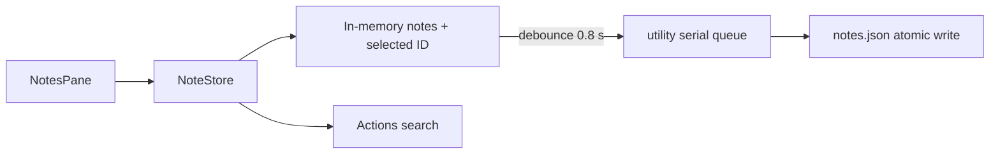

# Notes

## Назначение

Быстрый scratchpad, а не полноценная notes application: короткие временные мысли без folders/formatting.

## Flow

## Behavior

New note создаётся мгновенно и выбирается. Order не reshuffle'ится на каждое редактирование. При уходе с tab пустые notes удаляются. Selected ID живёт в store, чтобы выбор переживал unmount pane.

## Persistence

`~/Library/Application Support/Impuls/notes.json`. Max 10 MiB / 5 000 notes. Запись debounce на utility queue; `flush()` async, `flushSynchronously()` на shutdown гарантирует final durability.

## Backup

Notes входят в portable backup schema v2. File path itself не экспортируется.

## Permissions / network

Нет permission/network.

## Source map

- `NoteStore.swift`
- `NotesPane.swift`
- `StorageEnvironment.swift`

## Инварианты

- tests only injected temporary storage;
- atomic bounded persistence;
- final shutdown flush;
- blank note cleanup on leave;
- no feature creep в полноценный document editor без отдельного product decision.
