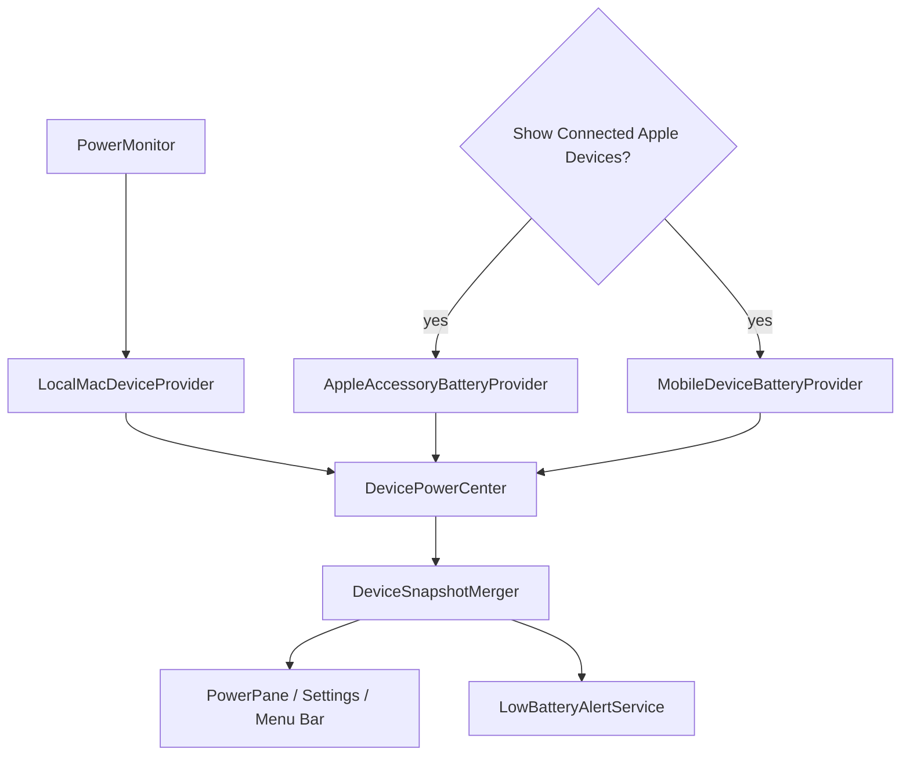

# Power / Battery

## Назначение

На portable Mac пользователь видит Battery; на desktop Mac — Power. Local Mac data дополняется opt-in Apple device center.

## Architecture

## Power Center presentation (1.4.14)

`PowerPane` — master-detail Device Navigator: вертикальный список устройств слева, detail card справа, вместо прежнего горизонтального переключателя-и-карточки. Desktop-ветка никогда не выдумывает процент: у Mac mini в навигаторе и в detail card нет battery percentage, только AC source/adapter. Severity coloring (`warning <= 20%`, `critical <= 10%`) зеркалит `LowBatteryAlertEngine.Policy`, так что устройство, готовое дать alert, уже так выглядит в списке. Merge/refresh/provider contracts ниже не изменились.

## Local Mac

`PowerMonitor` остаётся отдельным established path. `LocalMacDeviceProvider` адаптирует его в unified device model. Не переписывать local power path ради external devices.

## External device privacy boundary

Module switch и external-device switch различны. External providers стартуют только когда Power module enabled **и** пользователь включил `Show Connected Apple Devices`. Production `MobileDeviceBatteryProvider.featureEnabled` default = true; hidden product gate отсутствует. iPhone/iPad support имеет статус Stable с 1.4.16 после повторного owner hardware QA. Сам transport по-прежнему использует undocumented Apple protocol и потому остаётся изолированным implementation boundary; Stable здесь означает подтверждённое пользовательское поведение, а не превращение протокола в public API.

## Providers

- local Mac: public IOPowerSources + bounded IORegistry supplement для доступных значений;
- accessories: IORegistry + best-effort fixed-argument `system_profiler` source;
- iPhone/iPad: local usbmuxd/lockdown transport over USB or Wi-Fi sync, existing trust required.

`IORegistryAccessoryMapper` (1.4.14) распознаёт Bluetooth Magic Keyboard/Magic Mouse/Magic Trackpad и по USB-IF vendor ID `0x05AC`, и по Bluetooth SIG Apple vendor ID `0x004C` — `AppleDeviceManagementHIDEventService` репортит эти аксессуары под `0x004C`, что раньше приводило к тихой потере записи на реальном Mac mini, хотя Control Center видел заряд корректно. Пустой `Product` string на этих устройствах закрывается небольшой hardware-confirmed таблицей Bluetooth ProductID, а registry-флаг `Built-In` теперь приоритетнее эвристики по transport string, когда он присутствует.

### Third-party Bluetooth accessories (1.4.16, #108)

Apple vendorship больше **не является условием показа**. Показывается то, для чего система сама отдаёт battery percentage.

Раньше `SystemProfilerAccessoryParser.device(named:)` начинался с `guard isApple(properties)`, то есть стороннее устройство отбрасывалось **до** того, как вообще проверялось наличие батареи. Это и был дефект: наушники, у которых macOS читает заряд, не показывались из-за производителя.

Теперь порядок обратный: обязательны `device_address` (стабильная identity) и хотя бы один валидный `device_batteryLevel*`. Нет показания — нет карточки, независимо от вендора.

Vendor ID при этом сохраняет одну роль — он решает, **как устройство называется**:

- Apple vendor (`0x004C`) → прежняя классификация по product name; AirPods и Magic-аксессуары не затронуты, включая fallback `.unknown` = «Apple Device»;
- не-Apple → generic kind строго из `device_minorType` (`Headset`/`Headphones` → `.headphones`, `Keyboard`, `Mouse`, `Trackpad`, иначе `.accessory`). Product name **не** используется для классификации: сторонний девайс волен назвать себя «AirPods Pro Max Ultra», и это не доказательство бренда.

Generic kinds (`.headphones`, `.keyboard`, `.mouse`, `.trackpad`, `.accessory`) — vendor-neutral: реальное user-visible имя устройства плюс класс, который заявила сама система. Бренд/модель не угадываются.

`externalPower` остаётся `.unknown` для всех аксессуаров любого вендора: этот источник не сообщает charging state ни для кого. Новых источников, сканирования, сетевых запросов и изменения cadence нет — это тот же single `system_profiler` read.

**Что осталось недоступным.** Bluetooth-устройство, для которого `SPBluetoothDataType` не публикует battery field, показать нельзя. Единственное место в системе, где такое значение встречается, — anonymous accessory power source в `pmset -g accps`; он идёт через `IOPSCopyPowerSourcesByType`/`kIOPSAccessoryType`, которых нет в public SDK headers, и не содержит ни имени, ни стабильной identity. Привязать этот процент к конкретному Bluetooth-устройству без догадки невозможно, поэтому Impuls этого не делает. См. `13-qa/behavioral-qa-matrix.md` PWR-13.

### pmset battery overlay для Bluetooth-аксессуаров (1.4.16, #108 follow-up)

**Что это.** Третий accessory-источник, строго overlay. `system_profiler` остаётся **единственным** источником identity подключённых Bluetooth-устройств; `pmset` поставляет только число.

**Почему.** Реальный сторонний headset, который macOS сама показывает как 80%, не публикует battery field в `SPBluetoothDataType`, не имеет battery property нигде в IORegistry и отсутствует в public `IOPSCopyPowerSourcesList`. Значение доходит до macOS через `IOPSCopyPowerSourcesByType`/`kIOPSAccessoryType`, которых нет ни в одном public SDK header — поэтому Impuls их **не вызывает**, а запускает shipped-бинарь, который это делает.

**Честный статус источника.** `/usr/bin/pmset` — публичный системный CLI по фиксированному пути, никаких private symbols Impuls не вызывает. Но `-g accps` и `-xml` не описаны в `man pmset`: это **undocumented compatibility surface**, и обращение с ним соответствующее — любой отказ (нет бинаря, non-zero exit, timeout, не-plist, изменившаяся схема) даёт **пустой overlay**, то есть теряется дополнительное значение батареи и ничего больше. Power продолжает работать, остальные источники не затронуты, выдуманных значений не появляется.

**Correlation rule — строго one-to-one, fail closed.** Два источника не имеют общего идентификатора: accessory UUID из `pmset` — не Bluetooth address и вообще не встречается в выводе `system_profiler` (проверено). Единственная связка — user-visible name, а имя доказательство слабое: пользователь его меняет и уникальность не гарантирована. Поэтому overlay применяется, только когда одновременно:

1. запись `pmset` — Bluetooth accessory (`Transport Type == Bluetooth`, `Type == Accessory Source`);
2. нормализованные имена совпадают (регистр и пробелы — шум, ничего больше);
3. классы совместимы по семейству (`Headset`/`Headphones` → headphones, и т.д.);
4. **ровно один** кандидат и **ровно одна** запись с этим именем.

Иначе overlay не применяется. Два устройства с одним именем дисквалифицируют **оба**: доказательств, какое из них чьё, нет, а выбрать одно — это догадка.

Никогда не используются для сопоставления: сам процент, порядок записей, время появления, «подключён только один аксессуар», похожесть имени, попытка связать accessory UUID с Bluetooth address.

**Identity.** После overlay сохраняется существующая address-derived `AppleDeviceIdentity` из `system_profiler`. Accessory UUID из `pmset` **не читается парсером вообще** — его нет в модели, поэтому он не может быть сохранён, залогирован или показан, а его стабильность при reconnect не является зависимостью. Миграция существующих device preferences не требуется.

**Charging.** Берётся из `Is Charging`, когда источник его сообщает. `Is Charged` не считается доказательством внешнего питания: полная батарея — не кабель. Отсутствующее или противоречивое → `unknown`. 100% по-прежнему не доказательство зарядки.

**Cadence.** Не менялась. `pmset` запускается **только** когда после registry и `system_profiler` остались подключённые устройства без показания — если всё уже отвечено, процесс не порождается.

**Real hardware evidence (2026-08-25).** Владелец подтвердил скриншотом System Settings → Bluetooth: заряд стороннего headset = 80%. Живой прогон production-пути на том же Mac: `system_profiler` — 0 устройств с батареей, 1 подключённое без; `pmset` — 1 Bluetooth accessory reading, 80%, `Is Charging = 0`; overlay — 1 карточка, 80%, headphones, charging `disconnected`; всего accessory cards — 1, дубликата нет. См. `13-qa/behavioral-qa-matrix.md` PWR-14.

### iPhone/iPad reliability audit (1.4.16)

Аудит existing mobile provider для issue #93. Полная протокольная история — `docs/APPLE_DEVICE_BATTERY_SUPPORT.md`; здесь фиксируется только то, что реально изменилось в 1.4.16 и итоговое решение Beta/Stable.

Transport dedup/precedence (USB предпочтителен, Network — fallback, группировка по стабильному `rawIdentifier`, а не по transient numeric `DeviceID`) уже существовал и покрыт deterministic tests — не менялся.

Найдено и исправлено два реальных defect, оба доказаны по существующему коду/его собственным комментариям, а не предположены:

1. **Locked device терял last-known reading.** `MobileDeviceClient.error(for:)` уже различал `PasswordProtected` (`.deviceLocked`) от `InvalidHostID`/`UserDeniedPairing` (`.notTrusted`), но `MobileDeviceBatteryProvider.publish(failure:)` схлопывал оба в один `DeviceProviderStatus.permissionRequired`, а `DevicePowerCenter.apply()` для этого статуса очищал `lastGoodDevices` — прямое противоречие собственному комментарию `DevicePowerCenter`: "A transient failure must not blank the list." Добавлен отдельный `DeviceProviderStatus.deviceLocked`: карточка сохраняется как Last Known (та же ветка, что и `.temporarilyFailed`), UI показывает честное "device is locked" вместо общего "unlock and tap Trust", а не выдуманную точную причину — только там, где протокол её действительно различает.
2. **Disconnect-during-read race.** `refresh()` при уже идущем чтении просто ставил `refreshPending = true` и ждал завершения текущего чтения — топология могла измениться (устройство отключилось) **до** того, как in-flight read вернул результат, и тот успевал опубликоваться как `.ready` прежде, чем следующий refresh его поправит. Новый `refreshDiscardingInFlightRead()` (topology change и wake) отменяет readTask и запускает чтение заново, вместо того чтобы просто ставить его в очередь; обычный polling-tick `refresh()` по-прежнему только ставит follow-up в очередь, не отменяя ничего. Никакого нового timer/generation token — используется уже существующий `Task.cancel()` + `Task.isCancelled` guard в `refresh()`.

Cadence не менялся (60s active / 900s idle остаются). Никакого нового network/LAN discovery, private API или изменения privacy boundary.

**Beta → Stable: Stable approved.** После stabilization #93/#94 владелец продукта многократно проверил реальные iPhone и iPad в рабочих сценариях, включая USB и уже настроенный Finder Wi-Fi Sync. Устройства стабильно появляются, показывают фактическое состояние батареи и корректно возвращаются после reconnect; correctness gaps, требующие сохранять пользовательскую маркировку Beta, в этом цикле не подтверждены. В 1.4.16 продуктовая маркировка Beta снимается. Это presentation/status change: transport, cadence, privacy/network boundary, trust model и правило «missing stays missing» не меняются. Недокументированность usbmuxd/lockdown остаётся техническим риском и продолжает явно фиксироваться в архитектуре и research-документации.

## Числа из системных словарей

IOKit и usbmuxd отдают `CFNumber` той ширины, которую выбрал драйвер или устройство. Все читатели используют один `RegistryNumber`: отклонить не-`NSNumber`, отклонить `CFBoolean`, отклонить не-finite, округлить, преобразовать через failable инициализатор. Преобразование тотальное — `Int(someDouble)` вне диапазона `Int` это trap, а не переполнение.

Своего верхнего предела helper не несёт намеренно: что считать правдоподобным процентом или ёмкостью, решает домен (`AppleDeviceNormalizer` ограничивает процент диапазоном `0...100`, `PowerSnapshot` проверяет пару ёмкостей перед делением). Скрытый предел на этом уровне молча отбрасывал бы значения, которые владелец домена считает корректными.

## Honest missing data

Missing value остаётся missing: нет fabricated 0%, guessed charging state или guessed connector. Last-good external reading может временно оставаться с freshness timestamp после transient failure; alerts используют более строгий current-ready set.

## Refresh lifecycle

`DevicePowerCenter` координирует providers и `DeviceRefreshScheduler`. Opening panel даёт immediate foreground refresh внешним providers. Heavy device I/O не выполняется на main actor.

`AppleAccessoryBatteryProvider` регистрируется на IOKit-уведомления о появлении и исчезновении аксессуаров. Контекстом callback'а служит retained `AccessoryNotificationContext`, который держит provider **слабо**, а не сам provider: IOKit хранит указатель всё время жизни регистрации и не может узнать, что provider освобождён. Teardown сначала инвалидирует box — с этого момента уже поставленный в очередь callback читает `nil` и ничего не делает, — затем освобождает iterators и port, и лишь потом освобождает сам box на main-очереди, куда доставляются уведомления. Порядок здесь и есть гарантия; IOKit собственной не даёт.

## Low battery alerts

Opt-in. Persisted setting не prompt'ит notifications самостоятельно. Alerts оценивают только sufficiently fresh/current provider data.

### Delivery reliability contract (1.4.16)

`LowBatteryAlertEngine` различает **pending** и **confirmed** state:

- пересечение порога сначала создаёт process-local `deliveryID`; оно блокирует duplicate async sends, но не записывает `warningFired` / `criticalFired` на диск;
- `LowBatteryAlertService` пересекает единственную системную границу через `UNUserNotificationCenter.add`;
- только после того, как Notification Center принял request без ошибки, service вызывает `confirmDelivery`, и соответствующее fired-state становится durable;
- ошибка доставки вызывает `cancelDelivery`: тот же sufficiently fresh low reading может повториться на следующей **обычной** provider evaluation. Отдельного retry timer, tighter cadence или busy loop для этого нет;
- если компонент успел подняться выше re-arm threshold, pending token инвалидируется. Позднее завершение старой async delivery не должно закреплять уже завершившийся low-battery cycle;
- critical alert по-прежнему имеет приоритет над warning в одном цикле устройства. Успешный critical commit также закрывает lower-priority warning state, которое он заместил;
- pending state намеренно не переживает process death. Если процесс завершился до подтверждения системной доставки, безопасная ошибка — повторить предупреждение после следующего запуска, а не считать недоставленное уведомление показанным.

`UNUserNotificationCenter.add` подтверждает принятие request системой, но не доказывает, что пользователь физически увидел banner. Поэтому Behavioral QA отдельно проверяет реальный Notification Center/TCC path; unit tests владеют retry, dedup, persistence и precedence state machine.

Между тем моментом, когда `deliver()` бросает ошибку, и моментом, когда `LowBatteryAlertService` возвращается на `@MainActor`, чтобы вызвать `cancelDelivery`, есть реальный actor hop (`delivery` не MainActor-изолирован); `Task { @MainActor ... }` теперь явный, а не выведенный, потому что `Package.swift` собирает этот target в Swift 5 language mode, где implicit-isolation inheritance для unstructured `Task {}` не гарантирован. Deterministic tests не гадают число `Task.yield()`: `testDeliveryFailureRetriesAtSameReadingAndOnlySuccessPersists` повторно вызывает тот же production `evaluate()` в bounded poll до тех пор, пока retry не пройдёт, что и есть реальный retry-путь — следующая обычная provider evaluation, а не отдельный таймер.

## Identity

Raw UDID/serial/Bluetooth/pairing material не выходит в UI/logs/backup. `AppleDeviceIdentity` создаёт opaque local identity boundary.

## Source map

- `PowerMonitor.swift`, `PowerSnapshot.swift`
- `DevicePowerCenter.swift`, `DeviceBatteryProviding.swift`
- `LocalMacDeviceProvider.swift`
- `AppleAccessoryBatteryProvider.swift`
- `MobileDeviceBatteryProvider.swift`
- `AppleDeviceIdentity.swift`
- `DeviceSnapshotMerger.swift`, `DeviceRefreshScheduler.swift`
- `LowBatteryAlertEngine.swift`, `LowBatteryAlertService.swift`
- `PowerPane.swift`

## Инварианты

- `.power` internal module ID не менять;
- no private Apple frameworks;
- external discovery explicit opt-in;
- raw identifiers never UI/log/feedback/backup;
- I/O off main actor;
- missing stays missing;
- mobile provider failure не ломает local/accessory providers;
- failed Notification Center delivery never becomes persisted fired-state;
- retry uses the existing provider lifecycle rather than a new background loop;
- a locked-but-trusted device keeps its last-known reading rather than being dropped;
- a topology/wake refresh discards an in-flight read instead of letting it publish after the device set has changed.

## Связано

- [ADR-004](../08-decisions/ADR-004-local-only-device-identity.md)
- `docs/APPLE_DEVICE_BATTERY_SUPPORT.md`
- `docs/QA_APPLE_DEVICES_1.4.6.md`
