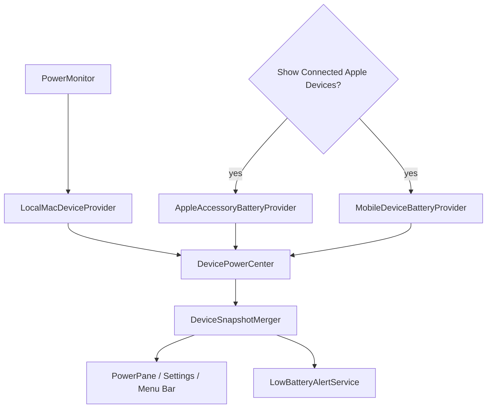

# Power / Battery

## Назначение

На portable Mac пользователь видит Battery; на desktop Mac — Power. Local Mac data дополняется opt-in Apple device center.

## Architecture

## Local Mac

`PowerMonitor` остаётся отдельным established path. `LocalMacDeviceProvider` адаптирует его в unified device model. Не переписывать local power path ради external devices.

## External device privacy boundary

Module switch и external-device switch различны. External providers стартуют только когда Power module enabled **и** пользователь включил `Show Connected Apple Devices`. Production `MobileDeviceBatteryProvider.featureEnabled` default = true; hidden product gate отсутствует. iPhone/iPad support остаётся Beta/undocumented-protocol risk.

## Providers

- local Mac: public IOPowerSources + bounded IORegistry supplement для доступных значений;
- accessories: IORegistry + best-effort fixed-argument `system_profiler` source;
- iPhone/iPad: local usbmuxd/lockdown transport over USB or Wi-Fi sync, existing trust required.

## Числа из системных словарей

IOKit и usbmuxd отдают `CFNumber` той ширины, которую выбрал драйвер или устройство. Все читатели используют один `RegistryNumber`: отклонить не-`NSNumber`, отклонить `CFBoolean`, отклонить не-finite, округлить, преобразовать через failable инициализатор. Преобразование тотальное — `Int(someDouble)` вне диапазона `Int` это trap, а не переполнение.

Своего верхнего предела helper не несёт намеренно: что считать правдоподобным процентом или ёмкостью, решает домен (`AppleDeviceNormalizer` ограничивает процент диапазоном `0...100`, `PowerSnapshot` проверяет пару ёмкостей перед делением). Скрытый предел на этом уровне молча отбрасывал бы значения, которые владелец домена считает корректными.

## Honest missing data

Missing value остаётся missing: нет fabricated 0%, guessed charging state или guessed connector. Last-good external reading может временно оставаться с freshness timestamp после transient failure; alerts используют более строгий current-ready set.

## Refresh lifecycle

`DevicePowerCenter` координирует providers и `DeviceRefreshScheduler`. Opening panel даёт immediate foreground refresh внешним providers. Heavy device I/O не выполняется на main actor.

`AppleAccessoryBatteryProvider` регистрируется на IOKit-уведомления о появлении и исчезновении аксессуаров. Контекстом callback'а служит retained `AccessoryNotificationContext`, который держит provider **слабо**, а не сам provider: IOKit хранит указатель всё время жизни регистрации и не может узнать, что provider освобождён. Teardown сначала инвалидирует box — с этого момента уже поставленный в очередь callback читает `nil` и ничего не делает, — затем освобождает iterators и port, и лишь потом освобождает сам box на main-очереди, куда доставляются уведомления. Порядок здесь и есть гарантия; IOKit собственной не даёт.

## Low battery alerts

Opt-in. Persisted setting не prompt'ит notifications самостоятельно. Alerts оценивают только sufficiently fresh/current provider data.

## Identity

Raw UDID/serial/Bluetooth/pairing material не выходит в UI/logs/backup. `AppleDeviceIdentity` создаёт opaque local identity boundary.

## Source map

- `PowerMonitor.swift`, `PowerSnapshot.swift`
- `DevicePowerCenter.swift`, `DeviceBatteryProviding.swift`
- `LocalMacDeviceProvider.swift`
- `AppleAccessoryBatteryProvider.swift`
- `MobileDeviceBatteryProvider.swift`
- `AppleDeviceIdentity.swift`
- `DeviceSnapshotMerger.swift`, `DeviceRefreshScheduler.swift`
- `LowBatteryAlertEngine.swift`, `LowBatteryAlertService.swift`
- `PowerPane.swift`

## Инварианты

- `.power` internal module ID не менять;
- no private Apple frameworks;
- external discovery explicit opt-in;
- raw identifiers never UI/log/feedback/backup;
- I/O off main actor;
- missing stays missing;
- mobile provider failure не ломает local/accessory providers.

## Связано

- [ADR-004](../08-decisions/ADR-004-local-only-device-identity.md)
- `docs/APPLE_DEVICE_BATTERY_SUPPORT.md`
- `docs/QA_APPLE_DEVICES_1.4.6.md`
