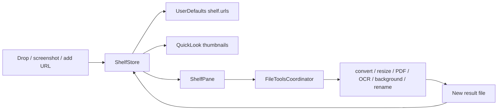

# Shelf

## Назначение

Временная полка файлов между окнами. Shelf хранит **references**, а не копии исходников.

## Data flow

## State / persistence

До 60 URL paths сохраняются в UserDefaults. Load фильтрует исчезнувшие файлы. Thumbnail runtime-only. Multi-selection хранится в memory.

## File ownership

Удаление карточки не удаляет исходный файл. File tools создают новый результат и не перезаписывают original. Undo для созданных/переименованных объектов должен проверять, что пользователь не изменил файл после операции.

## Pasteboard

`ShelfStore.copy` ставит internal marker `io.tumanov.impuls.internal`, чтобы `ClipboardStore` не записал собственную операцию как новый capture. Image data читается bounded до 64 MiB.

## Rename security

Rename запрещает path separators/escape, `.`/`..`, extension change через base-name API и overwrite существующего файла.

## Permissions / network

Нет network owner. Работа с файлами начинается с файлов, которые пользователь сам передал/создал. QuickLook/Vision/system Share/AirDrop являются локальными/system capabilities.

## Source map

- `ShelfStore.swift`
- `ShelfPane.swift`
- `ShelfDragSource.swift`
- `FileToolsCoordinator.swift`
- `FileToolsService.swift`
- `ScreenshotVault.swift`

## Инварианты

- shelf is references, not secret copies;
- originals are not overwritten by transforms;
- bounded file reads;
- direct file work stays outside SwiftUI pane;
- internal pasteboard marker prevents self-capture loops.
