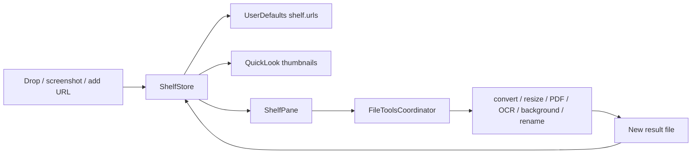

# Shelf

## Назначение

Временная полка файлов между окнами. Shelf хранит **references**, а не копии исходников.

С 1.4.16 (IMP-39) есть одно исключение из window-level drop: файл, брошенный на панель **«Заготовки»**, создаёт там file pin и на Полку не попадает. Drop именно в этот таб означает «закрепи надолго», а не «положи временно»; на остальных табах поведение прежнее. Владелец этого контракта — [Snippets](snippets.md).

## Data flow

## State / persistence

До 60 URL paths сохраняются в UserDefaults. Load фильтрует исчезнувшие файлы. Thumbnail runtime-only. Multi-selection хранится в memory.

## Cancellation of long file operations (1.4.16, IMP-15)

`FileToolsCoordinator` owns exactly one operation at a time. Начало операции занимает единственный slot (`beginOperation`), поэтому вторая операция не стартует, пока первая не завершилась. Coordinator создаётся один раз в `NotchViewModel.init` и живёт всё время процесса: запущенная пачка **переживает** закрытие/скрытие панели — это осознанный контракт, а не побочный эффект. Остановить её может только явное действие пользователя.

**Cancel является cooperative.** Convert, resize, remove background и recognize text — это один синхронный ImageIO/Vision вызов на файл, и публичного API, который безопасно прерывает такой вызов на середине, нет. Поэтому Cancel означает: *не начинать следующий item, а уже запущенный дать доработать*, чтобы он оставил после себя валидный файл, а не обрезанный. `Task.detached` не наследует cancellation, а работа внутри синхронная, поэтому используется явный флаг `FileToolsCancellation`, который читается на документированных границах.

| Операция | Где принимается Cancel | Что происходит с текущим item |
| --- | --- | --- |
| Convert batch | между items | доработает и сохранится как success |
| Resize batch | между items | доработает и сохранится как success |
| Remove Background batch | между items | доработает и сохранится как success |
| OCR / text batch | между items | доработает, но результат **не** попадёт в буфер обмена |
| Combine Images into PDF | между **страницами** | незавершённый PDF удаляется |

### Partial-result policy

- завершённые outputs остаются валидными результатами и попадают в Shelf;
- оставшиеся items не начинаются;
- source-файлы никогда не изменяются и не удаляются;
- Undo предлагается только если для **каждого** сохранённого output удалось снять `GeneratedFileRecord` — частичность пачки не повод ослаблять это правило;
- status отличает `Cancelled` от `Failed`; cancellation никогда не показывается как generic error. Иконка предупреждения появляется только когда файлы реально упали, и относится к ним, а не к самой отмене;
- если Cancel пришёл, когда в работе был **последний** item, ничего не пропущено — честный отчёт это обычное завершение, а не «Cancelled».

### Clipboard policy для OCR

Отмена text batch оставляет буфер обмена **без изменений**, даже если часть страниц уже распознана; статус говорит об этом прямо (`Cancelled · Clipboard Unchanged`).

Сгенерированный файл аддитивен: он новый, валиден сам по себе, лежит рядом с источником и его можно отменить. Буфер обмена — не такой: у него один слот, поэтому запись частичного текста уничтожила бы то, что пользователь там держал, ради результата, от которого он только что отказался, и без Undo. Потерять распознанный текст — более дешёвая ошибка.

### Incomplete output cleanup

Каждая image-операция пишет в уникальный URL рядом с источником и сама удаляет свой частичный результат, если запись бросила исключение. Поэтому единственный артефакт, который может остаться **неполным**, — это PDF: `CGDataConsumer(url:)` создаёт файл до первой страницы. Отмена между страницами закрывает контекст и удаляет этот файл.

Undo **не** отменяем: он перемещает уже проверенный набор файлов в Корзину после полного preflight, и остановка на середине — единственный исход хуже обоих концов.

## File ownership

Удаление карточки не удаляет исходный файл. File tools создают новый результат и не перезаписывают original. Undo для созданных/переименованных объектов должен проверять, что пользователь не изменил файл после операции.

## Pasteboard

`ShelfStore.copy` ставит internal marker `io.tumanov.impuls.internal`, чтобы `ClipboardStore` не записал собственную операцию как новый capture. Image data читается bounded до 64 MiB.

## Rename security

Rename запрещает path separators/escape, `.`/`..`, extension change через base-name API и overwrite существующего файла.

## Permissions / network

Нет network owner. Работа с файлами начинается с файлов, которые пользователь сам передал/создал. QuickLook/Vision/system Share/AirDrop являются локальными/system capabilities.

## Source map

- `ShelfStore.swift`
- `ShelfPane.swift`
- `ShelfDragSource.swift`
- `FileToolsCoordinator.swift` — ownership, cancellation, status, Undo
- `FileToolsService.swift` — сами файловые операции и `FileToolsCancellation`
- `ScreenshotVault.swift`

## Инварианты

- shelf is references, not secret copies;
- originals are not overwritten by transforms;
- bounded file reads;
- direct file work stays outside SwiftUI pane;
- internal pasteboard marker prevents self-capture loops;
- one file operation at a time, cancellable only at a boundary where a valid result is guaranteed;
- cancellation is an outcome, never a generic error.
