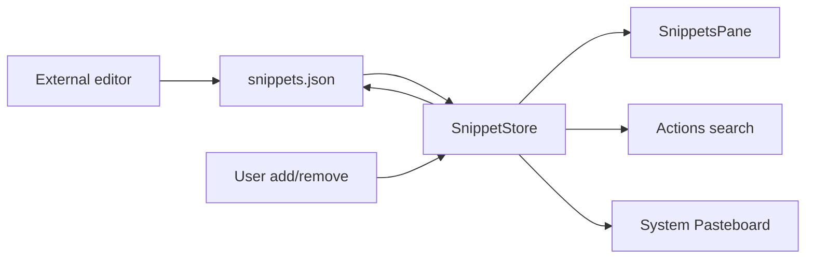

# Snippets

## Назначение

Ручной список часто используемого текста. Это не автоматическая clipboard history: попадание в Snippets всегда intentional.

## Flow

## Persistence

`~/Library/Application Support/Impuls/snippets.json`, pretty-printed user-editable JSON. Label optional. Перед записью store reload'ит file, чтобы не затереть external edits. File signature включает size/modification/resource identity.

Limits: 10 MiB, 5 000 items, query 256 chars, searchable value bounded 16 KiB.

Запись идёт через serial utility queue `io.tumanov.impuls.snippets.writer`, как у `NoteStore`. Debounce нет намеренно: snippet меняется по осознанному действию, а не на каждое нажатие клавиши. `NotchViewModel.stop()` вызывает `flushSynchronously()` — durability на выходе приравнена к notes.

Пока запись в полёте, `reload()` не читает file: копия в памяти новее диска, и чтение отменило бы изменение, которое ещё летит. Retry в `reload()` действительно повторяет попытку — подмена файла редактором во время bounded read проявляется как read/decode failure, и прежний `catch` возвращался на первой же итерации, из-за чего единственный сценарий, ради которого цикл был написан, не срабатывал.

## Identity

Snippet ID compact/hash-based: label, либо text для unnamed item. Duplicate identity заменяется новой записью, что также даёт устойчивый SwiftUI list identity без hashing огромных strings при каждом diff.

## Permissions / network

Нет permission/network. Copy использует system pasteboard; именно это позволяет не требовать Accessibility permission для injection.

## Source map

- `SnippetStore.swift`
- `SnippetsPane.swift`
- `StorageEnvironment.swift`

## Инварианты

- user-editable file остаётся human-readable;
- reload before write;
- bounded file/search;
- no automatic feed from clipboard;
- no Accessibility injection.
