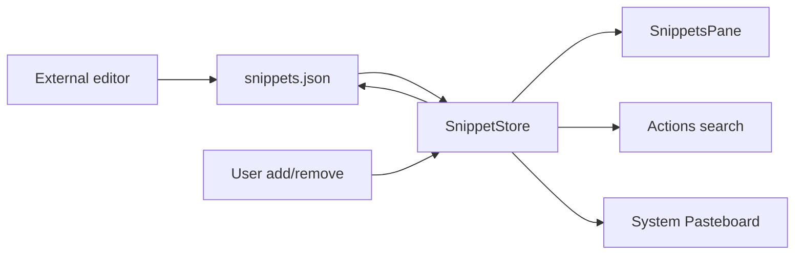

# Snippets

## Назначение

Ручной список часто используемого текста. Это не автоматическая clipboard history: попадание в Snippets всегда intentional.

## Flow

## Persistence

`~/Library/Application Support/Impuls/snippets.json`, pretty-printed user-editable JSON. Label optional. Перед записью store reload'ит file, чтобы не затереть external edits. File signature включает size/modification/resource identity.

Limits: 10 MiB, 5 000 items, query 256 chars, searchable value bounded 16 KiB.

Запись идёт через serial utility queue `io.tumanov.impuls.snippets.writer`, как у `NoteStore`. Debounce нет намеренно: snippet меняется по осознанному действию, а не на каждое нажатие клавиши. `NotchViewModel.stop()` вызывает `flushSynchronously()` — durability на выходе приравнена к notes.

Пока запись в полёте, `reload()` не читает file: копия в памяти новее диска, и чтение отменило бы изменение, которое ещё летит. Retry в `reload()` действительно повторяет попытку — подмена файла редактором во время bounded read проявляется как read/decode failure, и прежний `catch` возвращался на первой же итерации, из-за чего единственный сценарий, ради которого цикл был написан, не срабатывал.

## File pins (1.4.16, IMP-39)

Помимо текста, элементом может быть **локальный файл**. Это по-прежнему ручной список: файл попадает сюда только явным действием — кнопкой рядом с `+` или drag-and-drop в панель.

**Взаимодействие.** Одиночный клик кладёт файл в системный pasteboard как файловый объект (`writeObjects([url as NSURL])`), то есть ⌘V в Finder вставляет сам файл, а не текст пути. Двойной клик открывает файл в приложении по умолчанию через `NSWorkspace`. Различение одиночного и двойного клика делает `ClickArbiter`: одиночное действие откладывается на `NSEvent.doubleClickInterval` — системный интервал, а не константа — и отменяется, если пришёл второй клик. Поэтому двойной клик никогда не даёт copy+open и не открывает файл дважды; третий и последующие клики игнорируются. Для клавиатуры и VoiceOver те же действия есть в контекстном меню и в accessibility actions: Copy, Open, Show in Finder, Choose File Again, Delete.

**Что хранится.** Содержимое файла не читается и не сохраняется никогда. В `snippets.json` у file pin читаемый путь лежит в `text`, а необязательный `file.bookmark` — единственное, что позволяет пережить переименование и перемещение. Файл остаётся hand-editable: запись вида `{"text": "/Users/me/report.pdf", "file": {}}` валидна и резолвится по пути. Bookmark создаётся без security scope — приложение не sandboxed, и scoped bookmark обещал бы containment, которого нет.

**Разрешение ссылки.** `SnippetFileResolver` пробует bookmark, затем путь. Опции резолва — `[.withoutUI, .withoutMounting]`; `withoutMounting` здесь несущая: без неё bookmark на отключённый том пытался бы его смонтировать и мог заблокировать вызывающий поток. Если bookmark оказался stale, но разрешился, он переписывается на месте — без дубликата и без изменения порядка.

**Чего resolver не делает.** Не ищет файл. Нет recursive scan, Spotlight, поиска по имени и угадывания по inode: неразрешимая ссылка — это честное `File Unavailable`, а не догадка. У недоступного pin остаются только Choose File Again и Delete; Copy/Open/Reveal fail closed и не делают ничего. Re-select заменяет ссылку у той же строки, сохраняя её позицию; Cancel не меняет ничего.

**Границы.** Один pin — один обычный файл. Каталог, dead symlink, сокет и устройство отклоняются до создания записи. Availability проверяется лениво — при появлении строки и по действию пользователя; ни таймера, ни поллинга, ни watcher'а модуль не добавляет. File pin не попадает в Actions search: каждый его результат несёт `.text`, а копирование файла обязано класть файл, а не путь.

**Удаление.** Remove убирает только запись. На этом пути нет `FileManager.removeItem`, trash и перемещения — пользовательский файл остаётся на диске, и это закреплено регрессионным тестом.

## Identity

Snippet ID compact/hash-based: label, либо text для unnamed item. Duplicate identity заменяется новой записью, что также даёт устойчивый SwiftUI list identity без hashing огромных strings при каждом diff.

## Permissions / network

Нет permission/network. Copy использует system pasteboard; именно это позволяет не требовать Accessibility permission для injection.

## Source map

- `SnippetStore.swift`
- `SnippetFilePin.swift`
- `SnippetFileActions.swift`
- `SnippetsPane.swift`
- `StorageEnvironment.swift`

## Инварианты

- user-editable file остаётся human-readable;
- reload before write;
- bounded file/search;
- no automatic feed from clipboard;
- no Accessibility injection;
- содержимое закреплённого файла не читается и не сохраняется;
- ссылка на файл не восстанавливается поиском;
- удаление pin не трогает файл на диске.
