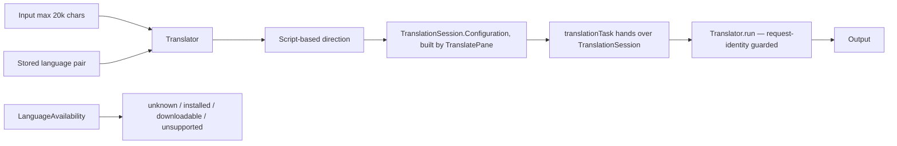

# Translate

## Назначение

Перевод текста через Apple Translation framework (`import Translation`). ИМПУЛЬС не создаёт собственный translation backend и не строит второй translator вокруг системного — этот модуль честно отражает состояние framework, а не заменяет его.

## Flow

Session ownership is unchanged from before this review: `.translationTask(configuration)` creates and owns the `TranslationSession`; `Translator` never constructs one. `TranslatePane.schedule()` debounces keystrokes (320 ms) and builds/invalidates `configuration`; `Translator.run(_:)` is called with whatever session the modifier hands over.

## Direction

Обе стороны pair всегда явные. Если scripts различимы (`TranslationScript`), направление определяется по письменности текста; иначе сохраняется stated direction и пользователь может swap вручную. Locale variants нормализуются до base language (`en-GB`/`en-US` → `en`, `pt-BR` → `pt`) — framework's own language list carries regions separately and answers "unsupported" for a regional variant it actually translates fine as the bare language.

## Readiness model (reviewed 1.4.16 — #99)

`Translator.Readiness` has four cases, not three: `unknown`, `installed`, `downloadable`, `unsupported`. Before this review, a pair whose scan had not landed yet silently defaulted to `downloadable` — a menu opened on a Mac with everything already installed showed a false download mark next to languages that needed nothing. `unknown` is presented the same as `installed` (no icon, not disabled): offering it is honest, since neither "ready" nor "impossible" is known yet, and the pane explains itself the moment the pair is actually tried.

`Readiness.init(forward:backward:)` queries `LanguageAvailability.status(from:to:)` in **both** directions and treats either one being `.installed` as the pair being installed (same for `.supported` → `downloadable`). This is not an assumption that installing one direction installs the other — it is two real, independent framework queries combined with OR, because `Translator.route(for:)` decides direction dynamically per keystroke from the text's script, so "is this pair usable" genuinely means "is at least one direction ready." Apple's own documentation states `LanguageAvailability.Status.installed` means the framework "has it downloaded and ready" for that specific pairing; no documented guarantee of directional symmetry was found, so the code deliberately queries both rather than inferring one from the other.

## Assets and missing packs

`LanguageAvailability` определяет installed/supported pair, queried before every translation. ИМПУЛЬС **намеренно не вызывает** `TranslationSession.prepareTranslation()` — it blocks on a system download prompt that has nowhere to appear over a borderless, non-activating panel, so it would hang forever. This decision was re-audited for 1.4.16 and left unchanged: no new evidence of a safe explicit-user-action path was found. Instead:

- before translating, `Translator.run(_:)` checks `LanguageAvailability.status(from:to:)`; anything short of `.installed` sets `needsDownload`/`failure` instead of calling `session.translate(_:)`;
- `session.translate(_:)` can still throw `TranslationError.notInstalled` on macOS 26+ if a pack disappears between that check and the call — handled the same way as the pre-check finding it missing, not as a generic failure;
- `Translator.openLanguageSettings()` sends the user to System Settings → General → Language & Region → Translation Languages (`x-apple.systempreferences:com.apple.Localization-Settings.extension?translation` — the same public URL scheme other Impuls settings navigation already uses, `?translation` is that pane's documented anchor straight to the Translation section rather than the general pane);
- reopening the Translate pane (tab switch away and back) re-scans readiness for the current pair — the one lifecycle point where the user is likely returning from installing/removing a pack, without a background poll.

## Race and lifecycle safety (reviewed 1.4.16 — #99)

`Translator.run(_:)` captures `request` (text + pair + retry-attempt counter, `Request: Equatable`) once at entry and re-checks it after every suspension point (`await LanguageAvailability().status`, `await session.translate`). Before this review only the pair identifier was re-checked — a retry, or new text typed at the *same* pair while a previous run was still in flight, was not caught by that guard, and `.translationTask`/Swift Task cancellation propagating promptly enough to prevent a stale answer from landing was never verified rather than assumed. The `Request` re-check closes that gap regardless of how promptly cancellation actually propagates.

`loadSupportedLanguages()` also gained a duplicate-scan guard: `supported.isEmpty` alone did not rule out a second concurrent scan, since the first scan leaves `supported` empty for its whole (async) duration — a rapid tab-away-and-back before it landed could start a second one. A `Task` reference now guards this the same way `availabilityTask` already guarded `refreshAvailability()`.

`session.translate(_:)` throwing is mapped explicitly rather than shown as raw `error.localizedDescription`, which would be Apple's own system-language text (not necessarily Impuls's chosen interface language): Swift `CancellationError` and `TranslationError.alreadyCancelled` (macOS 26+) never become a visible failure; `TranslationError.notInstalled` (macOS 26+) and the three `unsupportedX` cases map to the same product messages as the pre-check; anything else gets one safe, localized generic fallback.

## State / persistence

Input/output/failure/readiness — runtime only. Language pair сохраняется в UserDefaults (`translate.pair.v1`) — nothing else. Input max 20 000 chars. `TranslatorTests.testOnlyThePairIsPersistedNeverInputOrOutput` guards this directly.

## Permissions / network

Product-level network owner отсутствует. Framework queries/translation принадлежат macOS Translation subsystem, entirely on-device. Нет отдельного user-data upload API ИМПУЛЬСа. Translated/source text is never logged; diagnostic `NSLog` lines carry only language codes and framework status enum values.

## Source map

- `Translator.swift`
- `TranslationScript.swift`
- `TranslatePane.swift`

## Инварианты

- no custom translation network backend, no second translator built around the framework;
- stale session/request result (pair **or** text **or** retry attempt) never overwrites a newer one;
- `unknown` readiness is never presented as `installed` or `downloadable`;
- base-language normalization;
- input bounded;
- `prepareTranslation()` stays unused; asset installation is always an explicit user action through System Settings;
- explicit, honest failure/readiness instead of a hanging download prompt or a repeated system prompt;
- only the language pair is ever persisted.
