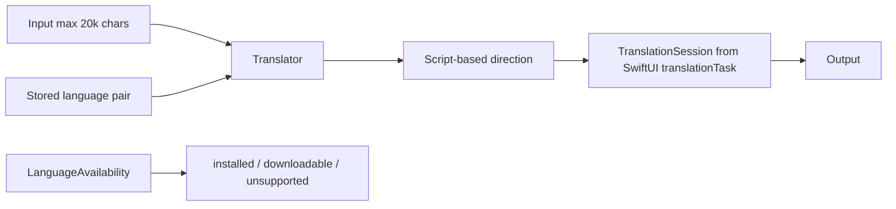

# Translate

## Назначение

Перевод текста через Apple Translation framework. ИМПУЛЬС не создаёт собственный translation backend.

## Flow

## Direction

Обе стороны pair всегда явные. Если scripts различимы, направление определяется по письменности текста; иначе сохраняется stated direction и пользователь может swap вручную. Locale variants нормализуются до base language.

## Assets

`LanguageAvailability` определяет installed/supported pair. ИМПУЛЬС не вызывает `prepareTranslation()` из borderless panel, потому что system download prompt может зависнуть вне normal activation context; вместо этого UI объясняет missing pack и ведёт пользователя в system-supported path.

## State / persistence

Input/output/failure — runtime. Language pair сохраняется в UserDefaults (`translate.pair.v1`). Input max 20 000 chars.

## Permissions / network

Product-level network owner отсутствует. Framework queries/translation принадлежат macOS Translation subsystem. Нет отдельного user-data upload API ИМПУЛЬСа.

## Source map

- `Translator.swift`
- `TranslationScript.swift`
- `TranslatePane.swift`

## Инварианты

- no custom translation network backend;
- stale session result не должен перезаписать новую pair;
- base-language normalization;
- input bounded;
- explicit failure/readiness instead of hanging download prompt.
