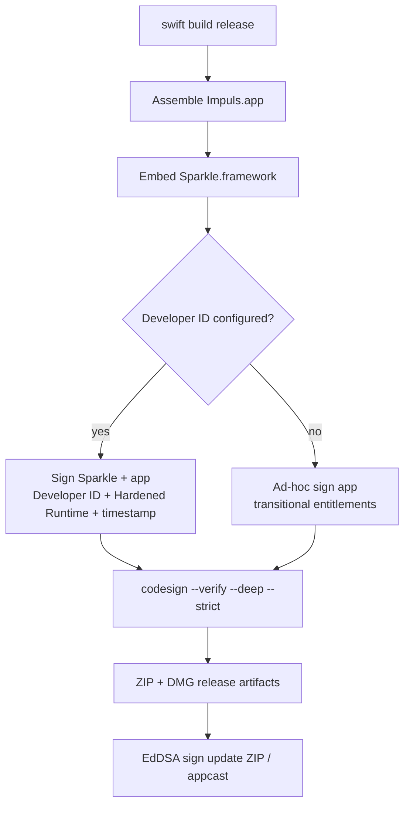

# Signing and Distribution

## Два режима сборки

`Scripts/bundle.sh` собирает `.app` без Xcode project и выбирает signing path по `IMPULS_DEVELOPER_ID_APPLICATION`.

## Developer ID path

Framework подписывается первым application identity, затем app — Developer ID Application, Hardened Runtime, timestamp и production entitlements. Этот путь не должен требовать `disable-library-validation`.

Developer ID configuration changes distribution trust only; they must not weaken the independent Sparkle archive/feed verification contract.

## Ad-hoc fallback

Если Developer ID не настроен, app подписывается ad-hoc с отдельными `Impuls.AdHoc.entitlements`. Embedded upstream Sparkle сохраняет свою подпись; для transitional ad-hoc host library validation отключена, поскольку host не имеет Team ID.

Ad-hoc fallback is an explicit distribution limitation, not a signal to disable update authenticity. The release/update path still requires the configured Sparkle EdDSA public/private key pair and signed archive/appcast metadata.

## Gatekeeper / notarization

Ad-hoc build не эквивалентен notarized Developer ID distribution. Первая установка может требовать ручного разрешения Gatekeeper, а TCC continuity между заменяемыми builds менее предсказуема. Нельзя обходить это private APIs или ослаблением update signatures.

Notarization belongs only to a Developer ID path when Apple credentials are actually configured. Documentation/tests must not imply a notarized public artifact merely because the bundle itself passes `codesign --verify`.

## Bundle identity

- bundle ID: `io.tumanov.impuls`;
- minimum macOS: 15.0;
- UI element app (`LSUIElement`);
- RU/EN resources;
- calendar + Apple Events usage descriptions;
- Sparkle public key/feed embedded in Info.plist;
- signed-feed and verify-before-extraction flags remain enabled independently of ad-hoc vs Developer ID host signing.

## Release artifact integrity

The normal release workflow verifies more than the `.app` code signature:

1. build/test the candidate;
2. create DMG and ZIP artifacts;
3. verify the expected version/release metadata;
4. generate the Sparkle appcast with the configured EdDSA key;
5. verify the appcast references the candidate version;
6. verify the ZIP signature through Sparkle `sign_update` tooling;
7. publish SHA-256 checksums together with the release artifacts.

The EdDSA private key is a CI secret and must never be committed. The public key embedded in the application must match the private signing key used by the release workflow; a mismatch is a release blocker rather than a reason to bypass verification.

## Toolchain

CI selects Xcode 26.3 because device layer uses public SDK declaration `SecIdentityCreate`; deployment target remains macOS 15. Toolchain version и runtime minimum — разные вещи.

## Trust layers

Apple code signing/notarization отвечает за macOS distribution trust. Sparkle EdDSA signature отвечает за authenticity in-app update. SHA-256 is release-artifact integrity evidence but is not a substitute for the signed Sparkle trust chain. Ни один слой не заменяет остальные.

## Canonical implementation owners

- `Scripts/bundle.sh` — app assembly, Info.plist update flags, ad-hoc/Developer ID signing path;
- `.github/workflows/release.yml` — release key validation, artifact/appcast generation and release publication;
- `Sources/Impuls/Services/UpdateService.swift` — runtime user consent and Sparkle update policy;
- `Package.swift` + `Package.resolved` — pinned Sparkle dependency contract.

## Связано

- [Update System](../05-release/update-system.md)
- [Release Pipeline](../05-release/release-pipeline.md)
- [Dependency and Supply-Chain Policy](../06-security/supply-chain.md)
- [Permissions and TCC](permissions-and-tcc.md)
