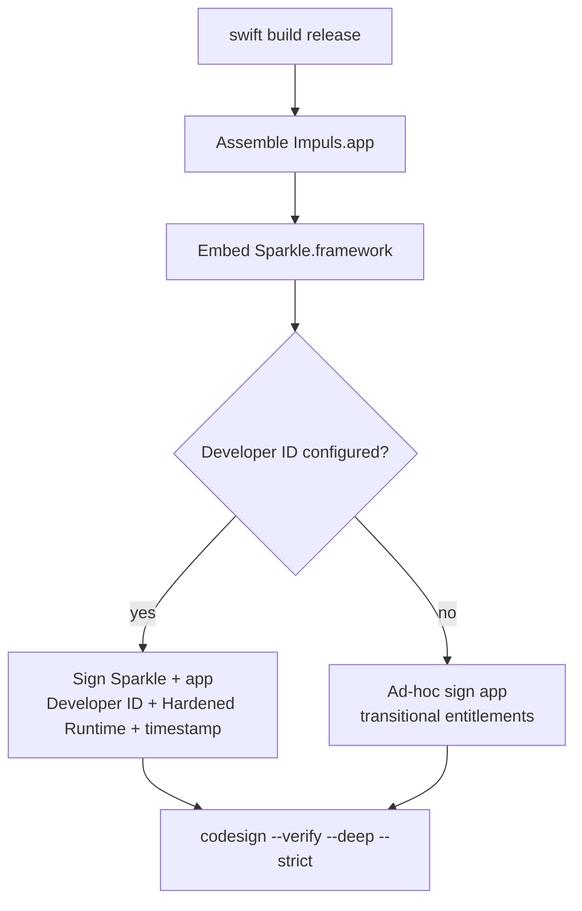

# Signing and Distribution

## Два режима сборки

`Scripts/bundle.sh` собирает `.app` без Xcode project и выбирает signing path по `IMPULS_DEVELOPER_ID_APPLICATION`.

## Developer ID path

Framework подписывается первым application identity, затем app — Developer ID Application, Hardened Runtime, timestamp и production entitlements. Этот путь не должен требовать `disable-library-validation`.

## Ad-hoc fallback

Если Developer ID не настроен, app подписывается ad-hoc с отдельными `Impuls.AdHoc.entitlements`. Embedded upstream Sparkle сохраняет свою подпись; для transitional ad-hoc host library validation отключена, поскольку host не имеет Team ID.

## Gatekeeper / notarization

Ad-hoc build не эквивалентен notarized Developer ID distribution. Первая установка может требовать ручного разрешения Gatekeeper, а TCC continuity между заменяемыми builds менее предсказуема. Нельзя обходить это private APIs или ослаблением update signatures.

## Bundle identity

- bundle ID: `io.tumanov.impuls`;
- minimum macOS: 15.0;
- UI element app (`LSUIElement`);
- RU/EN resources;
- calendar + Apple Events usage descriptions;
- Sparkle public key/feed embedded in Info.plist.

## Toolchain

CI selects Xcode 26.3 because device layer uses public SDK declaration `SecIdentityCreate`; deployment target remains macOS 15. Toolchain version и runtime minimum — разные вещи.

## Trust layers

Apple code signing/notarization отвечает за macOS distribution trust. Sparkle Ed25519 signature отвечает за authenticity in-app update. Один слой не заменяет другой.

## Связано

- [Update System](../05-release/update-system.md)
- [Release Pipeline](../05-release/release-pipeline.md)
- [Permissions and TCC](permissions-and-tcc.md)
