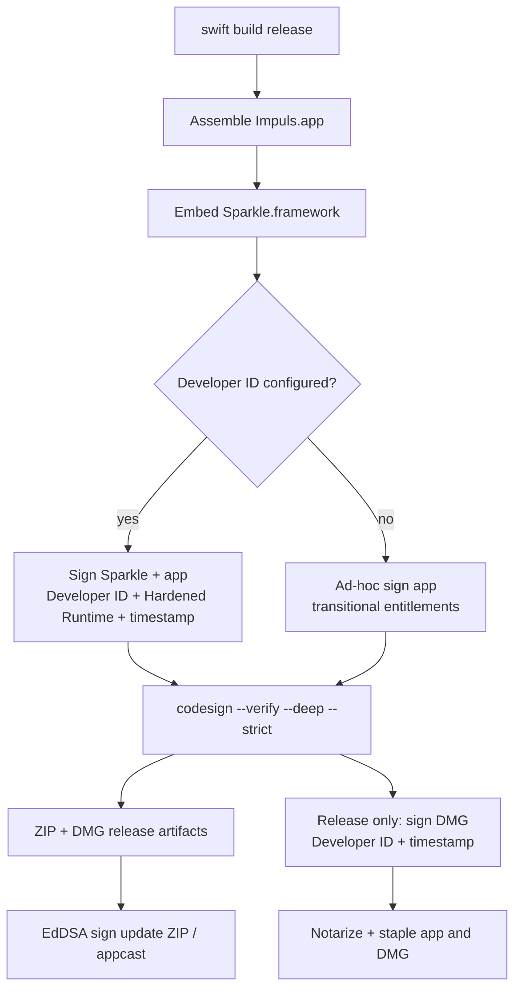

# Signing and Distribution

## IMP-13 review

Reviewed the release contour ahead of Developer ID activation. `Scripts/bundle.sh` is unchanged: its Developer ID branch was already correct, and its ad-hoc branch is still what a local build needs. What changed is `.github/workflows/release.yml`, which now imports a certificate into an ephemeral keychain, notarizes and staples, and refuses to run at all without Apple credentials — and `Scripts/dmg.sh`, which can now package an existing bundle instead of always rebuilding one.

No Apple credentials exist in the repository, and no notarized artifact has been produced yet. The pipeline is prepared, not exercised.

## Два режима сборки

`Scripts/bundle.sh` собирает `.app` без Xcode project и выбирает signing path по `IMPULS_DEVELOPER_ID_APPLICATION`.

## Developer ID path

Framework подписывается первым application identity, затем app — Developer ID Application, Hardened Runtime, timestamp и production entitlements. Этот путь не должен требовать `disable-library-validation`.

Developer ID configuration changes distribution trust only; they must not weaken the independent Sparkle archive/feed verification contract.

### CI secret contract

Имена, не значения. Ни один из этих secrets не хранится в репозитории, и ни один не печатается в лог.

| Secret | Что это |
| --- | --- |
| `IMPULS_DEVELOPER_ID_P12_BASE64` | Developer ID Application certificate + private key, PKCS#12, base64 |
| `IMPULS_DEVELOPER_ID_P12_PASSWORD` | пароль этого `.p12` |
| `IMPULS_DEVELOPER_ID_APPLICATION` | signing identity, строка вида `Developer ID Application: …` |
| `APPLE_ID` | Apple ID для notarytool |
| `APPLE_TEAM_ID` | 10-символьный Team ID |
| `APPLE_APP_SPECIFIC_PASSWORD` | app-specific password для notarytool |
| `SPARKLE_EDDSA_PRIVATE_KEY` | существующий Sparkle seed, не изменён |

`notarytool` здесь вызывается с `--apple-id/--team-id/--password`. Это один из поддерживаемых Apple способов, а не единственный: App Store Connect API key (`--key/--key-id/--issuer`) и сохранённый keychain profile (`store-credentials --keychain-profile`) поддерживаются Apple так же. Выбран самый простой путь для текущего individual account; переход на API key — смена secret contract, а не архитектуры.

### Ephemeral keychain lifecycle

Certificate существует только внутри одного CI job:

1. `security create-keychain` в `$RUNNER_TEMP` со сгенерированным на этот запуск паролем;
2. `security set-keychain-settings` / `security unlock-keychain`;
3. `.p12` декодируется в `$RUNNER_TEMP`, импортируется через `security import -T /usr/bin/codesign`, и удаляется сразу после импорта;
4. `security set-key-partition-list` — иначе первый `codesign` уходит в UI-prompt, которого на runner никто не подтвердит;
5. keychain добавляется **в начало** user search list, прежний список сохраняется для восстановления;
6. проверяется, что настроенной identity соответствует **ровно один** codesigning certificate во всём search list — ambiguous identity недопустима;
7. шаг `if: always()` восстанавливает search list, удаляет keychain и подчищает любой оставшийся `.p12`.

`login.keychain` не используется. Certificate не сохраняется как artifact.

### Fail-closed production release

`release.yml` проверяет наличие всех secrets **до** сборки и падает, называя только отсутствующие имена. Ad-hoc fallback из `bundle.sh` на этом пути недопустим: после сборки проверяется, что leaf authority — `Developer ID Application`, что флаги содержат `runtime` и **не** содержат `adhoc`, что присутствует secure `Timestamp`, и что production entitlements не отключают Library Validation.

Из этого следует практическое: пока Apple secrets не настроены, release workflow не может выпустить ничего — включая push, меняющий `Scripts/version`. Это намеренно.

## Notarization

После Developer ID signing:

1. `codesign --verify --deep --strict` и проверка authority/flags/timestamp/entitlements;
2. временный ZIP только для передачи в notary service;
3. `xcrun notarytool submit --wait`;
4. status обязан быть `Accepted`; иначе запрашивается `xcrun notarytool log` и job падает;
5. `xcrun stapler staple` + `xcrun stapler validate`;
6. повторный `codesign --verify --deep --strict`;
7. `spctl --assess --type exec`.

DMG собирается из уже notarized и stapled app, **подписывается собственной Developer ID подписью** и проходит **вторую** submission. Подпись здесь не факультативна, но по решению самого проекта, а не потому, что мы установили какое-то универсальное правило Apple: `hdiutil create` отдаёт неподписанный образ, а выбранный production distribution design требует, чтобы финальный распространяемый DMG был Developer ID Application signed, notarized и stapled. Скачанный DMG к тому же карантинится как отдельный файл, и собственный stapled ticket позволяет Gatekeeper проверить его без обращения к сети.

Последовательность для DMG:

1. `./Scripts/dmg.sh --no-build`;
2. `codesign --sign "$IMPULS_DEVELOPER_ID_APPLICATION" --timestamp` — ровно один раз, без `--force`, без `--options runtime` (Hardened Runtime — свойство исполняемого файла, а не контейнера);
3. `codesign --verify --verbose=2` и через `codesign -dvvv` — leaf authority, точное совпадение с production identity, отсутствие ad-hoc, наличие secure `Timestamp`;
4. CDHash подписанного образа фиксируется **до** notarization;
5. `xcrun notarytool submit --wait` → `Accepted`;
6. `xcrun stapler staple` + `xcrun stapler validate`;
7. повторный `codesign --verify`, `hdiutil verify`, `spctl --assess --type open --context context:primary-signature`;
8. CDHash сверяется с зафиксированным.

После submission образ **не переподписывается**. Apple выдаёт ticket на конкретный code directory hash, и повторная подпись сделала бы staple'нутый ticket несоответствующим образу.

## Что подписано и notarized

| Артефакт | Developer ID signed | Notarized | Stapled |
| --- | --- | --- | --- |
| `Impuls.app` | да (`bundle.sh`) | да | да |
| `Impuls-<version>.dmg` | да (release workflow) | да, отдельная submission | да |
| `Impuls-<version>.zip` | сам архив не подписывается | — | содержит отдельно notarized и stapled `Impuls.app` |

ZIP — транспортный контейнер Sparkle, а не самостоятельно подписываемый артефакт: Gatekeeper проверяет приложение, которое из него извлечено, и у этого приложения есть собственный stapled ticket. Поэтому ZIP собирается **после** stapling.

Sparkle EdDSA остаётся независимым trust layer поверх всего этого: подписи Apple отвечают за distribution trust, EdDSA — за подлинность обновления, и ни одна не заменяет другую.

### Same-final-app invariant

Приложение собирается в workflow **один раз**. Ни один шаг после notarization не пересобирает, не переподписывает и не заменяет `build/Impuls.app`.

Это проверяется, а не подразумевается: code directory hash фиксируется при подписи и затем сверяется с bundle в `build/`, с приложением, извлечённым из финального ZIP, и с приложением внутри смонтированного DMG. `Scripts/dmg.sh --no-build` — то, что делает это возможным; обычный `./Scripts/dmg.sh` по-прежнему собирает app и остаётся правильным для локальной работы.

## Ad-hoc fallback

Если Developer ID не настроен, app подписывается ad-hoc с отдельными `Impuls.AdHoc.entitlements`. Embedded upstream Sparkle сохраняет свою подпись; для transitional ad-hoc host library validation отключена, поскольку host не имеет Team ID.

Ad-hoc fallback is an explicit distribution limitation, not a signal to disable update authenticity. The release/update path still requires the configured Sparkle EdDSA public/private key pair and signed archive/appcast metadata.

## Gatekeeper / notarization

Ad-hoc build не эквивалентен notarized Developer ID distribution. Первая установка может требовать ручного разрешения Gatekeeper, а TCC continuity между заменяемыми builds менее предсказуема. Нельзя обходить это private APIs или ослаблением update signatures.

Notarization belongs only to a Developer ID path when Apple credentials are actually configured. Documentation/tests must not imply a notarized public artifact merely because the bundle itself passes `codesign --verify`.

Релизный контур для Developer ID и notarization подготовлен, но по состоянию на 1.4.15 ни один публичный artifact не был notarized: у проекта ещё нет активных Apple Developer credentials. Первый notarized artifact появится после credentialed release candidate, и до этого никакая документация не должна утверждать обратное.

## Bundle identity

- bundle ID: `io.tumanov.impuls`;
- minimum macOS: 15.0;
- UI element app (`LSUIElement`);
- development region `en`, и семь поставляемых локализаций: `en`, `ru`, `de`, `fr`, `es`, `zh-Hans`, `ja`. Каждая объявлена в `CFBundleLocalizations` и лежит в `Contents/Resources/<lang>.lproj`; вместе с `Localizable.strings` в той же папке поставляется локализованный `InfoPlist.strings`;
- calendar + Apple Events usage descriptions. Базовые значения лежат в `Info.plist` на русском, а язык, который пользователь фактически прочитает в системном диалоге, macOS берёт из подходящего `.lproj/InfoPlist.strings`. Поэтому добавление языка — это одновременно новая `.lproj` **и** запись в `CFBundleLocalizations`: папка без записи попадёт в bundle, но останется невидимой для macOS;
- Sparkle public key/feed embedded in Info.plist;
- signed-feed and verify-before-extraction flags remain enabled independently of ad-hoc vs Developer ID host signing.

Проверки распределены между двумя workflow: `build.yml` проверяет в собранном `.app` наличие обеих таблиц каждого из семи языков и то, что каждый язык объявлен в `CFBundleLocalizations`; `release.yml` проверяет непустой `NSAppleEventsUsageDescription` в самом `Info.plist`.

## Release artifact integrity

The normal release workflow verifies more than the `.app` code signature:

1. build/test the candidate;
2. create DMG and ZIP artifacts;
3. verify the expected version/release metadata, the bundle's own signature and entitlements, and `hdiutil verify` on the DMG;
4. unpack the ZIP again and re-run `codesign --verify --deep --strict` on the extracted app — the archive users actually receive is verified, not only the build directory;
5. generate the Sparkle appcast with the configured EdDSA key;
6. verify the appcast references the candidate version, and that its enclosure `length` equals the ZIP's byte size;
7. verify the appcast and the ZIP signature through Sparkle `sign_update --verify`;
8. publish SHA-256 checksums together with the release artifacts.

The EdDSA private key is a CI secret and must never be committed. The public key embedded in the application must match the private signing key used by the release workflow; a mismatch is a release blocker rather than a reason to bypass verification.

## Toolchain

CI selects Xcode 26.3 because device layer uses public SDK declaration `SecIdentityCreate`; deployment target remains macOS 15. Toolchain version и runtime minimum — разные вещи.

## Trust layers

Apple code signing/notarization отвечает за macOS distribution trust. Sparkle EdDSA signature отвечает за authenticity in-app update. SHA-256 is release-artifact integrity evidence but is not a substitute for the signed Sparkle trust chain. Ни один слой не заменяет остальные.

## Canonical implementation owners

- `Scripts/bundle.sh` — app assembly, Info.plist update flags, ad-hoc/Developer ID signing path;
- `.github/workflows/release.yml` — release key validation, artifact/appcast generation and release publication;
- `Sources/Impuls/Services/UpdateService.swift` — runtime user consent and Sparkle update policy;
- `Package.swift` + `Package.resolved` — pinned Sparkle dependency contract.

## Связано

- [Update System](../05-release/update-system.md)
- [Release Pipeline](../05-release/release-pipeline.md)
- [Dependency and Supply-Chain Policy](../06-security/supply-chain.md)
- [Permissions and TCC](permissions-and-tcc.md)
