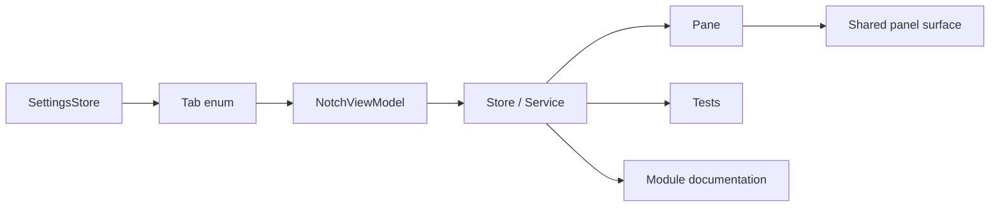

# Adding a Module

## Цель

Новый модуль — изменение public product surface, а не только новый SwiftUI view.

## Минимальный состав

1. новый `NotchViewModel.Tab` case;
2. store/service с одной domain responsibility;
3. отдельный `*Pane.swift`;
4. wiring в единственном `NotchViewModel`;
5. localized strings RU + EN;
6. settings/module preference compatibility;
7. `AppFeatureCatalog` entry;
8. tests;
9. module documentation в `knowledge-base/02-modules/`;
10. release notes.

## Решение по данным

До кода ответить:

- какие данные входят в модуль;
- сохраняются ли они;
- где и в каком формате;
- нужен ли permission;
- нужен ли network owner;
- какие limits обязательны;
- переносимы ли данные в backup;
- что происходит при выключении модуля.

## Архитектурный flow

## Запреты

- pane не делает direct filesystem I/O;
- store не импортирует SwiftUI без архитектурной причины;
- module не создаёт per-display service;
- новый network access не добавляется «локально» — четвёртый network owner требует ADR/security review;
- permission не запрашивается на launch/update;
- отсутствующие данные не подменяются guessed values.

## Definition of done

Модуль считается интегрированным только когда код, tests, localization, settings, documentation, privacy/security impact и release notes согласованы.
