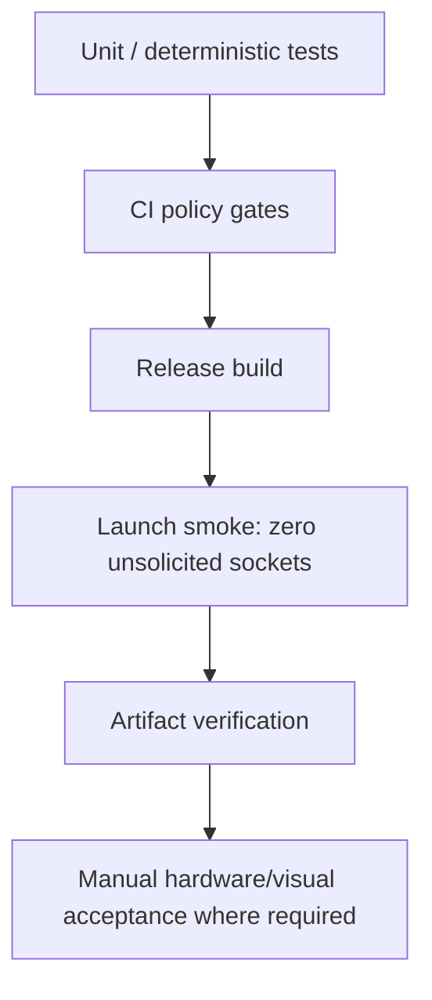

# Testing Strategy

## Уровни проверки

## XCTest

`Tests/ImpulsTests` проверяет stores, persistence, display topology, device power, media/security helpers, settings/backup и другие domain contracts. Тесты должны использовать injected storage/environment и не читать реальные пользовательские файлы.

Базовая команда: `swift test -c release`.

## Python tests

`Tests/PythonTests` покрывает server/site/release helper code. Команда: `python3 -m unittest discover -s Tests/PythonTests -p 'test_*.py'`.

## CI как executable policy

`build.yml` — не только build script. Он literal-check'ами защищает:

- три network owners;
- отсутствие private MediaRemote/injection paths;
- pinned Sparkle 2.9.5;
- signed-feed/update verification flags;
- bounded reads/search budgets;
- feedback privacy boundary;
- adaptive theme;
- Actions hover semantics;
- localization completeness;
- version + release notes pairing;
- bundle identity/entitlements;
- zero unsolicited sockets at launch.

## Hardware/manual QA

Некоторые свойства нельзя честно доказать только CI: реальный external display/Sidecar, Apple device models, TCC dialogs, VoiceOver, appearance, hardware battery fields. Такие пункты должны оставаться явно `manual`, а не получать фиктивный PASS.

## Change-based checklist

- service/store → unit tests;
- persistence → load/save/migration/limits/delete tests;
- permissions → not-requested/denied/granted + no auto-prompt proof;
- networking → allow-list + consent + redirect + launch smoke;
- multi-display → A/B/hot unplug/keyboard ownership;
- release → CI + bundle + DMG/ZIP/appcast verification;
- UI → light/dark, Reduce Motion, keyboard, accessibility when applicable.

## Связано

- [Adding a Module](adding-a-module.md)
- [Project Invariants](../10-ai/invariants.md)
- `.github/workflows/build.yml`
