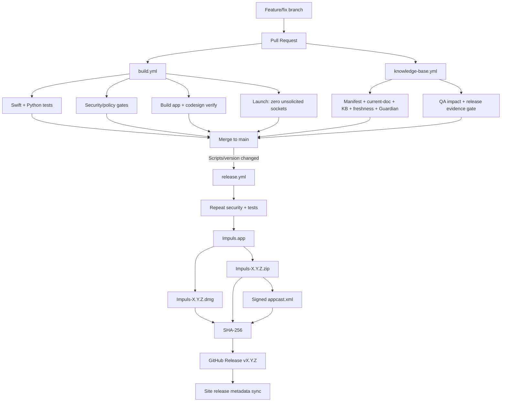

# Release Pipeline

## End-to-end

## Release source of truth

- version: `Scripts/version`;
- user-facing release notes: `docs/releases/<version>.md`;
- release-specific manual/mixed QA evidence and shipping decision: `knowledge-base/13-qa/release-evidence/<version>.md`;
- product source: `main` after merge;
- production workflow: `.github/workflows/release.yml`.

Version, release notes and Release QA Evidence travel together. Starting with 1.4.12, a version baseline without the corresponding evidence file is invalid; historical `not-recorded` is not accepted for new releases.

## Build CI

Pull requests against `main`/`release/**` run the application build/test/security contour according to current workflow paths. The knowledge-base workflow separately validates routing, current-document consistency, documentation semantics/freshness, QA impact and release evidence when its tracked inputs change.

Green unit tests never convert a manual/hardware/TCC scenario into a `pass`. `Scripts/check-qa-impact.py --base <base-sha>` determines which Behavioral QA IDs a real diff may affect; `Scripts/check-release-qa-evidence.py --release-gate` owns the candidate shipping decision.

## Documentation and agent guard

`Scripts/check-current-documentation.py` protects high-value current-state/agent entrypoints and cross-surface locale/routing parity. It complements rather than replaces:

- `Scripts/check-knowledge-base.py` — structure/frontmatter/links/current baseline entrypoints;
- `Scripts/check-documentation-guardian.py` — semantic obligations from a diff;
- `Scripts/check-documentation-freshness.py` — tracked source→canonical-doc history;
- `Scripts/check-project-manifest.py` — stable routing topology.

A release bump that exposes stale current-state documentation should fail before production rather than being repaired in a post-release note.

## Release trigger

`release.yml` launches on push to `main` when `Scripts/version` or the release workflow itself changes, and it also supports manual dispatch. The normal shipping path is a reviewed version-bump PR merged to `main`; do not create production tags/assets by hand to bypass it.

## Artifact verification

The production pipeline validates the release metadata and security boundaries, runs tests/build, creates the application/DMG/ZIP, verifies bundle identity/signature/entitlements, verifies the DMG, re-extracts and verifies the ZIP application, generates the signed Sparkle appcast, verifies the appcast/archive signature and enclosure length, and publishes SHA-256 evidence with the release assets.

Developer ID/notarization is a separate distribution-trust layer. A successful `codesign --verify` alone is never evidence that the public artifact is notarized; verify the actual release environment/artifact before making that claim.

## Production telemetry endpoint

Release env receives `IMPULS_VERSION_STATISTICS_ENDPOINT` from repository configuration. The workflow fails closed unless the configured value is an HTTPS hostname with exact `/v1/heartbeat`, then checks the built `Info.plist`. Source code does not hardcode a live production endpoint; exact current production topology belongs to the private operations source of truth.

## Website and legal pages

`docs/` GitHub Pages must not treat hand-edited generated pages as release truth. Site sync updates static release fallback/SEO metadata and regenerates marketing/legal locale pages from their canonical sources. Current website/localization ownership is documented in [Website Architecture](../07-web/website.md), [Website Legal and Privacy Localization](../07-web/legal-privacy.md) and [Localization](../04-development/localization.md).

Website publication is not a second app release workflow: it does not bump `Scripts/version`, tag, sign or upload application release artifacts.

## Rollback / failure

Do not “fix” a failed release by manually uploading arbitrary assets. Correct the source/workflow/metadata contract, rerun the required gates, then use the established release/reissue path. Keep release-specific known gaps truthful in Release QA Evidence rather than erasing them from documentation.

## Связано

- [Release Process](release-process.md)
- [Release QA Evidence](../13-qa/release-evidence/README.md)
- [Behavioral QA Change Impact Traceability](../13-qa/change-impact-traceability.md)
- [Update System](update-system.md)
- [Signing and Distribution](../03-macos/signing-distribution.md)
- `.github/workflows/build.yml`
- `.github/workflows/knowledge-base.yml`
- `.github/workflows/release.yml`
