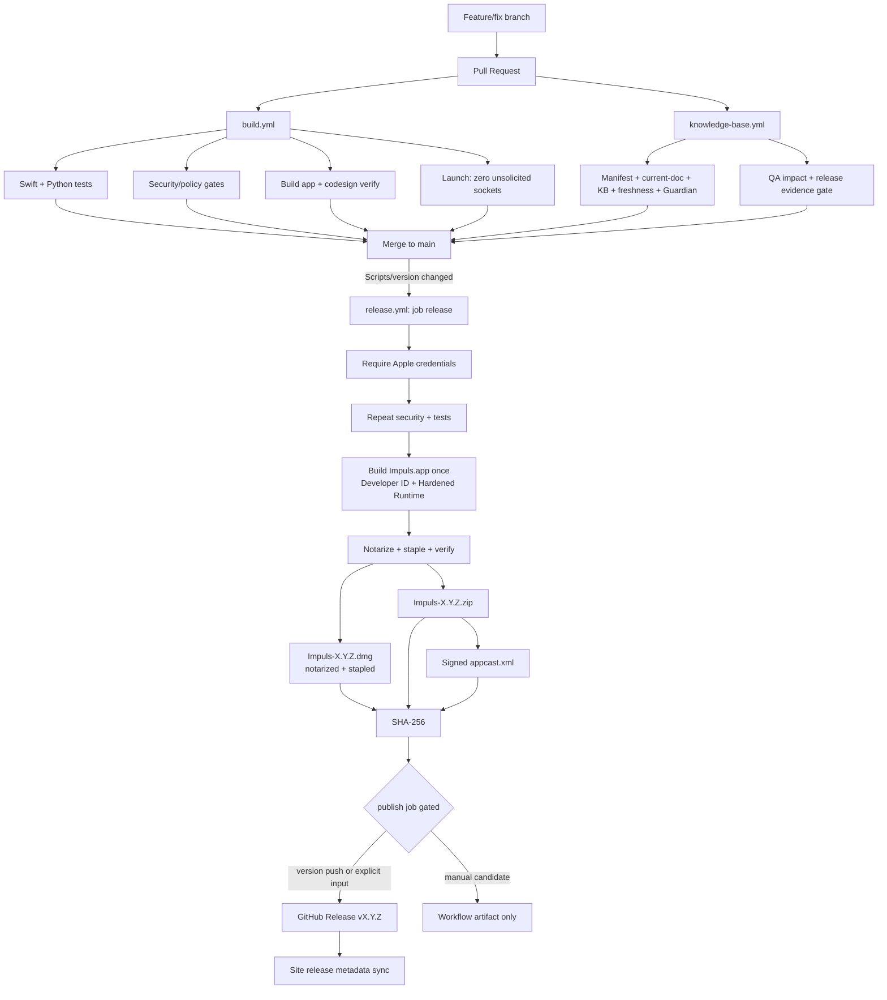

# Release Pipeline

## End-to-end

## Release source of truth

- version: `Scripts/version`;
- user-facing release notes: `docs/releases/<version>.md`;
- release-specific manual/mixed QA evidence and shipping decision: `knowledge-base/13-qa/release-evidence/<version>.md`;
- product source: `main` after merge;
- production workflow: `.github/workflows/release.yml`.

Version, release notes and Release QA Evidence travel together. Starting with 1.4.12, a version baseline without the corresponding evidence file is invalid; historical `not-recorded` is not accepted for new releases.

## Build CI

Pull requests against `main`/`release/**` run the application build/test/security contour according to current workflow paths. The knowledge-base workflow separately validates routing, current-document consistency, documentation semantics/freshness, QA impact and release evidence when its tracked inputs change.

Green unit tests never convert a manual/hardware/TCC scenario into a `pass`. `Scripts/check-qa-impact.py --base <base-sha>` determines which Behavioral QA IDs a real diff may affect; `Scripts/check-release-qa-evidence.py --release-gate` owns the candidate shipping decision.

## Documentation and agent guard

`Scripts/check-current-documentation.py` protects high-value current-state/agent entrypoints and cross-surface locale/routing parity. It complements rather than replaces:

- `Scripts/check-knowledge-base.py` — structure/frontmatter/links/current baseline entrypoints;
- `Scripts/check-documentation-guardian.py` — semantic obligations from a diff;
- `Scripts/check-documentation-freshness.py` — tracked source→canonical-doc history;
- `Scripts/check-project-manifest.py` — stable routing topology.

A release bump that exposes stale current-state documentation should fail before production rather than being repaired in a post-release note.

## Release trigger

`release.yml` launches on push to `main` when `Scripts/version` changes, and on manual dispatch. The normal shipping path is a reviewed version-bump PR merged to `main`; do not create production tags/assets by hand to bypass it.

The workflow file is deliberately **not** in its own push paths. It used to be, which meant that editing the release pipeline re-published whatever version was current — a workflow change is not a decision to ship. Changes to `release.yml` are covered by ordinary repository CI and by `Tests/PythonTests/test_release_signing_pipeline.py`; the credentialed Apple path is exercised through manual dispatch.

## Two jobs, one gate

| Job | Permissions | Holds Apple credentials | Can publish |
| --- | --- | --- | --- |
| `release` | `contents: read` | yes | no |
| `publish` | `contents: write` | no | yes |

`publish` runs only when `needs: release` succeeded, the ref is `refs/heads/main`, and either the trigger was a `Scripts/version` push or the dispatch input `publish_release` was explicitly turned on. It downloads the artifacts the `release` job produced, re-checks their SHA-256 against the digests recorded after verification, and only then calls `gh release`.

The split is the point: a rejected notarization fails `release`, so `publish` never starts, and no step that touches signing material has write access to the repository.

### Manual signed/notarized release candidate

`workflow_dispatch` with `publish_release` left off — the default — builds, signs, notarizes, staples and verifies the candidate, uploads it as a workflow artifact, and stops. No tag, no GitHub Release, no change to the appcast users see. This is how a Developer ID and notarization setup is validated before anything is published.

`publish_release` turned on is the only manual path to a production release, and it still refuses to run outside `main`.

## Developer ID and notarization

The `release` job is fail-closed: it verifies every required Apple secret before building and stops, naming only the missing secrets. There is no ad-hoc fallback on this path — after the build it asserts the leaf authority is `Developer ID Application`, that the signature is not ad-hoc, that Hardened Runtime and a secure timestamp are present, and that production entitlements do not disable Library Validation.

The application is built once. Nothing after notarization rebuilds, re-signs or replaces it, and that is checked by carrying the notarized code directory hash through to the extracted ZIP and the application inside the DMG. `Scripts/dmg.sh --no-build` packages the existing bundle; the default `./Scripts/dmg.sh` still builds one and remains correct locally.

Ownership of the detail belongs to [Signing and Distribution](../03-macos/signing-distribution.md).

## Artifact verification

The production pipeline validates the release metadata and security boundaries, runs tests/build, creates the application/DMG/ZIP, verifies bundle identity/signature/entitlements, verifies the DMG, re-extracts and verifies the ZIP application, generates the signed Sparkle appcast, verifies the appcast/archive signature and enclosure length, and publishes SHA-256 evidence with the release assets.

Developer ID/notarization is a separate distribution-trust layer. A successful `codesign --verify` alone is never evidence that the public artifact is notarized; verify the actual release environment/artifact before making that claim.

As of 1.4.15 no public artifact has been notarized: the pipeline is prepared, the Apple Developer credentials are not yet active. The first notarized artifact will come from a credentialed release candidate.

## Production telemetry endpoint

Release env receives `IMPULS_VERSION_STATISTICS_ENDPOINT` from repository configuration. The workflow fails closed unless the configured value is an HTTPS hostname with exact `/v1/heartbeat`, then checks the built `Info.plist`. Source code does not hardcode a live production endpoint; exact current production topology belongs to the private operations source of truth.

## Website and legal pages

`docs/` GitHub Pages must not treat hand-edited generated pages as release truth. Site sync updates static release fallback/SEO metadata and regenerates marketing/legal locale pages from their canonical sources. Current website/localization ownership is documented in [Website Architecture](../07-web/website.md), [Website Legal and Privacy Localization](../07-web/legal-privacy.md) and [Localization](../04-development/localization.md).

Website publication is not a second app release workflow: it does not bump `Scripts/version`, tag, sign or upload application release artifacts.

## Rollback / failure

Do not “fix” a failed release by manually uploading arbitrary assets. Correct the source/workflow/metadata contract, rerun the required gates, then use the established release/reissue path. Keep release-specific known gaps truthful in Release QA Evidence rather than erasing them from documentation.

## Связано

- [Release Process](release-process.md)
- [Release QA Evidence](../13-qa/release-evidence/README.md)
- [Behavioral QA Change Impact Traceability](../13-qa/change-impact-traceability.md)
- [Update System](update-system.md)
- [Signing and Distribution](../03-macos/signing-distribution.md)
- `.github/workflows/build.yml`
- `.github/workflows/knowledge-base.yml`
- `.github/workflows/release.yml`
