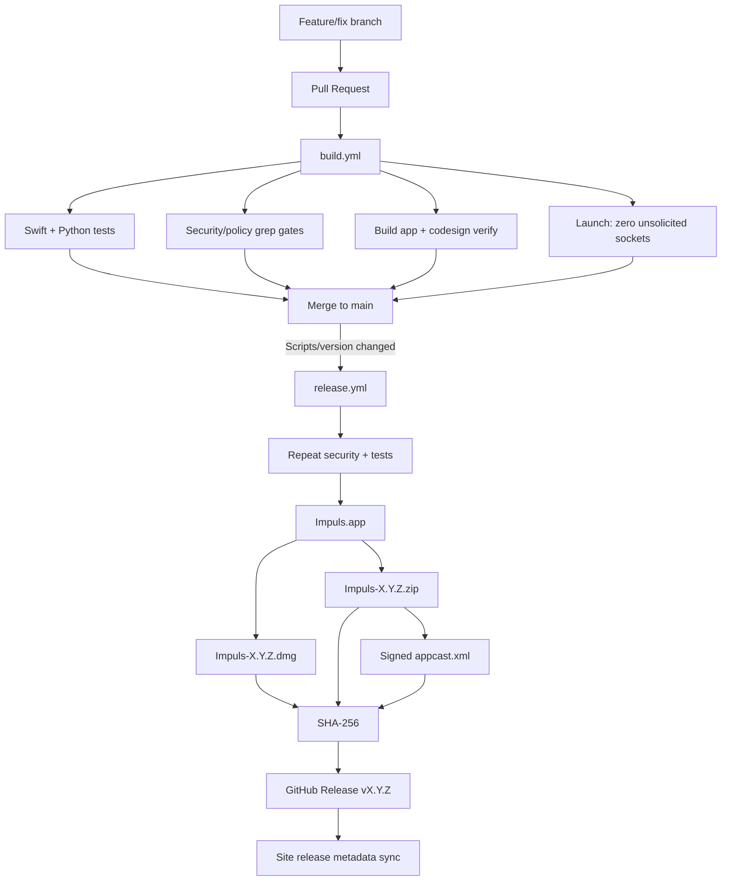

# Release Pipeline

## End-to-end

## Release source of truth

- version: `Scripts/version`;
- release notes: `docs/releases/<version>.md`;
- product source: `main` after merge;
- workflow: `.github/workflows/release.yml`.

Version и release notes должны путешествовать вместе.

## Build CI

Pull requests against `main`/`release/**` запускают build. Markdown-only push в main может быть ignored через `paths-ignore`, но PR policy checks зависят от changed paths/workflow rules.

## Release trigger

`release.yml` запускается на push в main, когда изменён `Scripts/version` или сам `release.yml`, а также вручную. Workflow умеет reissue existing version metadata, что использовалось для исправления release pipeline без фиктивного bump.

## Artifact verification

Pipeline проверяет bundle identity, version, Sparkle linkage, entitlements, codesign, DMG verify, ZIP extraction + codesign, appcast XML/signature/length, SHA-256.

## Production telemetry endpoint

Release env получает `IMPULS_VERSION_STATISTICS_ENDPOINT` из repository variable. Pipeline fail-closed требует HTTPS host и exact `/v1/heartbeat`, затем проверяет value внутри built `Info.plist`.

## Website

`docs/` GitHub Pages не должен hardcode current release как единственный источник. Site sync обновляет static fallback/SEO metadata, а runtime release API остаётся отдельным current-release source для browser page.

## Rollback / failure

Не «чинить» сломанный release ручной загрузкой произвольных assets. Исправляется workflow/branch, проверки повторяются, затем release reissue через штатный pipeline.

## Связано

- [Release Process](release-process.md)
- [Update System](update-system.md)
- `.github/workflows/build.yml`
- `.github/workflows/release.yml`
