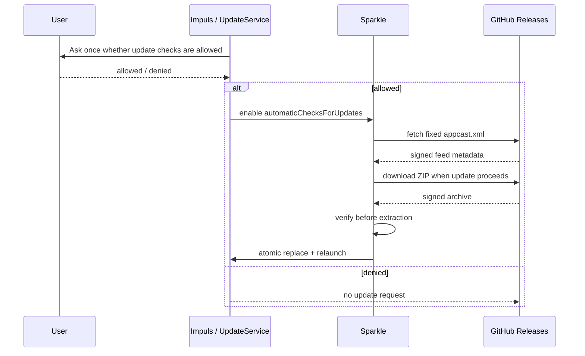

# Update System

## IMP-13 review

Reviewed the Developer ID / notarization preparation. Sparkle version, feed, signature handling, consent and update flags are all unchanged. What moved is where the update ZIP comes from: it is now built from the notarized and stapled bundle, after Apple has accepted it, instead of from a second build produced by `dmg.sh`.

## Контракт

Update channel — opt-in network boundary на Sparkle 2.9.5 с fixed GitHub appcast и signed archive verification.

## Feed boundary

Точный URL: `https://github.com/TumanovNV/impuls/releases/latest/download/appcast.xml`. `UpdateService.isAllowedFeedURL` проверяет scheme/host/path и отсутствие port/query/fragment/user/password, а затем дополнительно сверяет весь `absoluteString` с константой — покомпонентная проверка не остаётся единственной защитой.

## Consent

States: unknown, allowed, denied. Default unknown. Если denied, automatic downloads принудительно off. Automatic installation можно включить только после network consent.

## Sparkle settings

CI проверяет — часть в исходниках, часть в `Info.plist` уже собранного `.app`:

- Sparkle exact 2.9.5 в `Package.swift` + pinned revision в `Package.resolved`;
- `SUFeedURL` в собранном bundle равен точному feed URL, а `SUPublicEDKey` — ожидаемому публичному ключу;
- `SUVerifyUpdateBeforeExtraction = true`;
- `SURequireSignedFeed = true`;
- `SUSignedFeedFailureExpirationInterval = 0` — просроченная подпись feed'а не «протухает» в разрешающую сторону;
- `SUEnableSystemProfiling = false`;
- `SUEnableAutomaticChecks = false` и `SUAutomaticallyUpdate = false` по умолчанию;
- `SUAllowsAutomaticUpdates = true`. Это означает, что возможность автообновления доступна, а **не** что оно включено: два флага выше остаются false, и политику по-прежнему решает пользователь через `UpdateService`;
- `SUScheduledCheckInterval = 86400`;
- бинарник связан со Sparkle через `@rpath`;
- public Ed25519 key соответствует release signing secret.

## Version-statistics release guard

Release workflow отдельно fail-closed проверяет repository variable
`IMPULS_VERSION_STATISTICS_ENDPOINT`: допустим только HTTPS hostname с точным
`/v1/heartbeat`. Он передаётся в `bundle.sh`, а собранный `Info.plist` обязан
содержать то же значение до создания release artifacts. HMAC secret collector
остаётся только на сервере и в workflow не передаётся.

## Signing chain

Release workflow использует private Ed25519 seed из GitHub secret для генерации appcast и signature ZIP. Secret никогда не коммитится. Built app содержит только public key.

## Developer ID

`bundle.sh` использует Developer ID, если `IMPULS_DEVELOPER_ID_APPLICATION` настроен; иначе fallback ad-hoc. Это остаётся верным для локальной сборки.

Release workflow ad-hoc fallback не принимает: он требует полный набор Apple secrets до сборки и проверяет подпись готового app на предмет `Developer ID Application` authority, Hardened Runtime, secure timestamp и отсутствия ad-hoc флага.

Sparkle update authenticity и Apple notarization/signing — разные trust layers. Отсутствие Developer ID влияет на Gatekeeper/permission continuity, но не должно ослаблять Sparkle signature checks. Обратное тоже верно: notarization ничего не подтверждает про appcast и не заменяет EdDSA-подпись архива.

## Что именно скачивает Sparkle

ZIP для appcast собирается **после** того, как приложение notarized и stapled, из того же `build/Impuls.app`. Порядок здесь — контракт, а не удобство: архив, собранный до stapling, содержал бы app без ticket, и Gatekeeper на машине пользователя проверял бы его через сеть.

Что это уже не так, проверяется в workflow: code directory hash фиксируется в момент подписи и сверяется с приложением, извлечённым из финального ZIP. Подробности — [Signing and Distribution](../03-macos/signing-distribution.md).

## Локализация и update contract

`Scripts/bundle.sh` — общий владелец и update-флагов, и списка локализаций, поэтому добавление языков задевает tracked source этого документа. Update/security contract при этом не меняется: расширение `CFBundleLocalizations` и новые `.lproj` не трогают ни feed URL, ни ключи Sparkle, ни consent, ни подпись артефактов. Sparkle показывает release notes из appcast (`SUShowReleaseNotes`), а они приходят из `docs/releases/<version>.md` и локализации приложения не подчиняются.

## Инварианты

- never create release/update assets by hand outside established workflow;
- feed URL fixed;
- no update networking without consent;
- signed feed + verify-before-extraction always on;
- system profile always off;
- dependency bump Sparkle требует отдельного security review.

## Связано

- [Release Pipeline](release-pipeline.md)
- [ADR-005](../08-decisions/ADR-005-signed-update-trust-chain.md)
- [Networking](../01-architecture/networking.md)
