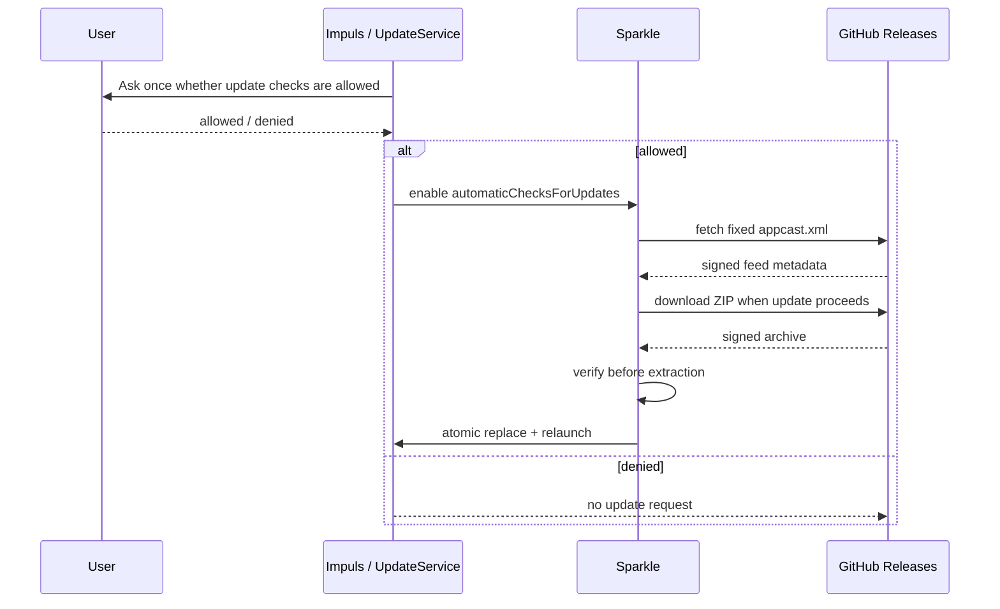

# Update System

## Контракт

Update channel — opt-in network boundary на Sparkle 2.9.5 с fixed GitHub appcast и signed archive verification.

## Feed boundary

Точный URL: `https://github.com/TumanovNV/impuls/releases/latest/download/appcast.xml`. `UpdateService.isAllowedFeedURL` проверяет scheme/host/path и отсутствие port/query/fragment/user/password.

## Consent

States: unknown, allowed, denied. Default unknown. Если denied, automatic downloads принудительно off. Automatic installation можно включить только после network consent.

## Sparkle settings

CI проверяет:

- Sparkle exact 2.9.5 + resolved revision;
- `SUVerifyUpdateBeforeExtraction = true`;
- `SURequireSignedFeed = true`;
- system profiling = false;
- automatic checks/downloads default false;
- scheduled interval 86400;
- public Ed25519 key соответствует release signing secret.

## Signing chain

Release workflow использует private Ed25519 seed из GitHub secret для генерации appcast и signature ZIP. Secret никогда не коммитится. Built app содержит только public key.

## Developer ID

`bundle.sh` использует Developer ID, если `IMPULS_DEVELOPER_ID_APPLICATION` настроен; иначе fallback ad-hoc. Sparkle update authenticity и Apple notarization/signing — разные trust layers. Отсутствие Developer ID влияет на Gatekeeper/permission continuity, но не должно ослаблять Sparkle signature checks.

## Инварианты

- never create release/update assets by hand outside established workflow;
- feed URL fixed;
- no update networking without consent;
- signed feed + verify-before-extraction always on;
- system profile always off;
- dependency bump Sparkle требует отдельного security review.

## Связано

- [Release Pipeline](release-pipeline.md)
- [ADR-005](../08-decisions/ADR-005-signed-update-trust-chain.md)
- [Networking](../01-architecture/networking.md)
