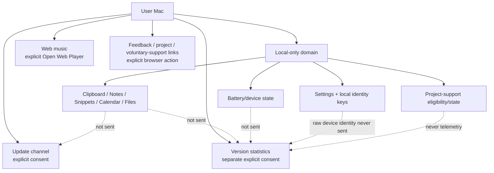

# Privacy Boundaries

## Boundary map

## Local-first promises

Clipboard, notes, snippets, file contents and calendar data не являются telemetry/update payloads. Feedback service тоже сам ничего не отправляет: формирует bounded local report и открывает GitHub form/browser только по явному действию.

External Apple-device data remains a local presentation/provider domain. Battery percentage, charging state, raw UDID/serial/Bluetooth identity and pairing material are not version-statistics fields.

Project-support eligibility is another local-only domain. First meaningful-use time, coarse use/day counters, prompt state and shown count are used only to decide whether the app may present its bounded support prompt. They are not included in version statistics, feedback diagnostics or portable backup. The prompt is capped at two automatic appearances for the lifetime of that local state. Opening the project GitHub page is an explicit browser action; Impuls does not query GitHub for account/star state.

Voluntary development support is a separate, stateless Settings action. The user explicitly chooses CloudTips or Boosty, and Impuls hands only that provider's exact approved HTTPS page to the system browser. Impuls does not fetch or preflight the page, embed payment UI, receive a callback, or store a provider choice, amount, outcome, account state or entitlement. Card and payment credentials are entered on and processed by the external provider page under that provider's terms; they never pass through Impuls.

The explicit interface-language preference is also local. `AppLanguageService` owns `app.language.v1` and the explicit `AppleLanguages` override path; no language pack or language preference is fetched/sent as telemetry.

## Сохранность локальных данных

Приватность включает и то, что локальные данные не исчезают молча. Зашифрованный архив истории буфера, который эта сборка не может открыть, больше не перезаписывается при включении persistence: `load()` отличает «пусто» от «нечитаемо». Остаточная граница задокументирована в [Current Limitations](../09-known-issues/current-limitations.md).

## Consent separation

Update consent, explicit web-player action, version-statistics consent and external-device discovery are separate decisions. Consent/action одной boundary не переносится на другую. Feedback/project/voluntary-support links are browser handoffs after explicit user actions rather than hidden product networking.

Version statistics remain off until their own opt-in. The client may attempt the narrow heartbeat no more than once per hour for the same app version; a failed collector does not convert application launch or user-facing work into retry traffic. An app version that differs from the version of the last attempt is not held back by that previous version's cooldown, so a newly installed update can report its own version without waiting for a manual relaunch. A best-effort in-process scheduler proposes an attempt roughly hourly for the life of the run; it does not change what is sent or how often a single version may actually attempt.

## Identity separation

Version statistics use a random installation UUID stored device-only in Keychain. The collector stores an HMAC digest of that installation value, not the raw UUID.

Apple-device presentation identity is a different boundary: raw hardware identifiers exist only long enough to derive an HMAC-backed local `AppleDeviceIdentity` using a per-Mac device-only Keychain secret. The derived preference key is deliberately local-only and excluded from portable backup/feedback. Raw hardware identifiers do not become installation IDs and the two identity spaces are never joined.

Project-support counters/state are a third unrelated local state space. They contain no installation UUID or hardware identity and are never joined to the telemetry pseudonym.

## Telemetry payload contract

The version heartbeat is intentionally small and version-only:

- schema version;
- installation pseudonym;
- current Impuls version;
- previous version only when the client observed a real transition.

No name/contact information, app content, clipboard/notes/snippets/calendar/files, battery state, raw Apple-device identifier, selected UI language, project-support count/state, feedback text or GitHub-star state is part of this payload. Endpoint/path/redirect validation and collector retention are documented in [Version Statistics Collector](../07-web/version-statistics-collector.md).

## UI honesty

Privacy включает не только «не отправлять», но и не придумывать: missing battery %, connector, charging state или stale device status должны быть visibly unknown/stale. The Menu Bar presentation consumes the same already-resolved local state and does not start a new provider/network boundary.

The 1.4.16 version-statistics diagnostics section in Settings follows the same rule and does not widen the payload contract above: `VersionTelemetryService.diagnostics()` only echoes consent, the exact version string a heartbeat would send, local attempt/success timestamps and a safe never-attempted/succeeded/failed outcome — never a raw installation UUID, request/response body or server detail. Opening or refreshing that section is a local read; it never becomes a heartbeat attempt on its own.

Support/feedback UI follows the same honesty rule: opening GitHub is recorded only as the browser action being accepted, never as proof that a star or issue was actually submitted. A voluntary-support handoff records nothing at all and cannot change application functionality.

## Verification owners

- `Sources/Impuls/Services/AppleDeviceIdentity.swift` — raw-device → derived local identity boundary;
- `Sources/Impuls/Services/VersionTelemetryService.swift` — consented heartbeat + installation Keychain identity;
- `Collector/version-statistics/collector.py` — HMAC storage/retention boundary;
- `Sources/Impuls/Services/FeedbackService.swift` — explicit local report/browser handoff;
- `Sources/Impuls/Services/ProjectSupportPromptService.swift` — local-only support eligibility/state;
- `Sources/Impuls/Services/AppLanguageService.swift` — local language preference/override owner;
- `Sources/Impuls/Services/ClipboardHistoryPersistence.swift` — encrypted optional local clipboard archive.

Архив остаётся локальным и зашифрованным; write latch 1.4.12-hardening ничего к этому не добавляет и ничего не отправляет. Одно уточнение по логированию: заблокированная запись пишет в `NSLog` строку с **количеством** удержанных в памяти записей и причиной — содержимое буфера, превью и пути туда не попадают, как и в остальных сообщениях этого файла.

## Legal / public docs

Public technical commitments находятся in root `PRIVACY.md` и `SECURITY.md`. Canonical source operator policy опубликована по `/privacy/`; шесть localized notices находятся по language-specific privacy routes. `/site-privacy.html` — legacy handoff, не canonical policy. Engineering owner генерации/маршрутизации — [Website Legal and Privacy Localization](../07-web/legal-privacy.md).

Knowledge base объясняет engineering contract, но не заменяет юридический текст. A public-policy change and an internal engineering-boundary change must be kept consistent without putting private infrastructure facts into this repository. Universal “GDPR compliant” claims, private privacy mailbox, DPO or EU representative must not be invented without established facts.
