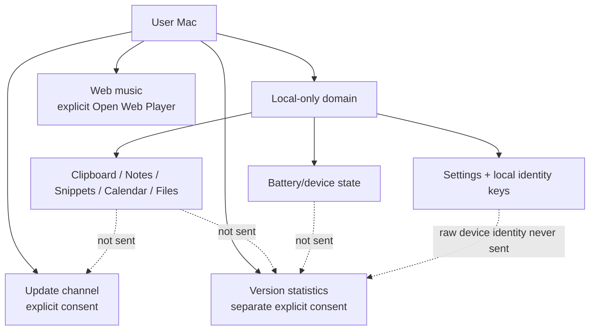

# Privacy Boundaries

## Boundary map

## Local-first promises

Clipboard, notes, snippets, file contents and calendar data не являются telemetry/update payloads. Feedback service тоже сам ничего не отправляет: формирует bounded local report и открывает GitHub form/browser.

External Apple-device data remains a local presentation/provider domain. Battery percentage, charging state, raw UDID/serial/Bluetooth identity and pairing material are not version-statistics fields.

## Сохранность локальных данных

Приватность включает и то, что локальные данные не исчезают молча. Зашифрованный архив истории буфера, который эта сборка не может открыть, больше не перезаписывается при включении persistence: `load()` отличает «пусто» от «нечитаемо». Остаточная граница задокументирована в [Current Limitations](../09-known-issues/current-limitations.md).

## Consent separation

Update consent, web-player action и version-statistics consent — три разных решения пользователя. Consent одной boundary не переносится на другую.

Version statistics remain off until their own opt-in. The client may attempt the narrow heartbeat no more than once per hour for the same app version; a failed collector does not convert application launch or user-facing work into retry traffic. As of 1.4.14, an app version that differs from the version of the last attempt is not held back by that limit — this closes a real gap where an update landing inside a still-cooling-down hour kept reporting the old version until the next manual relaunch. A best-effort in-process scheduler also proposes an attempt roughly hourly for the life of the run rather than only once at launch; it does not change what is sent or how often a single version may actually attempt.

## Identity separation

Version statistics use a random installation UUID stored device-only in Keychain. The collector stores an HMAC digest of that installation value, not the raw UUID.

Apple-device presentation identity is a different boundary: raw hardware identifiers exist only long enough to derive an HMAC-backed local `AppleDeviceIdentity` using a per-Mac device-only Keychain secret. The derived preference key is deliberately local-only and excluded from portable backup/feedback. Raw hardware identifiers do not become installation IDs and the two identity spaces are never joined.

## Telemetry payload contract

The version heartbeat is intentionally small and version-only:

- schema version;
- installation pseudonym;
- current Impuls version;
- previous version only when the client observed a real transition.

No name/contact information, app content, clipboard/notes/snippets/calendar/files, battery state or raw Apple-device identifier is part of this payload. Endpoint/path/redirect validation and collector retention are documented in [Version Statistics Collector](../07-web/version-statistics-collector.md).

## UI honesty

Privacy включает не только «не отправлять», но и не придумывать: missing battery %, connector, charging state или stale device status должны быть visibly unknown/stale. The Menu Bar presentation consumes the same already-resolved local state and does not start a new provider/network boundary.

## Verification owners

- `Sources/Impuls/Services/AppleDeviceIdentity.swift` — raw-device → derived local identity boundary;
- `Sources/Impuls/Services/VersionTelemetryService.swift` — consented heartbeat + installation Keychain identity;
- `Collector/version-statistics/collector.py` — HMAC storage/retention boundary;
- `Sources/Impuls/Services/FeedbackService.swift` — explicit local report/browser handoff;
- `Sources/Impuls/Services/ClipboardHistoryPersistence.swift` — encrypted optional local clipboard archive.

Архив остаётся локальным и зашифрованным; write latch 1.4.12-hardening ничего к этому не добавляет и ничего не отправляет. Одно уточнение по логированию: заблокированная запись пишет в `NSLog` строку с **количеством** удержанных в памяти записей и причиной — содержимое буфера, превью и пути туда не попадают, как и в остальных сообщениях этого файла.

## Legal / public docs

Public commitments находятся in `PRIVACY.md`, `SECURITY.md` и published website privacy policy. Knowledge base объясняет engineering contract, but не заменяет юридический текст. A public-policy change and an internal engineering-boundary change must be kept consistent without putting private infrastructure facts into this repository.
