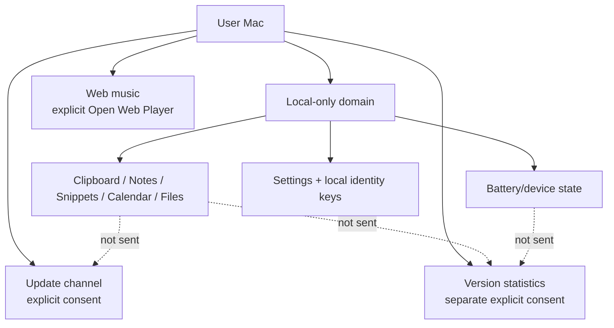

# Privacy Boundaries

## Boundary map

## Local-first promises

Clipboard, notes, snippets, file contents and calendar data не являются telemetry/update payloads. Feedback service тоже сам ничего не отправляет: формирует bounded local report и открывает GitHub form/browser.

## Consent separation

Update consent, web-player action и version-statistics consent — три разных решения пользователя. Consent одной boundary не переносится на другую.

## Identity separation

Version statistics UUID случайный, device-only. Device presentation keys derived/local. Raw hardware identifiers не становятся installation ID и не объединяются с telemetry.

## UI honesty

Privacy включает не только «не отправлять», но и не придумывать: missing battery %, connector, charging state или stale device status должны быть visibly unknown/stale.

## Legal / public docs

Public commitments находятся в `PRIVACY.md`, `SECURITY.md` и published website privacy policy. Knowledge base объясняет engineering contract, но не заменяет юридический текст.
