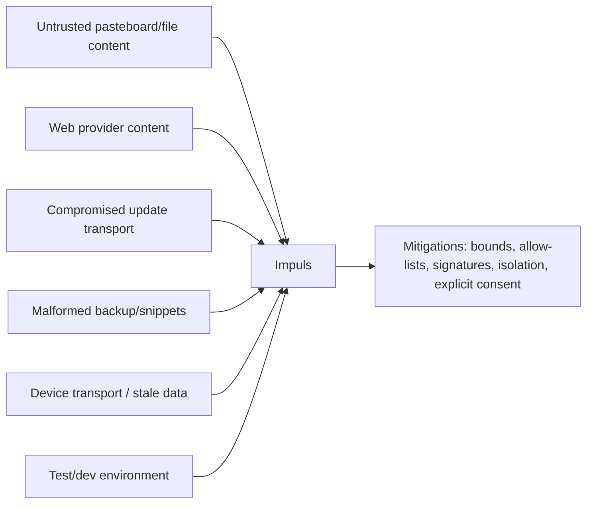

# Threat Model

## Scope

Модель рассматривает desktop utility, которая читает local user data, открывает selected web providers, обновляется через Internet и взаимодействует с Apple devices.

## T1 — Oversized/malformed local input

Риски: memory pressure, parser abuse, UI stalls. Mitigations: `BoundedFileReader`, `BoundedData`, `BoundedText`, per-feature byte/item limits, atomic writes, bounded search/link scans.

## T2 — Clipboard privacy leakage

Риски: password-manager content, excluded app, self-capture. Mitigations: concealed type ignored, per-app exclusions, internal marker, persistence off by default, AES-GCM + device-only Keychain.

## T3 — Malicious web navigation/content

Риски: WebKit становится generic browser, bridge reports from wrong origin. Mitigations: WebKit only explicit open, main-frame provider allow-list, state reports only allowed HTTPS provider page, no other source creates `WebMusicPlayer`.

## T4 — Update supply chain

Риски: MITM/modified archive/feed. Mitigations: HTTPS fixed GitHub feed, signed feed, Ed25519 archive signature, verify before extraction, pinned Sparkle version, release secret/public key verification, artifact codesign checks.

## T5 — Telemetry expansion/redirect

Риски: consent scope creep, endpoint redirect, extra fields. Mitigations: separate consent, exact `/v1/heartbeat`, no redirects, allow-listed Codable payload, max once/day attempt, endpoint build-configured not source-hardcoded.

## T6 — Device identifiers / pairing secrets

Риски: raw IDs leak to UI/log/backup/feedback. Mitigations: `AppleDeviceIdentity` opaque boundary, not Codable raw identity, local HMAC-derived keys, selected-device key excluded from backup.

## T7 — Device protocol instability

Риски: undocumented iPhone/iPad path changes, hangs, partial failures. Mitigations: quarantined provider, Beta status, off until explicit external-device switch, I/O off main actor, provider failure isolation, truthful unavailable/stale states.

## T8 — Stale async completion

Риски: old display transition/provider task resurrects state after newer intent. Mitigations: generation counters, stopped-provider guard, task cancellation/coalescing, active-surface single ownership.

## T9 — Test contamination

Риск: tests read/write real notes, snippets or Keychain clipboard key. Mitigations: explicit `StorageEnvironment`, no defaults for sensitive persistence constructors, nil clipboard persistence in tests.

## T10 — Известное слепое пятно CI-проверки сетевой границы

**Статус: принятый defense-in-depth риск, зафиксирован аудитом 1.4.12. Код не менялся намеренно.**

Шаг «Enforce the network boundary» в `.github/workflows/build.yml` ищет
`URLSession|NSURLSession|URLRequest|NSURLConnection|NWConnection|NWListener|webSocketTask|CFStreamCreatePairWithSocketToHost`
вне трёх файлов-владельцев. Этот паттерн **не** покрывает `socket(`, `Darwin.connect` и `SSLCreateContext`.

Существующий транспорт устройств поэтому для проверки невидим: `MobileDeviceTransport.swift` открывает `AF_UNIX` socket к `/var/run/usbmuxd`, `LockdownTLSChannel.swift` использует Secure Transport. Это легитимная и уже задокументированная архитектура — локальный сокет, а не выход в интернет; discovery выключен до явного согласия (`showsExternalAppleDevices`, default `false`); TLS пришпилен к сертификатам pair record; кадры ограничены 512 KiB, дедлайны 5 с на сокет и 10 с на handshake. Инвариант «три Internet-владельца» фактически соблюдается.

Остаточный риск не в сегодняшнем коде, а в будущем: **новый** socket-based путь наружу в любом месте `Sources` прошёл бы эту проверку молча. Ловят его сейчас только review и PR-смоук-тест `lsof`, который проверяет лишь первые 10 секунд после запуска.

Расширение паттерна рассматривалось и сознательно отложено: оно потребовало бы узкого allowlist на два файла транспорта и честной переформулировки инварианта в ADR-003 («три Internet-владельца **плюс** один локальный socket-владелец»). Это архитектурно-документационное решение, а не правка проверки. До тех пор любое добавление сокета, Secure Transport или иного низкоуровневого сетевого API — обязательный триггер security review, независимо от того, что скажет CI.

## Security review trigger

Любое изменение network owner, permission, identity, persistence, update verification, file parser limit или hardware transport требует сверки этого threat model.
