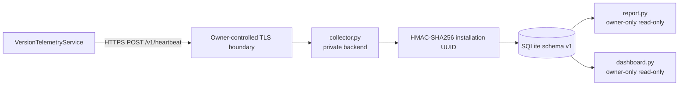

# Version Statistics Collector

## Scope warning

Collector считает только **consenting active installations**. Эти числа не являются абсолютным количеством пользователей, установок или уникальных downloads.

## Source-of-truth split

Этот документ описывает **public software contract** collector/dashboard. Конкретный production host, VPN/reverse-proxy topology, service state, server paths, backup state и operational access принадлежат private infrastructure vault.

Правило разделения: [Public / Private Operations Boundary](../12-reference/operations-boundary.md).

Private operational entrypoint (repository access required): `office-it-docs: Проекты/Impuls.md`.

## Architecture

The diagram is intentionally abstract. Current production addresses/routes are private operational facts, not public application architecture.

## Client contract

Owner: [`VersionTelemetryService.swift`](../../Sources/Impuls/Services/VersionTelemetryService.swift).

The client:

- has consent independent from Sparkle update networking;
- validates the configured endpoint before transport is touched;
- permits only HTTPS with exact `/v1/heartbeat` path and no credentials/query/fragment/port;
- sends at most one attempt per one-hour interval; the attempt timestamp is
  persisted before transport, so failures and relaunches share the same limit;
- uses an ephemeral URLSession without cookies/cache;
- rejects HTTP redirects;
- isolates failure from launch and user-facing app behavior.

Payload schema is registered in [Schema & Migration Registry](../12-reference/schema-migration-registry.md).

## Collector contract

Implementation: Python standard library + SQLite.

Accepted request:

- exact `POST /v1/heartbeat`;
- `Content-Type: application/json`;
- body ≤ 2 KiB;
- JSON object with no duplicate/unknown fields;
- `schema == 1`;
- canonical random UUID v4 installation ID;
- bounded version strings;
- optional `previous_version` differing from current version.

Success: HTTP 204.

Validation/DB failure is fail-closed with an HTTP error; malformed input is not partially recorded.

Implementation: [`collector.py`](../../Collector/version-statistics/collector.py).

## Identity/storage

Raw installation UUID **не сохраняется**. Collector stores a server-side HMAC-SHA256 digest.

Product DB does not persist IP/User-Agent. Collector request logging is disabled. The in-process rate limiter uses a temporary HMAC of peer address rather than recording it as analytics.

Application-side installation identity is a random UUID v4 kept in Keychain and used only after explicit opt-in.

## Database contract

Current SQLite database schema: **1**.

The version marker is SQLite `PRAGMA user_version`. `DATABASE_SCHEMA_VERSION` in `collector.py` is the code-level source for the currently supported version.

Current schema objects:

- `installations` — HMAC identity, first/last seen, current and previous version;
- `transitions` — unique installation/from/to transition with first observation;
- indexes for first/last seen queries.

SQLite uses WAL mode.

### Historical unversioned database

Before schema versioning, the same tables existed with `user_version = 0`. Startup now treats that state as legacy schema 0 and runs an ordered `0 -> 1` migration.

The migration is shape-preserving:

1. begin an immediate transaction;
2. create missing v1 objects for a genuinely new database;
3. validate the exact supported column sets of both tables;
4. set `PRAGMA user_version = 1` only after validation;
5. commit without rewriting existing telemetry rows.

If a legacy database has an unexpected shape, startup fails with `DatabaseMigrationError` and the version remains unchanged. If the file advertises a version newer than the running collector supports, startup also fails. This prevents silent downgrade use of a future database.

### Future database changes

Every future `N -> N+1` schema change requires:

- an explicit ordered migration in `collector.py`;
- deterministic tests starting from schema `N`;
- schema registry and collector documentation updates;
- a SQLite-safe production backup before the first process using the new schema starts;
- private operational validation/rollback procedure in `office-it-docs`.

Canonical migration policy: [Schema & Migration Registry](../12-reference/schema-migration-registry.md).

Tests: [`test_collector_database_migrations.py`](../../Tests/PythonTests/test_collector_database_migrations.py).

## Retention

Каждый accepted heartbeat в той же DB transaction удаляет installations и transition rows, чей `last_seen` старше 365 days. Retention не зависит от отдельного cron.

## Reverse proxy expectations

Operational deployment should:

- terminate TLS before the private collector backend;
- expose only the required heartbeat route;
- omit/anonymize client-identifying access logs for that route;
- enforce an additional body/rate limit;
- avoid forwarding public client IP merely for analytics;
- protect DB backups and HMAC secret as production credentials.

Exact current deployment topology belongs in private operational documentation.

## Reports/dashboard

[`report.py`](../../Collector/version-statistics/report.py) and [`dashboard.py`](../../Collector/version-statistics/dashboard.py) open SQLite read-only (`mode=ro` + `PRAGMA query_only=ON`).

Dashboard design contract:

- private administration access only;
- aggregate output only;
- no installation hashes/raw rows;
- GET/HEAD for `/` and `/healthz` only;
- mutating methods rejected;
- restrictive browser/cache headers;
- request logging disabled.

The dashboard resolver, not the browser, refreshes its latest-version label
from the fixed GitHub latest-release API. It accepts only a stable `vN.N.N`
release tag, atomically stores the validated result, and keeps the last
successful cache when GitHub is unavailable.

Tests: [`test_version_statistics_dashboard.py`](../../Tests/PythonTests/test_version_statistics_dashboard.py).

## Secret rotation

Rotating the HMAC secret creates a new unlinkable installation population. This is both a privacy property and an operational consequence: old and new digests must not be joined.

The **procedure** may be documented privately. The secret value never belongs in Git.

## Public-repo rule

This knowledge base may contain protocol/schema/privacy facts that are already part of the shipped/open-source contract. It must not become a copy of private infrastructure inventory.

For tasks that require current production runtime, use the private operational hub rather than inferring from source defaults or historical audit notes.

## Source map

- [`VersionTelemetryService.swift`](../../Sources/Impuls/Services/VersionTelemetryService.swift)
- [`collector.py`](../../Collector/version-statistics/collector.py)
- [`dashboard.py`](../../Collector/version-statistics/dashboard.py)
- [`report.py`](../../Collector/version-statistics/report.py)
- [`Dockerfile`](../../Collector/version-statistics/Dockerfile)
- [`Collector/version-statistics/README.md`](../../Collector/version-statistics/README.md)

## Verification map

- [`VersionTelemetryServiceTests.swift`](../../Tests/ImpulsTests/VersionTelemetryServiceTests.swift)
- [`test_collector_database_migrations.py`](../../Tests/PythonTests/test_collector_database_migrations.py)
- [`test_version_statistics.py`](../../Tests/PythonTests/test_version_statistics.py)
- [`test_version_statistics_dashboard.py`](../../Tests/PythonTests/test_version_statistics_dashboard.py)
- [Generated Type → Tests → Docs Map](../12-reference/generated-type-test-doc-map.md)
