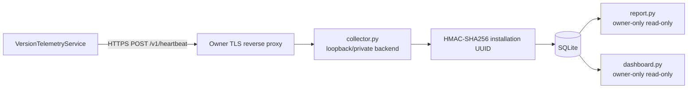

# Version Statistics Collector

## Scope warning

Collector считает только **consenting active installations**. Эти числа не являются абсолютным количеством пользователей, установок или уникальных downloads.

## Architecture

## Collector contract

Implementation: Python standard library + SQLite. Requires a secret at least 32 random bytes and persistent database path. Backend binds loopback by default. Public edge должен expose only exact `POST /v1/heartbeat` over TLS.

Accepted request:

- `Content-Type: application/json`;
- body ≤ 2 KiB;
- exact schema;
- canonical random UUID;
- expected version fields.

Success: HTTP 204.

## Identity/storage

Raw installation UUID **не сохраняется**. Collector stores server-side HMAC-SHA256 digest. Product DB не сохраняет IP/User-Agent; request logger не должен писать их. In-process rate limiter uses temporary peer-address HMAC.

## Retention

Каждый accepted heartbeat в той же DB transaction удаляет installations и transition rows, чей `last_seen` старше 365 days. Retention не зависит от отдельного cron.

## Reverse proxy requirements

Disable/omit client-identifying access logs для heartbeat path, impose separate body/rate limits, не прокидывать client IP в headers «ради аналитики». Protect HMAC secret и DB backups as production credentials.

## Reports/dashboard

`report.py` и `dashboard.py` открывают SQLite через `mode=ro` + `PRAGMA query_only=ON`. Dashboard должен жить только в private administration network; HTTP surface: GET/HEAD `/` и `/healthz`, остальные methods/paths rejected. Он показывает aggregates, не installation hashes/raw rows.

## Secret rotation

Rotation HMAC secret создаёт новую несопоставимую population. Это privacy property и operational consequence; старые/new digests не должны связываться.

## Public-repo rule

Knowledge base не хранит private internal IP, VPN peer list, production secrets или admin credentials. Конкретная инфраструктурная topology хранится в защищённой operational system, не в public repo.

## Source map

- `Collector/version-statistics/collector.py`
- `dashboard.py`
- `report.py`
- `Dockerfile`
- `Collector/version-statistics/README.md`
