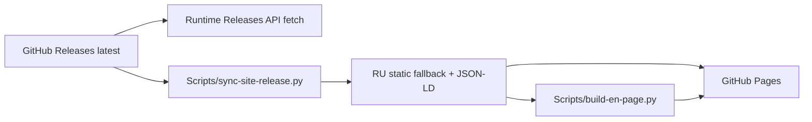
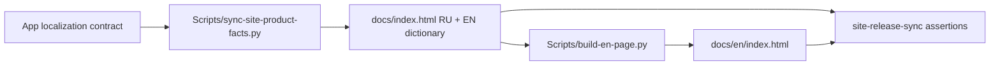

# Website Architecture

## Hosting boundary

`docs/` обслуживается GitHub Pages. Поэтому engineering knowledge base находится отдельно в `knowledge-base/`.

Маркетинговый сайт и локализации самого приложения — разные поверхности. **Сайт сейчас имеет две статические языковые версии: RU (`/`) и EN (`/en/`). Приложение Impuls 1.4.15 поддерживает семь языков интерфейса: `ru`, `en`, `de`, `fr`, `es`, `zh-Hans`, `ja`.** Фраза «7 языков интерфейса» на сайте описывает capability приложения и не означает, что сам сайт переведён на семь языков.

## Russian page

`docs/index.html` — canonical content/layout source и self-contained production page: no external CSS/JS/fonts и no build step для основной RU page. Это deliberate performance/reliability contract.

Страница несёт свою design system внутри себя — единственный `<style>` в `<head>`. Принципы, токены, композиция глав, motion, responsive и accessibility описаны в [Website Design System](design-system.md); значения остаются в CSS страницы.

RU source также содержит словари `EN` и `ALT`, из которых строится English page. Generated product facts не редактируются только в `docs/en/index.html`: сначала исправляется canonical RU/source generator, затем EN пересобирается.

## English page

English static page живёт в `docs/en/` и генерируется/проверяется `Scripts/build-en-page.py`, чтобы head/SEO/body не drift'или вручную.

Скрипт переносит разметку RU page целиком и подменяет:

- содержимое элементов с `data-i` по словарю `EN` внутри RU page;
- `alt` продуктовых снимков по словарю `ALT`;
- пути `assets/screens/ru/` → `assets/screens/en/`;
- релизные строки, которые RU-разметка пишет по-русски (`Версия x.y.z`, `x,y МБ`);
- head/SEO/JSON-LD, у которых нет runtime-эквивалента;
- блок переключателя языка — сверяется буквально и роняет сборку при расхождении.

Отсюда следуют требования к разметке RU page: `data-i` не вкладываются друг в друга, не ставятся на void-теги, и не менее 80 % ключей `EN` должны находить свой элемент — иначе скрипт считает, что разметка разошлась со словарём, и падает.

RU и EN делят один `<style>`, поэтому layout и визуальная система у них идентичны по построению, а не по договорённости.

## Release data

Version/download/SHA at runtime читаются из GitHub Releases API. Static markup содержит synchronized fallback для SEO/no-JS, но не является independent release source of truth.

CI/workflow сохраняет literal contracts вокруг `RELEASE_API`, `releaseHash(...)` и `data-conversion="feedback"`.

`sync-site-release.py` переписывает страницу по якорям, а не по позициям: объект `FALLBACK_RELEASE`, элементы `[data-release="version-label"|"size"|"filename"]`, `<code id="hash">`, релизные поля JSON-LD и все ссылки `[data-conversion="download"]`. Количество кнопок скачивания — решение вёрстки, скрипт его не фиксирует; наличие якорей — фиксирует.

После release metadata sync `Scripts/build-en-page.py` генерирует EN page из уже актуального RU source. Поэтому новый релиз не требует ручного редактирования двух HTML-файлов.

## Durable product facts

Нерелизные, но долговечные маркетинговые факты, которые должны переживать release metadata rewrite и регенерацию EN page, принадлежат `Scripts/sync-site-product-facts.py`.

На текущем baseline этот sync владеет публичным фактом о локализациях приложения:

- hero metadata RU: `7 языков интерфейса`;
- hero metadata EN: `7 interface languages`;
- FAQ RU: точный список семи языков и поведение System/manual language;
- FAQ EN: тот же контракт на английском.

`sync-site-product-facts.py` изменяет только canonical `docs/index.html`: добавляет RU markup и соответствующие keys в встроенный `EN` dictionary. После этого `Scripts/build-en-page.py` строит `docs/en/index.html`. **Generated EN page вручную не редактируется.**

Если shipped set локализаций приложения меняется, изменение сайта должно идти вместе с проверкой canonical app localization contract. Нельзя просто поменять число `7` в одном HTML-файле: нужно обновить product-facts owner и RU/EN assertions так, чтобы обе публичные страницы снова генерировались из одного контракта.

Важно: `WebSite.inLanguage`/`hreflang` относятся к языкам **сайта** (`ru`, `en`), а marketing copy `7 языков интерфейса` относится к языкам **приложения** (`ru`, `en`, `de`, `fr`, `es`, `zh-Hans`, `ja`). Эти понятия нельзя смешивать в SEO/JSON-LD.

## Site synchronization workflow

`.github/workflows/site-release-sync.yml` поддерживает static markup после публикации релиза и после изменений самих site generators.

Workflow запускается:

- после published GitHub Release;
- после успешного `release` workflow;
- вручную через `workflow_dispatch`;
- при push в `main`, затрагивающем `Scripts/sync-site-product-facts.py`, `Scripts/sync-site-release.py`, `Scripts/build-en-page.py` или сам `.github/workflows/site-release-sync.yml`.

Порядок работы:

1. `Scripts/sync-site-release.py` синхронизирует version/download/SHA;
2. `Scripts/sync-site-product-facts.py` синхронизирует durable product facts;
3. `Scripts/build-en-page.py` пересобирает EN page;
4. workflow запускает `--check` для всех трёх контрактов и literal RU/EN assertions;
5. при реальном diff bot коммитит только `docs/index.html` и `docs/en/index.html` в `main`.

Этот workflow **не является release path**: он не меняет `Scripts/version`, не подписывает/не тегирует приложение и не загружает release assets. Его bot commit затрагивает только website markup, поэтому собственный push-trigger не зацикливается.

## Themes

Website follows `prefers-color-scheme`; отдельного theme toggle нет. Dark/light обязаны проверяться обе.

Светлая тема — база, тёмная — переопределение в `@media(prefers-color-scheme:dark)`. Такой порядок сохраняется намеренно: он позволяет проверить светлую тему удалением одного набора media-блоков из CSSOM, без смены системного оформления.

Для gradient-clipped text theme overrides не должны использовать CSS `background` shorthand, который сбрасывает `background-clip`; используется `background-image`. На текущей странице градиентного текста нет, правило остаётся для любого будущего элемента с этим приёмом.

## No-JavaScript contract

Страница обязана быть полноценной без скрипта:

- ссылки скачивания ведут на реальный DMG, а не на страницу релиза;
- версия, размер, имя файла и SHA-256 присутствуют в статической разметке;
- durable product facts, включая текущий факт о семи языках приложения, присутствуют в статической RU/EN разметке;
- селектор модулей скрыт (`#rail` остаётся `hidden`), все модули показаны стопкой;
- ни один элемент не спрятан за `opacity` или за IntersectionObserver.

Последнее — не стилистика, а следствие трёх зафиксированных дефектов: невидимая без JS глава «Действия», блоки «Поведения», не выходившие из нижнего поля observer'а, и hero-панель, зависевшая от того, что CSS-анимация действительно проиграет. Действующее правило: анимируется только `transform`.

## SEO / privacy pages

`site-privacy.html`, `robots.txt`, `sitemap.xml`, manifest и RU/EN metadata должны оставаться согласованы. Новая public page требует sitemap review.

SEO-состав — title, description, canonical, hreflang, OpenGraph, Twitter, JSON-LD (`Person`, `WebSite`, `SoftwareApplication`, `FAQPage`) — считается утверждённым. Редизайн presentation layer его не переписывает.

Website language metadata остаётся RU/EN, пока реально существуют только две public language pages. Наличие семи app localizations само по себе не является основанием добавлять `de`, `fr`, `es`, `zh-Hans` или `ja` в website `hreflang`.

## Product screenshots

Screenshots должны быть real product captures либо явно demo data. Нельзя публиковать личные данные, internal notes, реальные calendar events или identifiers. Исторически screenshot leak уже был обнаружен, поэтому privacy review assets обязателен.

Рисованный «продуктовый» UI вместо снимка запрещён отдельно: страница обещает, что показывает приложение.

Панель имеет пропорцию ≈ 2.7 : 1. На узких экранах кадр не сжимается до нечитаемой полосы, а держит минимальную ширину и скроллится внутри себя; страница вбок не едет никогда.

## Invariants

1. `docs/index.html` остаётся canonical RU content/layout source; `docs/en/index.html` генерируется.
2. Website page locales (`ru`, `en`) и app interface locales (`ru`, `en`, `de`, `fr`, `es`, `zh-Hans`, `ja`) — разные контракты.
3. Release metadata принадлежит `Scripts/sync-site-release.py`; durable marketing facts принадлежат `Scripts/sync-site-product-facts.py`.
4. Product fact о числе/списке языков не редактируется только в generated HTML и должен переживать следующий release sync.
5. `site-release-sync.yml` может публиковать только website markup и не должен становиться вторым release workflow.
6. RU/EN static pages должны оставаться полезными без JavaScript.

## Связано

- [Website Design System](design-system.md)
- [Version Statistics Collector](version-statistics-collector.md)
- [Localization Architecture](../01-architecture/localization.md)
- [Release Pipeline](../05-release/release-pipeline.md)
- `.claude/rules/website.md`
- `Scripts/sync-site-product-facts.py`
- `Scripts/sync-site-release.py`
- `Scripts/build-en-page.py`
- `.github/workflows/site-release-sync.yml`
